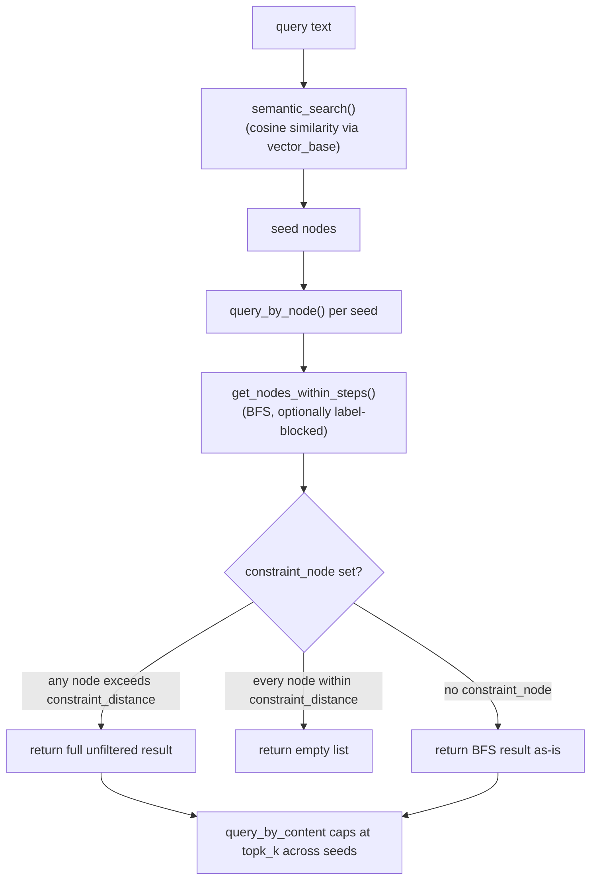
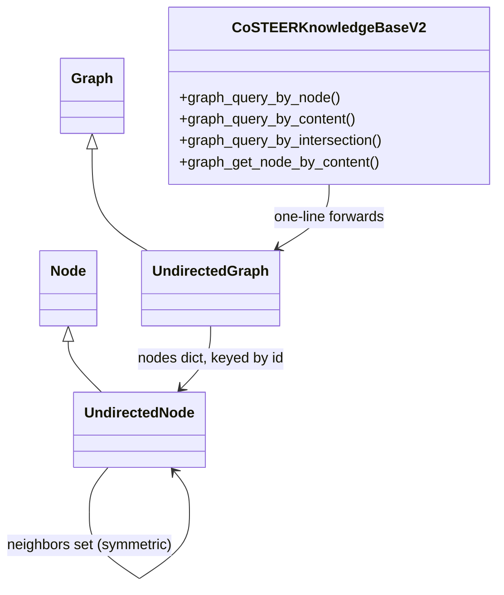

# UndirectedGraph — the shared semantic + connectivity memory substrate

<!-- connect:up:begin -->
> **Cross-repo concept:** part of [closed-loop-experiment-design](../../../concepts/closed-loop-experiment-design.md), [research-development-loop](../../../concepts/research-development-loop.md) across this wiki's repos.
<!-- connect:up:end -->
## Overview

This is the generic graph data structure underneath
[Co-STEER's knowledge management](rdagent-components-coder-CoSTEER-knowledge_management.md): every stored
fact — a task description, an error, a component tag — becomes an `UndirectedNode` with free-text
`content`, a `label` naming its node-type, and an embedding; nodes connect as plain undirected neighbor
pairs. The graph supports two orthogonal ways to find related nodes — pure **semantic** search (cosine
similarity over embeddings, via a companion vector store) and pure **connectivity** search (breadth-first
from a node, optionally walled off to only traverse certain labels) — and `CoSTEERKnowledgeBaseV2`'s
retrieval logic (the far side of this page) is built almost entirely as thin, purpose-named wrappers that
forward straight into these two primitives.

## Diagram

## Design rationale (why it's built this way)

Two independent search modes exist because they answer different questions.
[`semantic_search`](../catalog/rdagent/components/knowledge_management/graph.md#UndirectedGraph.semantic_search)'s
own docstring frames it as "search by node's embedding" — the entry point when all you have is free text
and no known related node.
[`get_nodes_within_steps`](../catalog/rdagent/components/knowledge_management/graph.md#UndirectedGraph.get_nodes_within_steps)
is pure graph topology — the entry point when you already have a specific node and want what's structurally
near it. [`query_by_content`](../catalog/rdagent/components/knowledge_management/graph.md#UndirectedGraph.query_by_content)
composes both: semantic search finds seed nodes for a plain-text query, then connectivity search expands
each seed outward, so a text query still benefits from graph structure — an error's *fix* need not be
textually similar to the error itself, but it is graph-adjacent to it.

[`add_node`](../catalog/rdagent/components/knowledge_management/graph.md#UndirectedGraph.add_node) dedupes
by trying [`get_node`](../catalog/rdagent/components/knowledge_management/graph.md#UndirectedGraph.get_node)
(exact id match) then [`find_node`](../catalog/rdagent/components/knowledge_management/graph.md#Graph.find_node)
(exact content+label match) before ever creating a new node. Its own docstring calls a
`same_node_threshold` parameter "empirical" for near-duplicate detection by embedding similarity, but the
code path that would actually use it (a commented-out `self.semantic_search(...)` call) is dead — in the
current source, deduplication is exact-match only, and `same_node_threshold` is accepted but unused (the
parameter is marked `# noqa: ARG002` in source, i.e. the linter is explicitly told to ignore that it's
unused).

`Node` is a bare alias for the vector store's own
[`content`](../catalog/rdagent/components/knowledge_management/vector_base.md#KnowledgeMetaData.content)-bearing
type rather than a separate class, and [`Document`](../catalog/rdagent/components/knowledge_management/vector_base.md#Document)
is the same alias reused on the vector-store side — the graph and its embedding index speak the exact same
node type with zero conversion, since `UndirectedGraph` composes a vector store internally purely for the
embedding half of every node.

## Entry points

- [`add_node`](../catalog/rdagent/components/knowledge_management/graph.md#UndirectedGraph.add_node) —
  every write into the graph, from any subsystem, goes through this one method (directly, or via
  [`add_nodes`](../catalog/rdagent/components/knowledge_management/graph.md#UndirectedGraph.add_nodes) for
  a node with several neighbors at once).
- [`get_nodes_within_steps`](../catalog/rdagent/components/knowledge_management/graph.md#UndirectedGraph.get_nodes_within_steps) —
  the BFS primitive every connectivity query is built from.
- [`batch_embedding`](../catalog/rdagent/components/knowledge_management/graph.md#Graph.batch_embedding) —
  where raw text becomes the embeddings `semantic_search` relies on; called in bulk before a batch of
  documents is loaded.
- [`graph_query_by_node`](../catalog/rdagent/components/coder/CoSTEER/knowledge_management.md#CoSTEERKnowledgeBaseV2.graph_query_by_node),
  [`graph_query_by_content`](../catalog/rdagent/components/coder/CoSTEER/knowledge_management.md#CoSTEERKnowledgeBaseV2.graph_query_by_content),
  [`graph_query_by_intersection`](../catalog/rdagent/components/coder/CoSTEER/knowledge_management.md#CoSTEERKnowledgeBaseV2.graph_query_by_intersection),
  [`graph_get_node_by_content`](../catalog/rdagent/components/coder/CoSTEER/knowledge_management.md#CoSTEERKnowledgeBaseV2.graph_get_node_by_content) —
  the seam where [Co-STEER's knowledge base](rdagent-components-coder-CoSTEER-knowledge_management.md) calls
  into this shared structure.

## Mechanism (step-by-step)

1. **Nodes are content + label + embedding + edges.** Every node is an
   [`UndirectedNode`](../catalog/rdagent/components/knowledge_management/graph.md#UndirectedNode) — free
   text [`content`](../catalog/rdagent/components/knowledge_management/vector_base.md#KnowledgeMetaData.content),
   a `label` naming its node-type ("component", "error", "task_description", "task_trace",
   "task_success_implement," and more, depending on which subsystem writes it), an optional
   [`embedding`](../catalog/rdagent/components/knowledge_management/vector_base.md#KnowledgeMetaData.embedding),
   and a [`neighbors`](../catalog/rdagent/components/knowledge_management/graph.md#UndirectedNode.neighbors)
   set that's mutated symmetrically whenever two nodes connect — connecting A to B always also connects B
   to A.

2. **Writes are idempotent by identity.** [`add_node`](../catalog/rdagent/components/knowledge_management/graph.md#UndirectedGraph.add_node)
   tries an exact id match via [`get_node`](../catalog/rdagent/components/knowledge_management/graph.md#UndirectedGraph.get_node),
   then an exact content+label match via
   [`find_node`](../catalog/rdagent/components/knowledge_management/graph.md#Graph.find_node); only if
   neither exists does it call `create_embedding()` and register the node in the graph's
   [`nodes`](../catalog/rdagent/components/knowledge_management/graph.md#Graph.nodes) dict and its vector
   store — calling `add_node` twice with an equivalent (content, label) never creates a duplicate, it
   reuses the existing node and just adds the requested edge to it.

3. **Connectivity search is a deterministic BFS.** [`get_nodes_within_steps`](../catalog/rdagent/components/knowledge_management/graph.md#UndirectedGraph.get_nodes_within_steps)
   walks breadth-first from a start node up to `steps` hops, visiting neighbors in a fixed
   sorted-by-content order — the source's own comment says this is "to make sure the result is
   deterministic," which matters because this feeds directly into an LLM prompt (see the knowledge
   management page's `component_query`/`error_query`), where reproducible ordering makes repeated runs
   comparable. When `block=True` and `constraint_labels` is set, the BFS refuses to traverse *through* any
   node whose label isn't in that set — labels don't just filter the final result, they can wall off entire
   regions of the graph from being reached at all.

4. **Semantic search is index lookup, not local computation.** [`semantic_search`](../catalog/rdagent/components/knowledge_management/graph.md#UndirectedGraph.semantic_search)
   hands the query content to the graph's internal vector store, which performs the actual similarity
   ranking, then maps each returned document id back to the corresponding graph node via
   [`get_node`](../catalog/rdagent/components/knowledge_management/graph.md#UndirectedGraph.get_node) — the
   vector store and the graph are two indexes over the same node ids, kept in sync because `add_node`
   writes to both.

5. **Composed retrieval: semantic seeds, connectivity expansion.** [`query_by_content`](../catalog/rdagent/components/knowledge_management/graph.md#UndirectedGraph.query_by_content)
   runs `semantic_search` per query string to get seed nodes, then for each seed runs
   [`query_by_node`](../catalog/rdagent/components/knowledge_management/graph.md#UndirectedGraph.query_by_node)
   (itself `get_nodes_within_steps` plus an optional `constraint_node`/`constraint_distance` post-filter),
   accumulating up to `topk_k` connected nodes across all seeds.

6. **Finding nodes connected to *several* seeds at once.** [`get_nodes_intersection`](../catalog/rdagent/components/knowledge_management/graph.md#UndirectedGraph.get_nodes_intersection)
   is the graph-only, no-embedding way to find nodes reachable from more than one seed simultaneously: it
   walks each seed's BFS neighborhood via `get_nodes_within_steps`, then repeatedly intersects the running
   result against each subsequent seed's neighborhood — exactly what powers "this task touches N components
   at once" retrieval on the knowledge management page.

7. **`CoSTEERKnowledgeBaseV2`'s wrappers add no behavior of their own.** [`graph_query_by_node`](../catalog/rdagent/components/coder/CoSTEER/knowledge_management.md#CoSTEERKnowledgeBaseV2.graph_query_by_node),
   [`graph_query_by_content`](../catalog/rdagent/components/coder/CoSTEER/knowledge_management.md#CoSTEERKnowledgeBaseV2.graph_query_by_content),
   and [`graph_query_by_intersection`](../catalog/rdagent/components/coder/CoSTEER/knowledge_management.md#CoSTEERKnowledgeBaseV2.graph_query_by_intersection)
   are each a same-signature, one-line forward from `CoSTEERKnowledgeBaseV2` onto the matching method on
   this page's graph; [`graph_get_node_by_content`](../catalog/rdagent/components/coder/CoSTEER/knowledge_management.md#CoSTEERKnowledgeBaseV2.graph_get_node_by_content)
   is the same pattern over
   [`get_node_by_content`](../catalog/rdagent/components/knowledge_management/graph.md#UndirectedGraph.get_node_by_content).
   This pass-through layer is why the knowledge-management page can be understood entirely in terms of
   *what it asks this graph for*, without re-deriving how the graph answers.

## Key data structures

- [`UndirectedNode`](../catalog/rdagent/components/knowledge_management/graph.md#UndirectedNode) —
  [`content`](../catalog/rdagent/components/knowledge_management/vector_base.md#KnowledgeMetaData.content),
  [`label`](../catalog/rdagent/components/knowledge_management/vector_base.md#KnowledgeMetaData.label),
  [`embedding`](../catalog/rdagent/components/knowledge_management/vector_base.md#KnowledgeMetaData.embedding),
  an `appendix` slot for freeform extra payload, and a
  [`neighbors`](../catalog/rdagent/components/knowledge_management/graph.md#UndirectedNode.neighbors) set.
- `Graph.`[`nodes`](../catalog/rdagent/components/knowledge_management/graph.md#Graph.nodes) — the canonical
  `dict[id, Node]` registry every graph subclasses shares; `UndirectedGraph` additionally holds a
  `vector_base` as a parallel embedding index over the same ids.
- [`Node`](../catalog/rdagent/components/knowledge_management/graph.md#Node) /
  [`Document`](../catalog/rdagent/components/knowledge_management/vector_base.md#Document) — both bare
  aliases of the same underlying type, one used on the graph side, one on the vector-store side.

## Dynamics (design intent)

[`batch_embedding`](../catalog/rdagent/components/knowledge_management/graph.md#Graph.batch_embedding)
chunks nodes into groups of 16 before calling the embedding API — the source comment attributes this
directly to "openai create embedding API input's max length is 16," i.e. it's an API-limit constraint, not a
throughput tuning choice.

> [!inferred] `add_node`'s ordering — create the embedding, add to the vector store, *then* register in
> `nodes` — leaves a window where a node exists in the vector store before it's registered in the node
> dict. Nothing in this file guards that window with a lock (contrast with the `FileLock` used in the
> sibling factor-coder page's `execute()`), so concurrent writers racing on the same new node aren't
> obviously safe — this is a reading of the ordering, not a documented guarantee either way.

## Edge cases

- [`query_by_node`](../catalog/rdagent/components/knowledge_management/graph.md#UndirectedGraph.query_by_node)'s
  `constraint_node` handling is easy to misread: it computes a distance from every BFS result to
  `constraint_node`, but returns the **full, unfiltered** result set the moment it finds *any* node
  exceeding `constraint_distance`, and returns an **empty list** only when *every* result is already within
  range. It is not a per-node filter that keeps qualifying nodes and drops the rest — it is a coarse
  all-or-nothing gate whose "reject everything" case is triggered by the results already being close, not by
  them being far. A caller expecting per-node filtering by distance would be surprised by this.
- [`get_nodes_within_steps`](../catalog/rdagent/components/knowledge_management/graph.md#UndirectedGraph.get_nodes_within_steps)
  explicitly removes the start node from its own result — "neighbors within N steps" never includes the
  node you started from, even conceptually at step 0.
- [`semantic_search`](../catalog/rdagent/components/knowledge_management/graph.md#UndirectedGraph.semantic_search)'s
  docstring promises results "sorted by similarity score," but the method itself only maps returned document
  ids back to graph nodes — the actual ranking is entirely the vector store's responsibility, which is
  outside this packet's subgraph, so that guarantee can't be verified from this file alone.

## Open questions

- The vector store's own ranking/filtering logic (how `constraint_labels` and `similarity_threshold` are
  actually enforced during search) is not part of this packet's subgraph, so `semantic_search`'s precise
  guarantees can only be confirmed by reading the vector-store module directly.
- Whether the commented-out semantic-dedup branch in `add_node` (using `same_node_threshold`) was
  deliberately disabled or simply never finished is not stated anywhere in source.

## See also

- [Co-STEER knowledge management](rdagent-components-coder-CoSTEER-knowledge_management.md) — the primary
  consumer built on top of this structure, and the wrappers referenced in step 7 above.
- [RD-Agent paper summary](../../../sources/rd-agent.md) — the persistently growing knowledge base this
  graph is the storage layer for.
- [`research-development-loop`](../../../concepts/research-development-loop.md),
  [`closed-loop-experiment-design`](../../../concepts/closed-loop-experiment-design.md) — cross-repo
  concept pages this page connects to.
