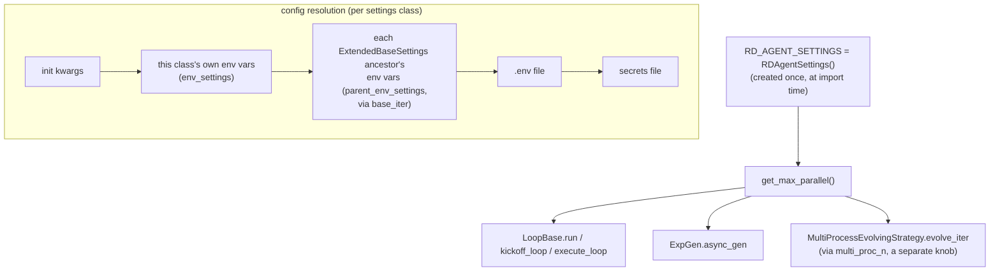

# The config system — one settings base class, one global instance

## Overview

`rdagent.core.conf` is small — one base class, one settings model, one instance — but it is the
plumbing the rest of the R&D loop depends on to size its own concurrency. Every scenario/component
settings class in the repo (Co-STEER, the environment layer, every `*PropSetting`, the LLM settings)
subclasses [`ExtendedBaseSettings`](../catalog/rdagent/core/conf.md#ExtendedBaseSettings), a thin
`pydantic-settings` extension whose entire job is fixing one gap: making environment-variable resolution
walk a settings class's *own* base classes, not just itself. On top of that sits a single global
instance, [`RD_AGENT_SETTINGS`](../catalog/rdagent/core/conf.md#RD_AGENT_SETTINGS), whose
`step_semaphore`/`get_max_parallel()` fields are the one knob that decides how many `Trace` branches,
`Experiment`s, and Co-STEER evolve rounds can be in flight across the entire loop at once (see the
proposal and evolving-framework pages).

## Diagram



## Design rationale (why it's built this way)

`pydantic-settings` normally builds one `EnvSettingsSource` per class using *that class's own*
`model_config` (its `env_prefix`, etc.) — it does not automatically also bind env vars using an
ancestor's prefix. RD-Agent needs that, because scenario settings classes each pick their own prefix
(e.g. `CoSTEERSettings.Config.env_prefix = "CoSTEER_"`) while still wanting to inherit fields — and their
env bindings — from a shared base. [`ExtendedBaseSettings`](../catalog/rdagent/core/conf.md#ExtendedBaseSettings)'s
override of `settings_customise_sources` fixes this by recursively walking `__bases__` with
[`base_iter`](../catalog/rdagent/core/conf.md#ExtendedBaseSettings.base_iter), building one extra
`EnvSettingsSource` per `ExtendedBaseSettings` ancestor (skipping `ExtendedBaseSettings` itself), and
returning them in this exact priority order:

```python
return init_settings, env_settings, *parent_env_settings, dotenv_settings, file_secret_settings
```

— constructor kwargs always win, then the leaf class's *own* env-var prefix, then each ancestor's prefix
in turn, then `.env`, then secrets files. This is what lets, say, a `CoSTEERSettings` subclass expose a
field both under its own `CoSTEER_`-prefixed name *and* under whatever prefix a shared ancestor declared,
without RD-Agent having to duplicate the field or manually re-list env sources per subclass.

[`step_semaphore`](../catalog/rdagent/core/conf.md#RDAgentSettings.step_semaphore)'s own docstring
explains why it's typed `int | dict[str, int]` rather than a single number: "you can specify an overall
semaphore or a step-wise semaphore like `{"coding": 3, "running": 2}`" — coding (LLM calls) and running
(Docker/GPU execution) have very different resource costs, so a single global cap would either starve
cheap steps or overrun expensive ones.
[`get_max_parallel`](../catalog/rdagent/core/conf.md#RDAgentSettings.get_max_parallel) collapses this
richer, per-step setting down to a single int (`max` of the dict's values) specifically for call sites
that only need "how many top-level loop iterations can be outstanding at once," not step-by-step limits.

## Entry points

- [`RD_AGENT_SETTINGS`](../catalog/rdagent/core/conf.md#RD_AGENT_SETTINGS) — a single instance built at
  module-import time (`RD_AGENT_SETTINGS = RDAgentSettings()`); every module that needs config imports
  this same object directly rather than constructing its own settings or receiving one via dependency
  injection.
- [`run`](../catalog/rdagent/utils/workflow/loop.md#LoopBase.run) — the workflow's outermost entry point;
  it spawns `RD_AGENT_SETTINGS.`[`get_max_parallel`](../catalog/rdagent/core/conf.md#RDAgentSettings.get_max_parallel)`()`
  concurrent `execute_loop()` coroutines alongside one `kickoff_loop()`.
- [`async_gen`](../catalog/rdagent/core/proposal.md#ExpGen.async_gen) — where the Research-phase proposal
  loop (see the proposal page) reads the same `get_max_parallel()` value to decide whether it may start
  generating the next experiment yet.
- [`evolve_iter`](../catalog/rdagent/components/coder/CoSTEER/evolving_strategy.md#MultiProcessEvolvingStrategy.evolve_iter) —
  where a *different* concurrency knob, `RD_AGENT_SETTINGS.`[`multi_proc_n`](../catalog/rdagent/core/conf.md#RDAgentSettings.multi_proc_n),
  sizes the OS-process pool used to implement sub-tasks in parallel inside one evolve round (see the
  evolving-framework page).
- [`workspace_path`](../catalog/rdagent/core/experiment.md#FBWorkspace.workspace_path) — where every
  `FBWorkspace` (see the experiment page) is rooted under `RD_AGENT_SETTINGS.workspace_path`, so one
  field controls where the entire loop's on-disk side effects land.

## Mechanism (step-by-step)

1. **Resolution rules are defined once, at class-creation time.**
   [`ExtendedBaseSettings`](../catalog/rdagent/core/conf.md#ExtendedBaseSettings)`.settings_customise_sources`
   is invoked by `pydantic-settings` whenever any subclass is instantiated, calling
   [`base_iter`](../catalog/rdagent/core/conf.md#ExtendedBaseSettings.base_iter) to collect every
   `ExtendedBaseSettings` ancestor of that specific subclass and build one env source per ancestor.

2. **One process-wide instance is created at import time.**
   [`RD_AGENT_SETTINGS`](../catalog/rdagent/core/conf.md#RD_AGENT_SETTINGS) is produced by
   `RDAgentSettings()` at the bottom of `conf.py` — a single, eagerly-constructed singleton, not a
   factory or a per-call construction.

3. **The rest of the codebase reads off that one instance directly.** Dozens of call sites — from
   [`workspace_path`](../catalog/rdagent/core/experiment.md#FBWorkspace.workspace_path) to
   [`multi_proc_n`](../catalog/rdagent/core/conf.md#RDAgentSettings.multi_proc_n)-gated multiprocessing
   calls in
   [`evaluate_iter`](../catalog/rdagent/components/coder/CoSTEER/evaluators.md#CoSTEERMultiEvaluator.evaluate_iter) —
   import `RD_AGENT_SETTINGS` and read a field off it inline, rather than having settings passed down
   through constructors.

4. **Loop-control call sites gate on the same derived value.**
   [`run`](../catalog/rdagent/utils/workflow/loop.md#LoopBase.run),
   [`kickoff_loop`](../catalog/rdagent/utils/workflow/loop.md#LoopBase.kickoff_loop),
   [`execute_loop`](../catalog/rdagent/utils/workflow/loop.md#LoopBase.execute_loop),
   [`get_semaphore`](../catalog/rdagent/utils/workflow/loop.md#LoopBase.get_semaphore), and
   [`async_gen`](../catalog/rdagent/core/proposal.md#ExpGen.async_gen) (both the base version and
   [`async_gen`](../catalog/rdagent/scenarios/data_science/proposal/exp_gen/router/__init__.md#ParallelMultiTraceExpGen.async_gen))
   all call
   [`get_max_parallel`](../catalog/rdagent/core/conf.md#RDAgentSettings.get_max_parallel), so a single
   config field consistently throttles concurrency across proposal, development, and the outer workflow
   driver.

5. **Scenario settings inherit the same env-resolution behavior for free.** Classes like
   [`CoSTEERSettings`](../catalog/rdagent/components/coder/CoSTEER/config.md#CoSTEERSettings),
   [`BasePropSetting`](../catalog/rdagent/components/workflow/conf.md#BasePropSetting),
   [`EnvConf`](../catalog/rdagent/utils/env.md#EnvConf), and
   [`LLMSettings`](../catalog/rdagent/oai/llm_conf.md#LLMSettings) all subclass
   [`ExtendedBaseSettings`](../catalog/rdagent/core/conf.md#ExtendedBaseSettings) rather than
   `pydantic-settings`'s plain `BaseSettings`, which is what makes step 1's `base_iter` walk apply to
   them automatically.

## Key data structures

- [`RDAgentSettings`](../catalog/rdagent/core/conf.md#RDAgentSettings) — the root settings model:
  `workspace_path`, `step_semaphore`, `multi_proc_n`, cache/pickle paths, and misc stdout-truncation
  limits, all `pydantic` fields with defaults, each independently overridable by an env var.
- [`step_semaphore`](../catalog/rdagent/core/conf.md#RDAgentSettings.step_semaphore) — `int |
  dict[str, int]`; the source of `get_max_parallel()` and, per-step, of
  [`get_semaphore`](../catalog/rdagent/utils/workflow/loop.md#LoopBase.get_semaphore)'s per-step
  `asyncio.Semaphore` limits.
- [`multi_proc_n`](../catalog/rdagent/core/conf.md#RDAgentSettings.multi_proc_n) — a *separate*
  concurrency knob from `step_semaphore`, controlling process-pool size for CPU-bound, per-sub-task work
  (factor-data processing, Co-STEER's `implement_one_task` dispatch) rather than loop-level parallelism.

## Dynamics (design intent)

There are two independent axes of parallelism here, and this page's settings size both without coupling
them: `step_semaphore`/`get_max_parallel()` bounds how many top-level loop iterations (proposal →
development → evaluation → feedback, see the proposal page) run concurrently, while `multi_proc_n` bounds
how many OS processes one `evolve_iter` round spawns to implement several sub-tasks in parallel *inside*
a single iteration (see the evolving-framework page). A run can be tuned along either axis independently
— high `step_semaphore` with `multi_proc_n=1` gets many parallel experiments each implementing their
sub-tasks serially; the reverse gets one experiment at a time implementing sub-tasks fast in parallel.

[`get_semaphore`](../catalog/rdagent/utils/workflow/loop.md#LoopBase.get_semaphore)'s own comments record
a second, correctness-motivated override: it forces `limit = 1` for the `"record"` and `"feedback"` step
names regardless of the configured `step_semaphore`, because "`record` is always the last step to modify
the global environment" and because of the `(-1,)` "latest node" selection syntax sugar used elsewhere
(see the proposal page) — letting two loops' `record`/`feedback` steps interleave could attach a result to
the wrong parent node in the trace.

## Edge cases

- A step name missing from a dict-valued `step_semaphore` silently defaults to a limit of `1` inside
  [`get_semaphore`](../catalog/rdagent/utils/workflow/loop.md#LoopBase.get_semaphore) (`limit.get(step_name,
  1)`) — a step a user forgot to add to the dict reads as "fully serialized," which looks like a
  parallelism bug rather than the config omission it actually is.
- [`RD_AGENT_SETTINGS`](../catalog/rdagent/core/conf.md#RD_AGENT_SETTINGS) is constructed once at *import*
  time, not lazily on first access — an environment variable exported after the process has already
  imported `rdagent.core.conf` (including, notably, inside a test that monkeypatches `os.environ` after
  import) will not be picked up without re-instantiating or reloading the module.
- `settings_customise_sources`'s `base_iter` walk only follows `__bases__` for classes that are
  themselves `ExtendedBaseSettings` subclasses — a settings class that mixes in some unrelated non-
  `ExtendedBaseSettings` base won't have that base's env vars collected, which is correct given the
  intent but easy to forget when composing settings via multiple inheritance.

## Open questions

- This packet's subgraph doesn't show any code path that re-instantiates or hot-reloads
  `RD_AGENT_SETTINGS` after process start, so whether long-running processes (e.g. a persistent server
  mode) are expected to pick up config changes without a restart isn't settled here.
- `app_tpl` (a template-override field on `RDAgentSettings`) has essentially no other reference inside
  this packet beyond its own field definition — which template loader actually consumes it isn't visible
  in this subgraph.

## See also

- [Experiment, Workspace, and Task](rdagent-core-experiment.md) — `FBWorkspace.workspace_path`, one of
  the concrete places `RD_AGENT_SETTINGS` is read from.
- [Proposal: Hypothesis, Trace, and ExpGen](rdagent-core-proposal.md) — `ExpGen.async_gen`'s use of
  `get_max_parallel()` to gate how many `Trace` branches can be proposed concurrently.
- [The evolving framework](rdagent-core-evolving_framework.md) — `multi_proc_n`'s role sizing the
  process pool inside one Co-STEER evolve round.
- [RD-Agent paper summary](../../../sources/rd-agent.md) — the paper doesn't discuss configuration
  directly, but its time-aware planning and parallel-branch exploration claims are what
  `step_semaphore`/`get_max_parallel()` mechanically implement.
