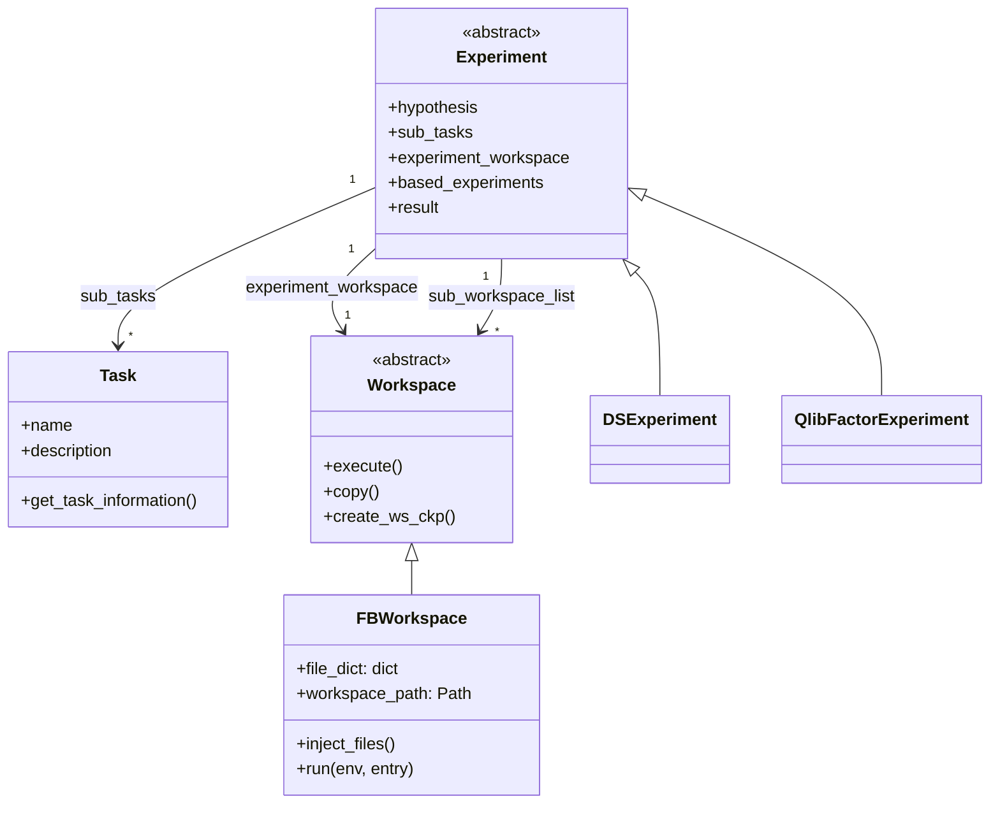

# Experiment, Workspace, and Task — the R&D loop's shared currency

<!-- connect:up:begin -->
> **Cross-repo concept:** part of [closed-loop-experiment-design](../../../concepts/closed-loop-experiment-design.md), [research-development-loop](../../../concepts/research-development-loop.md) across this wiki's repos.
<!-- connect:up:end -->
## Overview

`Experiment`, `Workspace`/`FBWorkspace`, and `Task` are the one object triangle every scenario in
RD-Agent (data science, Qlib quant, Kaggle, LLM fine-tuning, RL) reuses to represent "an idea plus its
implementation plus its result" as it moves through the Research→Development loop described in
[the RD-Agent paper](../../../sources/rd-agent.md). The key design idea is a deliberate split between
*what the code is* — a plain `dict[str, str]` of file contents (`file_dict`) that can be
deep-copied, pickled, and diffed cheaply — and *where it runs* — an ephemeral, disposable directory on
disk (`workspace_path`) that gets re-created from `file_dict` immediately before every execution. Every
concrete scenario (`DSExperiment`, `QlibFactorExperiment`, and others) is just this same triangle with
its three generic type parameters filled in differently, which is what lets one Research/Development
split serve very different domains without a rewrite.

## Diagram



## Design rationale (why it's built this way)

`FBWorkspace`'s own docstring lays out the intended lifecycle directly:

```python
def run_pipeline(self, **files: str):
    self.prepare()
    self.inject_files(**files)
    self.execute()
```

— [`FBWorkspace`](../catalog/rdagent/core/experiment.md#FBWorkspace) is documented as a "File-based task
workspace" whose implemented task is "a folder which contains related elements" (data, code, output).
The reason it keeps [`file_dict`](../catalog/rdagent/core/experiment.md#FBWorkspace.file_dict) as the
authoritative in-memory copy, rather than treating the on-disk folder as ground truth, is reproducibility
under mutation: [`run`](../catalog/rdagent/core/experiment.md#FBWorkspace.run) always calls
`prepare()` + [`inject_files`](../catalog/rdagent/core/experiment.md#FBWorkspace.inject_files) to
re-materialize `file_dict` onto a disk path before invoking the environment, so a `deepcopy`'d workspace
(used heavily by Co-STEER's fallback logic, see the evolving-framework page) is a *complete* snapshot —
copying `file_dict` is enough, nothing important lives only on disk.

`Experiment` is generic over three type parameters
(`ASpecificTask`, `ASpecificWSForExperiment`, `ASpecificWSForSubTasks`) precisely so the same
[`Experiment`](../catalog/rdagent/core/experiment.md#Experiment) class — "a sequence of tasks and the
implementations of the tasks after generated by the Developer" — can be specialized per scenario:
[`DSExperiment`](../catalog/rdagent/scenarios/data_science/experiment/experiment.md#DSExperiment) binds
all three parameters to `Task`/`FBWorkspace`/`FBWorkspace`, while
[`QlibFactorExperiment`](../catalog/rdagent/scenarios/qlib/experiment/factor_experiment.md#QlibFactorExperiment)
binds them to Qlib-specific workspace types. This is the code-level form of the paper's claim that the
Research/Development split is a *reusable interface*, not a one-off pipeline.

`Experiment.result` is a `@property` that reads/writes through a nested `RunningInfo` dataclass rather
than being a plain attribute — the source comments explain why: "only runner will assign this variable"
and "we will always create a new Experiment without copying previous results when we go to the next new
loop." In other words, `result` is deliberately *not* inherited across loop iterations; every new
`Experiment` starts with a clean result even when it reuses code from
[`based_experiments`](../catalog/rdagent/core/experiment.md#Experiment) (see
[`result`](../catalog/rdagent/core/experiment.md#Experiment.result)).

> [!inferred] `DSExperiment.__init__` eagerly creates a *single* shared
> [`FBWorkspace`](../catalog/rdagent/core/experiment.md#FBWorkspace) as
> [`experiment_workspace`](../catalog/rdagent/core/experiment.md#Experiment.experiment_workspace) even
> though the base `Experiment` class also supports one workspace *per sub-task*
> (`sub_workspace_list`). Reading `DSExperiment`'s body, this looks like a deliberate simplification for
> the data-science scenario specifically: instead of isolating each pipeline component (data loading,
> feature engineering, model, ensemble) in its own workspace, they all get folded into files inside one
> shared workspace, and a task is only "ready to run" once a `main.py` marker file exists in that shared
> `file_dict` — a naming convention enforced by scenario code, not by the type system.

## Entry points

- [`gen`](../catalog/rdagent/scenarios/data_science/proposal/exp_gen/proposal.md#DSProposalV2ExpGen.gen) —
  a concrete Research-phase generator that constructs a fresh
  [`DSExperiment`](../catalog/rdagent/scenarios/data_science/experiment/experiment.md#DSExperiment),
  attaching a hypothesis and a `pending_tasks_list`; this is where an `Experiment` object is first born
  in the loop.
- [`evolve_agent`](../catalog/rdagent/components/coder/CoSTEER/__init__.md#CoSTEER.evolve_agent) — the
  `RAGEvoAgent[EvolvingItem]` that Co-STEER hands the experiment's sub-tasks to; control passes here
  once Research has produced an `Experiment` and Development needs to fill in
  [`file_dict`](../catalog/rdagent/core/experiment.md#FBWorkspace.file_dict).
- [`evaluate`](../catalog/rdagent/scenarios/data_science/dev/runner/eval.md#DSRunnerEvaluator.evaluate) —
  representative of the many scenario-specific `Evaluator.evaluate` overrides; this is where
  `implementation.`[`run`](../catalog/rdagent/core/experiment.md#FBWorkspace.run) actually executes the
  workspace's code and turns stdout/exit-code into a feedback object.
- [`generate_feedback`](../catalog/rdagent/scenarios/kaggle/developer/feedback.md#KGExperiment2Feedback.generate_feedback) —
  where an executed `Experiment`'s
  [`result`](../catalog/rdagent/core/experiment.md#Experiment.result) is compared against
  `based_experiments` to produce the feedback that closes the loop back to the next Research step.
- [`_obj_to_json`](../catalog/rdagent/log/ui/storage.md#WebStorage._obj_to_json) — where
  `Experiment`/`FBWorkspace` state (hypothesis, tasks, files) gets serialized for RD-Agent's own web
  log viewer, i.e. the human-inspection surface for everything this page describes.

## Mechanism (step-by-step)

1. **An `Experiment` is proposed.** A concrete `ExpGen` such as
   [`gen`](../catalog/rdagent/scenarios/data_science/proposal/exp_gen/proposal.md#DSProposalV2ExpGen.gen)
   builds a [`DSExperiment`](../catalog/rdagent/scenarios/data_science/experiment/experiment.md#DSExperiment)
   carrying `sub_tasks` still to be implemented and a hypothesis inherited from the Research phase.
   Nothing about the object is executable yet — it is pure intent.

2. **Development fills in the workspace.** Co-STEER's
   [`evolve_agent`](../catalog/rdagent/components/coder/CoSTEER/__init__.md#CoSTEER.evolve_agent)
   iteratively mutates
   [`experiment_workspace`](../catalog/rdagent/core/experiment.md#Experiment.experiment_workspace)'s
   [`file_dict`](../catalog/rdagent/core/experiment.md#FBWorkspace.file_dict) across rounds (the
   evolving-framework page covers this loop in detail); each round calls
   [`inject_files`](../catalog/rdagent/core/experiment.md#FBWorkspace.inject_files), which both updates
   `file_dict` *and* writes the corresponding files to `workspace_path` — the in-memory and on-disk
   views never drift apart because every write goes through this one method.

3. **Execution always re-materializes before running.**
   [`run`](../catalog/rdagent/core/experiment.md#FBWorkspace.run) calls `prepare()` then
   `inject_files(**self.file_dict)` *again* before invoking `env.run(...)` — a defensive step that makes
   `run` idempotent regardless of what happened to the on-disk directory between calls (it could have
   been deleted, checkpointed, or restored elsewhere in the meantime).

4. **Evaluators turn execution into feedback.** Scenario-specific evaluators such as
   [`evaluate`](../catalog/rdagent/scenarios/data_science/dev/runner/eval.md#DSRunnerEvaluator.evaluate)
   and [`evaluate`](../catalog/rdagent/components/coder/data_science/pipeline/eval.md#PipelineCoSTEEREvaluator.evaluate)
   call `implementation.run`/`execute`, then feed extra artifacts back in via
   [`inject_files`](../catalog/rdagent/core/experiment.md#FBWorkspace.inject_files) (e.g. an `EDA.md`
   or `stdout.txt`) before producing a structured feedback object — the workspace keeps accumulating
   evidence about itself as it is evaluated, not just as it is coded.

5. **Feedback closes the loop.**
   [`generate_feedback`](../catalog/rdagent/scenarios/kaggle/developer/feedback.md#KGExperiment2Feedback.generate_feedback)
   reads the finished `Experiment`'s
   [`result`](../catalog/rdagent/core/experiment.md#Experiment.result) and its
   [`experiment_workspace`](../catalog/rdagent/core/experiment.md#Experiment.experiment_workspace),
   compares it against the prior SOTA in `based_experiments`, and returns an `ExperimentFeedback` — the
   artifact the proposal layer (see the proposal page) records against the trace for the *next*
   Research step.

6. **The whole object is what gets shown to a human.**
   [`_obj_to_json`](../catalog/rdagent/log/ui/storage.md#WebStorage._obj_to_json) serializes hypothesis
   text, task descriptions, and workspace file contents from these same objects into the log viewer's
   JSON feed — the `Experiment`/`Workspace`/`Task` triangle is simultaneously the runtime data model and
   the debugging surface.

## Key data structures

- [`file_dict`](../catalog/rdagent/core/experiment.md#FBWorkspace.file_dict) — the single source of
  truth for a workspace's code/config/output files; everything else (the on-disk `workspace_path`, what
  gets shown in logs, what gets checkpointed) is derived from it.
- [`experiment_workspace`](../catalog/rdagent/core/experiment.md#Experiment.experiment_workspace) /
  `sub_workspace_list` — the two places an `Experiment` can hold workspaces: one shared workspace for
  the whole experiment, or one per sub-task; which one a scenario actually uses is a scenario-level
  choice, not something the base class enforces.
- `based_experiments` — the lineage pointer to prior (typically SOTA) experiments a new one builds on;
  this is how change-diffing and comparison-based feedback (step 5 above) get a baseline without the
  `Trace` itself being involved.
- [`Task`](../catalog/rdagent/core/experiment.md#Task) — deliberately thin: a name, a description, and
  `get_task_information()`, a *string* used as the dictionary key for knowledge-base lookups
  (`success_task_to_knowledge_dict`, `failed_task_info_set` — see the evolving-framework page). Task
  identity for caching purposes is string equality on this description, not object identity.

## Dynamics (design intent)

Because `Workspace.copy()`/`FBWorkspace.copy()` is a `deepcopy`, and because `run()` always rebuilds the
on-disk directory from `file_dict` first, a workspace can be frozen (deep-copied), thrown away, or
resumed on a *different* underlying directory without losing anything that matters — the disk directory
under `workspace_path` (a fresh `uuid4().hex` per instance) is treated as disposable scratch space, never
as the durable record. This is what makes the Co-STEER "keep the best-so-far, roll back on regression"
pattern described on the evolving-framework page possible: a fallback copy of an `Experiment` is just a
`deepcopy()` away from being fully restorable.

## Edge cases

- [`inject_files`](../catalog/rdagent/core/experiment.md#FBWorkspace.inject_files) uses a sentinel
  string, `DEL_KEY = "__DEL__"`, as a file's *value* to mean "delete this file" rather than "write this
  content" — a value collision with that literal string (however unlikely) would be silently
  misinterpreted as a deletion instruction.
- `is_ready_to_run` on
  [`DSExperiment`](../catalog/rdagent/scenarios/data_science/experiment/experiment.md#DSExperiment)
  checks for the literal filename `"main.py"` inside `file_dict` — "ready" is a filename convention, not
  a property the type system can check, so a differently-named entry point would silently never be
  considered ready.
- `Experiment.__init__` defaults `based_experiments` to a mutable empty list (`Sequence[...] = []`) in
  the signature; every subclass constructor that doesn't explicitly pass `based_experiments` shares
  whatever caching behavior Python gives mutable default arguments unless callers are careful — worth
  double-checking if lineage ever appears to leak across unrelated experiments.

## Open questions

- The subgraph doesn't settle *when* `sub_results` (a separate `dict[str, float]` on `Experiment`) stops
  being written to — its own comment marks it `# TODO: in Kaggle, now sub results are all saved in
  self.result, remove this in the future`, so at least one scenario still has two overlapping ways to
  record partial results.
- Whether every scenario is expected to eventually converge on the "one shared `experiment_workspace`"
  pattern `DSExperiment` uses, versus the base class's per-sub-task `sub_workspace_list`, isn't decided
  anywhere visible in this packet — it currently reads as an open scenario-by-scenario choice.

## See also

- [Proposal: Hypothesis, Trace, and ExpGen](rdagent-core-proposal.md) — how the `hypothesis` field on
  `Experiment` gets produced, and how finished `(Experiment, ExperimentFeedback)` pairs are recorded.
- [The evolving framework](rdagent-core-evolving_framework.md) — how Co-STEER's `evolve_agent` actually
  fills in `experiment_workspace.file_dict` round by round.
- [Configuration](rdagent-core-conf.md) — `workspace_path` and other settings this page's objects read
  from `RD_AGENT_SETTINGS`.
- [RD-Agent paper summary](../../../sources/rd-agent.md) — the Research/Development split this data
  model implements in code.
- [`research-development-loop`](../../../concepts/research-development-loop.md),
  [`closed-loop-experiment-design`](../../../concepts/closed-loop-experiment-design.md) — cross-repo
  concept pages this page connects to.
