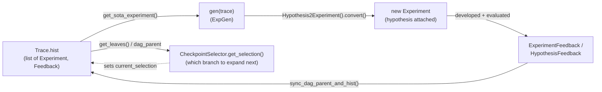

# Hypothesis, Trace, and ExpGen — the Research phase's proposal machinery

<!-- connect:up:begin -->
> **Cross-repo concept:** part of [closed-loop-experiment-design](../../../concepts/closed-loop-experiment-design.md), [research-development-loop](../../../concepts/research-development-loop.md) across this wiki's repos.
<!-- connect:up:end -->

## Overview

This is the Research half of RD-Agent's [Research→Development split](../../../sources/rd-agent.md):
`ExpGen.gen(trace)` is the one abstract call every scenario implements to turn a running history into
the next `Experiment`, and `Trace` is where that history actually lives — not as a flat list, but as a
DAG of `(Experiment, ExperimentFeedback)` node pairs with explicit parent links. The key design idea is
that `Trace` is simultaneously RD-Agent's **memory context** (FC-Memory-Context in the paper) and its
**exploration-path structure** (FC-Exploration-Path-Structuring): the same `hist`/`dag_parent` fields
that let a generator ask "what has been tried and did it work?" also let a scenario branch into multiple
parallel sub-traces and decide which branch to expand next, rather than being forced into one linear
chain of ideas.

## Diagram



## Design rationale (why it's built this way)

[`ExpGen`](../catalog/rdagent/core/proposal.md#ExpGen)'s own abstract
[`gen`](../catalog/rdagent/core/proposal.md#ExpGen.gen) docstring spells out the conceptual
decomposition directly, as an equivalence in code comments:

```python
# ExpGen().gen() ==
Hypothesis2Experiment().convert(
    HypothesisGen().gen(trace)
)
```

That is: proposing an experiment is *defined* as generating a `Hypothesis` from the trace, then
converting that hypothesis into a concrete `Experiment` — two separable concerns (what to try vs. how to
package it as tasks) that a scenario is free to fuse into one `gen()` override (as
[`gen`](../catalog/rdagent/scenarios/finetune/proposal/proposal.md#LLMFinetuneExpGen.gen) and
[`gen`](../catalog/rdagent/scenarios/rl/proposal/proposal.md#RLPostTrainingExpGen.gen) do) rather than
literally calling two objects.

[`Trace`](../catalog/rdagent/core/proposal.md#Trace) stores history as `hist: list[NodeType]` plus a
*parallel* `dag_parent: list[tuple[int, ...]]` rather than nesting nodes inside each other. The source
comments explain the payoff: "the sequence of hist and dag_parent is organized by the order to record
the experiment. So it may be different from the order of the loop_id" — under parallel execution,
experiments can *finish* (and get appended to `hist`) in a different order than they were *started*
(`loop_id`), so `Trace` keeps a separate `idx2loop_id` mapping rather than conflating array position with
temporal/logical order. `NEW_ROOT: tuple = ()` and `SEL_LATEST_SOTA: tuple = (-1,)` are deliberate
syntax-sugar sentinels for the two most common selections ("start a brand-new sub-trace" and "build on
whatever was recorded last") so most call sites never have to construct or reason about a real index.

> [!inferred] The comment "Multiple parent is not implemented yet" next to the `dag_parent` docstring
> (which explicitly documents a `(1, 2)`-style two-parent tuple as a valid *shape*) suggests `Trace` was
> designed with eventual experiment-merging (two branches recombining into one) in mind, but as read
> here it is currently a forest of trees, not a general DAG — every node in `hist` has at most one real
> parent today.

## Entry points

- [`gen`](../catalog/rdagent/core/proposal.md#ExpGen.gen) — the abstract Research-phase entry every
  scenario overrides; this is where a `Trace` turns into a new `Experiment`.
- [`async_gen`](../catalog/rdagent/core/proposal.md#ExpGen.async_gen) — the concurrency-aware wrapper the
  main loop actually calls; it polls `loop.get_unfinished_loop_cnt(...)` against the parallelism budget
  (see the config page) before invoking `gen`, so multiple `Trace` branches can be proposed without
  overrunning the configured parallel-loop limit.
- [`gen`](../catalog/rdagent/components/proposal/__init__.md#LLMHypothesisGen.gen) — a concrete,
  scenario-agnostic implementation of the "hypothesis first" half of the split described above.
- [`sync_dag_parent_and_hist`](../catalog/rdagent/core/proposal.md#Trace.sync_dag_parent_and_hist) —
  where a finished `(Experiment, ExperimentFeedback)` pair is actually written into the persistent trace,
  threading in the correct `dag_parent` entry for whatever selection was active when the experiment was
  created.
- [`get_sota_experiment`](../catalog/rdagent/core/proposal.md#Trace.get_sota_experiment) — where later
  Research/Development steps retrieve "the current best accepted experiment" to build the next
  hypothesis or comparison against, by walking ancestors backward from a selection point.

## Mechanism (step-by-step)

1. **The loop asks permission before proposing.**
   [`async_gen`](../catalog/rdagent/core/proposal.md#ExpGen.async_gen) loops on
   `loop.get_unfinished_loop_cnt(loop.loop_idx) < RD_AGENT_SETTINGS.get_max_parallel()`, sleeping until a
   slot frees up, then delegates to the scenario's
   [`gen`](../catalog/rdagent/core/proposal.md#ExpGen.gen). This is the mechanism that lets several
   `Trace` branches be explored concurrently without unboundedly forking work.

2. **`gen` reads the trace, not just its tail.** Concrete overrides pull context out of
   [`hist`](../catalog/rdagent/core/proposal.md#Trace.hist) rather than only the most recent node —
   [`_gen_hypothesis`](../catalog/rdagent/scenarios/finetune/proposal/proposal.md#LLMFinetuneExpGen._gen_hypothesis)
   looks up sibling experiments via `trace.get_children(parent_idx)` before prompting an LLM, and
   [`_build_trace_summary`](../catalog/rdagent/scenarios/rl/proposal/proposal.md#RLPostTrainingExpGen._build_trace_summary)
   explicitly summarizes `trace.`[`hist`](../catalog/rdagent/core/proposal.md#Trace.hist) into a prompt —
   the trace is memory context, read wholesale, not a single previous-result pointer.

3. **A `Hypothesis` becomes a concrete `Experiment`.** The conversion half of the split —
   [`convert`](../catalog/rdagent/components/proposal/__init__.md#LLMHypothesis2Experiment.convert) —
   takes the generated `Hypothesis` plus the `Trace` and returns a scenario-specific `Experiment`
   (`FactorExperiment`, `ModelExperiment`, etc. depending on scenario).

4. **The experiment runs, and its outcome is written back as a DAG edge.** Once an `Experiment` has been
   developed and evaluated (see the experiment page),
   [`sync_dag_parent_and_hist`](../catalog/rdagent/core/proposal.md#Trace.sync_dag_parent_and_hist)
   appends `(exp, feedback)` to `hist` and records the correct parent index in `dag_parent` —
   prioritizing the experiment's own `local_selection` if it carries one (needed for parallel multi-trace
   scenarios where the global `current_selection` may have already moved on to a different branch by the
   time this experiment's result comes back).

5. **Future steps ask the trace "what's SOTA?", not "what's last?".**
   [`get_sota_experiment`](../catalog/rdagent/core/proposal.md#Trace.get_sota_experiment) walks ancestors
   backward from a node (via `get_parents`) and returns the first one whose feedback
   `.decision` is `True` — an experiment can be *recorded* in `hist` and still lose to an earlier
   accepted ancestor when "current best" is asked for; recording and accepting are different concepts.

6. **Exploration-path structuring picks the next branch point.** Selector strategies such as
   [`get_selection`](../catalog/rdagent/scenarios/data_science/proposal/exp_gen/select/expand.md#LimitTimeCKPSelector.get_selection)
   — "Determine whether to continue with the current sub-trace or start a new one" — and
   [`get_selection`](../catalog/rdagent/scenarios/data_science/proposal/exp_gen/select/expand.md#SOTAJumpCKPSelector.get_selection)
   compute the `tuple[int, ...]` that becomes the trace's `current_selection`, i.e. *where in the tree*
   the next `gen()` call will attach its new node — this is the concrete implementation of
   FC-Exploration-Path-Structuring from [the paper](../../../sources/rd-agent.md).

## Key data structures

- [`Hypothesis`](../catalog/rdagent/core/proposal.md#Hypothesis) — deliberately plain: `hypothesis`,
  `reason`, and four `concise_*` summary fields, no behavior beyond `__str__`; its own docstring even
  flags the name as provisional ("TODO: We may have better name for it… Name Candidates: Belief").
  `DSHypothesis` (a documented subclass in-repo) adds a `component` field so a hypothesis can name which
  pipeline component it targets.
- [`hist`](../catalog/rdagent/core/proposal.md#Trace.hist) — the append-only list of
  `(Experiment, ExperimentFeedback)` tuples; this *is* the trace's memory, read by every `gen` override
  described above.
- [`Trace`](../catalog/rdagent/core/proposal.md#Trace)`.dag_parent` /
  `current_selection` — the tree structure and the "where are we now" cursor over it;
  [`DSTrace`](../catalog/rdagent/scenarios/data_science/proposal/exp_gen/base.md#DSTrace) extends this
  with `uncommitted_experiments` (loop-id-keyed, for experiments still in flight) and `get_leaves()` (the
  set of expandable frontier nodes), which is what lets a data-science run maintain several live
  sub-traces at once.
- [`HypothesisFeedback`](../catalog/rdagent/core/proposal.md#HypothesisFeedback) /
  [`ExperimentFeedback`](../catalog/rdagent/core/proposal.md#ExperimentFeedback) — the feedback object
  attached to each `hist` entry; `ExperimentFeedback.__bool__` returns `self.decision`, so feedback
  objects are directly truthy/falsy in the code that checks whether an experiment was accepted.

## Dynamics (design intent)

Parallelism here is explicit and layered on top of a fundamentally sequential-looking `hist` list:
[`async_gen`](../catalog/rdagent/core/proposal.md#ExpGen.async_gen) throttles how many `gen()` calls can
be outstanding at once via `RD_AGENT_SETTINGS.get_max_parallel()` (see the config page), while `Trace`
itself is built to tolerate results arriving out of the order they were started — the separate
`idx2loop_id` mapping and the `local_selection`-first logic in
[`sync_dag_parent_and_hist`](../catalog/rdagent/core/proposal.md#Trace.sync_dag_parent_and_hist) exist
specifically so a slower branch's result doesn't get attached to the wrong parent just because a faster,
later-started branch finished first.

## Edge cases

- `is_selection_new_tree` treats `selection == NEW_ROOT` **or** `len(self.dag_parent) == 0` as "this is a
  new tree" — meaning on a completely empty trace, *any* selection (even a stale `(-1,)`) is treated as a
  fresh root, which matters for the very first call in a run.
- `get_parents` special-cases `parent_tuple[0] == curr` (a node listed as its own parent) as a
  termination condition alongside an empty parent tuple — a defensive check against an accidental
  self-referential edge rather than something the DAG's writers are expected to produce intentionally.
- `SEL_LATEST_SOTA = (-1,)` is a *selection*, not an index — `get_sota_experiment`/`sync_dag_parent_and_hist`
  both have to explicitly translate `-1` into `len(self.hist) - 1` before using it (`get_parents`, by
  contrast, passes the index straight through and relies on Python's negative-indexing on `dag_parent`);
  code that forgets this translation and indexes `hist` directly with `-1` would happen to work in Python
  but for the wrong conceptual reason.

## Open questions

- The concrete branch-selection *policies* — what
  [`get_selection`](../catalog/rdagent/scenarios/data_science/proposal/exp_gen/select/expand.md#LimitTimeCKPSelector.get_selection)
  and
  [`get_selection`](../catalog/rdagent/scenarios/data_science/proposal/exp_gen/select/expand.md#BackJumpCKPSelector.get_selection)
  actually decide by name ("limit time", "back jump", "SOTA jump") beyond their docstrings — aren't in
  this packet's subgraph; this page can point at them as the place exploration-path strategy lives but
  can't ground their internal logic.
- Whether `Trace`'s documented-but-unimplemented multi-parent DAG shape (`(1, 2)`) is on a roadmap or
  abandoned isn't settled by anything visible here beyond the one inline comment.

## See also

- [Experiment, Workspace, and Task](rdagent-core-experiment.md) — what a `Trace` node's `Experiment` half
  actually contains, and how its `result`/`based_experiments` feed the feedback this page's `Trace`
  records.
- [The evolving framework](rdagent-core-evolving_framework.md) — the analogous, finer-grained
  propose→evaluate→feedback loop *inside* Development, once an `Experiment`'s tasks reach Co-STEER.
- [Configuration](rdagent-core-conf.md) — `RD_AGENT_SETTINGS.get_max_parallel()`, the knob `async_gen`
  reads to decide how many `Trace` branches can be proposed concurrently.
- [RD-Agent paper summary](../../../sources/rd-agent.md) — FC-Memory-Context and
  FC-Exploration-Path-Structuring, which `Trace` and its selectors implement.
- [`hypothesis-generation`](../../../concepts/hypothesis-generation.md),
  [`research-development-loop`](../../../concepts/research-development-loop.md),
  [`closed-loop-experiment-design`](../../../concepts/closed-loop-experiment-design.md),
  [`agentic-tree-search`](../../../concepts/agentic-tree-search.md) — cross-repo concept pages this page
  connects to.
