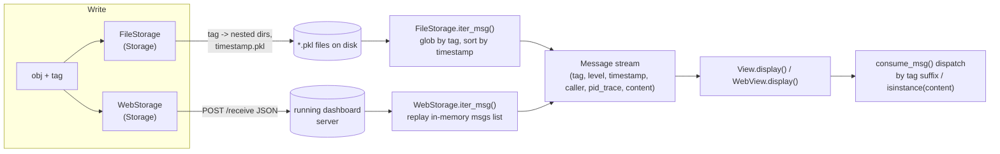

# Message, Storage, View: RD-Agent's tag-addressed event log

## Overview

Everything logged anywhere in RD-Agent — human-readable text, or an arbitrary Python object like a
hypothesis, a task list, a code workspace, or a results `DataFrame` — is normalized into one shape: a
[`Message`](../catalog/rdagent/log/base.md#Message) carrying a dotted namespace
([`tag`](../catalog/rdagent/log/base.md#Message.tag)), a timestamp, a process-lineage string, and the raw
payload ([`content`](../catalog/rdagent/log/base.md#Message.content)).
[`Storage`](../catalog/rdagent/log/base.md#Storage) is the abstract backend that can write and replay a
stream of these; `View` is the abstract consumer, exposed here through
[`display`](../catalog/rdagent/log/base.md#View.display). Two concrete backends live in this subgraph —
[`FileStorage`](../catalog/rdagent/log/storage.md#FileStorage) (one pickle file per message, with the tag
encoded as a directory path) and [`WebStorage`](../catalog/rdagent/log/ui/storage.md#WebStorage) (posts
JSON to a running dashboard server) — plus a long tail of consumers (Streamlit windows, summary scripts,
session loaders) all built on the same read primitive,
[`iter_msg`](../catalog/rdagent/log/base.md#Storage.iter_msg). This is neither content-addressed storage
(there is no hashing or dedup — two identical objects logged twice produce two files) nor a topic-based
pub/sub bus. It is closer to a flat, append-only event log addressed by a human-chosen path (the `tag`)
instead of a hash, which every consumer independently re-filters and re-interprets.

## Diagram

## Design rationale (why it's built this way)

`Storage`'s own docstring states the two-sided contract it has to satisfy:

> "The storage has mainly two kind of users: - The logging end... We can use it directly with the native
> logging storage / We can use it with other logging tools... - The view end: Mainly for the subclass of
> `logging.base.View`... It should provide two kind of ways to provide content - offline content provision.
> - online content preovision."

That two-sided contract is why [`content`](../catalog/rdagent/log/base.md#Message.content) is
typed as a bare `object` rather than a tagged union of known event kinds: the same storage carries
hypotheses, task lists, code workspaces, feedback objects, DataFrames, and even PIL images (`WebStorage`
saves PDF screenshots as JPGs when the tag contains `pdf_image`). The price of that generality is paid at
read time, not write time — every consumer has to recover "what kind of thing is this" itself. That is
exactly what the sprawling `isinstance(msg.content, ...)` / `msg.tag.endswith(...)` dispatch chains inside
[`consume_msg`](../catalog/rdagent/log/ui/web.md#SimpleTraceWindow.consume_msg) (and its siblings) do —
each window in the dashboard is really a small type-recovery routine for one slice of the content space.

The `tag` namespace does double duty as a lightweight index, not just a label. Because
[`FileStorage`](../catalog/rdagent/log/storage.md#FileStorage) turns `tag.replace(".", "/")` into an actual
directory path when writing, a consumer that only cares about one subtree can glob just that subtree
instead of scanning the whole log — `iter_msg(tag="sota_exp_to_submit")`, `iter_msg(tag="trace")`, and
`iter_msg(tag="record.trace")` (used by [`get_sota_exp_stat`](../catalog/rdagent/log/ui/utils.md#get_sota_exp_stat)
and [`summarize_win`](../catalog/rdagent/log/ui/ds_trace.md#summarize_win)) are all doing selective reads,
not full-trace scans. The directory structure *is* the query plan.

## Entry points

- [`iter_msg`](../catalog/rdagent/log/storage.md#FileStorage.iter_msg) (on `FileStorage`) and
  [`iter_msg`](../catalog/rdagent/log/ui/storage.md#WebStorage.iter_msg) (on `WebStorage`) — the two concrete
  overrides of the abstract [`iter_msg`](../catalog/rdagent/log/base.md#Storage.iter_msg) contract;
  this is where a caller turns a durable/live backend back into a `Message` stream.
- [`display`](../catalog/rdagent/log/ui/web.md#WebView.display) (on `WebView`) — the dashboard's fan-out
  point: it iterates a `Storage` and routes each message to the right window via
  [`consume_msg`](../catalog/rdagent/log/ui/web.md#StWindow.consume_msg).
- [`summarize_folder`](../catalog/rdagent/log/mle_summary.md#summarize_folder) and
  [`load_ft_session`](../catalog/rdagent/app/finetune/llm/ui/data_loader.md#load_ft_session) — consumers
  that bypass the `View`/dashboard layer entirely and call `iter_msg` directly to compute aggregate run
  statistics or reconstruct a hierarchical session structure; proof that `Storage` is a general read API,
  not just plumbing for the Streamlit UI.
- `read_trace` (in `rdagent.log.server.app` and `rdagent.log.server.debug_app`) — bridges the two concrete
  backends: it opens a [`FileStorage`](../catalog/rdagent/log/storage.md#FileStorage) over a persisted
  trace directory, drains it with `iter_msg`, and feeds each message through
  [`WebStorage`](../catalog/rdagent/log/ui/storage.md#WebStorage)'s JSON-translation logic to serve a *live*
  dashboard from *already-finished* runs — a direct demonstration that the two backends are interchangeable
  behind the same `Storage` contract.

## Mechanism (step-by-step)

1. Writing: given an object and a tag, [`FileStorage`](../catalog/rdagent/log/storage.md#FileStorage)
   builds a directory from the tag (`tag.replace(".", "/")`), creates it if missing, and pickles the object
   into a file named after a microsecond-precision timestamp; [`WebStorage`](../catalog/rdagent/log/ui/storage.md#WebStorage)
   instead POSTs a JSON translation of the object to a running server (and separately writes PDF-screenshot
   objects to a static image path). Both satisfy the same abstract write contract implied by `Storage`.
2. Reading is the abstract method that actually appears in this subgraph:
   [`iter_msg`](../catalog/rdagent/log/base.md#Storage.iter_msg) (on `Storage`) is declared
   `@abstractmethod` and its two overrides are recovered as `(virtual)` dispatch edges — meaning any code
   that holds a `Storage` reference (not knowing which concrete backend it is) can call `.iter_msg()` and
   get a `Message` generator either way.
3. [`iter_msg`](../catalog/rdagent/log/storage.md#FileStorage.iter_msg) (on `FileStorage`) globs `**/*.pkl` (or a
   tag-scoped subset), reconstructs each `Message`'s `tag` from the directory path and `pid_trace` from the
   immediate parent directory name, loads the pickle as `content`, and — critically — sorts the whole batch
   by timestamp before yielding. That sort is what gives every consumer a single, globally ordered view of
   events that were actually written by many concurrent loops/subprocesses in no particular file-creation
   order.
4. [`display`](../catalog/rdagent/log/ui/web.md#WebView.display) (on `WebView`) drives the dashboard's read
   side: it calls `iter_msg()` on whatever `Storage` it holds and, for each `Message`, dispatches to a
   [`consume_msg`](../catalog/rdagent/log/ui/web.md#StWindow.consume_msg) implementation chosen by tag
   suffix or `isinstance(msg.content, ...)`. List-valued content recurses through
   [`consume_msg`](../catalog/rdagent/log/ui/web.md#ObjectsTabsWindow.consume_msg) (on `ObjectsTabsWindow`), which
   re-wraps each list element as its own `Message` (copying `tag`/`level`/`timestamp`/`caller`/`pid_trace`
   from the parent) and hands it to a per-item window — so one logged list of, say, factor workspaces
   becomes one dashboard tab per workspace.
5. Several consumers skip the dashboard machinery and query `iter_msg` directly with a `tag` filter:
   [`get_sota_exp_stat`](../catalog/rdagent/log/ui/utils.md#get_sota_exp_stat) and
   [`get_score_stat`](../catalog/rdagent/log/ui/utils.md#get_score_stat) pull just the `sota_exp_to_submit`
   / `trace` subtree to compute run statistics offline, and
   [`load_ft_session`](../catalog/rdagent/app/finetune/llm/ui/data_loader.md#load_ft_session) rebuilds a
   hierarchical `Session`/`Loop`/`EvoLoop` structure entirely from the flat, tag-ordered `Message` stream —
   the tag namespace alone carries enough structure (loop id, evolving-round id, step name) to reconstruct
   the R&D loop's shape after the fact.

## Key data structures

- [`Message`](../catalog/rdagent/log/base.md#Message) — the atomic unit: `tag` (dotted namespace),
  `level`, `timestamp`, `caller` (module:function:line of the log call, when available), `pid_trace`
  (`"A-B-C"` process lineage — A forked B which forked C), and `content` (the raw logged object).
- `Storage.path` / `WebStorage.url` — each concrete backend's own addressing scheme; the `Message.tag` is
  the *logical* address, these are the *physical* one.
- The pid-named directory layer: `FileStorage` keys the immediate parent directory of each pickle by the
  writer's PID chain, which is what lets [`iter_msg`](../catalog/rdagent/log/storage.md#FileStorage.iter_msg)
  recover `pid_trace` purely from the filesystem layout.

## Dynamics (design intent)

Nothing in this subgraph performs write-side locking or coordination: concurrent writers (parallel loop
iterations, subprocesses spawned via `force_subproc`) each get their own PID-named subdirectory, so
cross-process collisions on the same tag are structurally avoided rather than locked against. Within a
single process, two messages logged under the same tag in the same microsecond would collide on filename —
the code relies on timestamp granularity, not an explicit uniqueness check, to keep files distinct.
[`WebStorage`](../catalog/rdagent/log/ui/storage.md#WebStorage) silently swallows connection failures
(catching `requests.ConnectionError`/`requests.Timeout` and printing rather than raising) — so if no
dashboard server is listening, the rest of the R&D loop is unaffected by the missing viewer; live viewing
is best-effort, not load-bearing.

## Edge cases

- [`iter_msg`](../catalog/rdagent/log/storage.md#FileStorage.iter_msg) (on `FileStorage`) always reconstructs
  `Message.caller` as an empty string — the original call-site attribution captured live by the text-log
  path (see [`rdagent-log-logger.md`](rdagent-log-logger.md)) is not persisted for pickled objects, so it
  cannot be recovered by replaying a `FileStorage` trace after the fact.
- The same method explicitly skips any file named `debug_llm.pkl` — some content is deliberately excluded
  from every replay, no matter which tag it lives under.
- [`consume_msg`](../catalog/rdagent/log/ui/web.md#ObjectsTabsWindow.consume_msg) (on `ObjectsTabsWindow`) asserts
  that, when explicit tab names are supplied, their count must equal `len(msg.content)` — a mismatched
  list-content message raises rather than silently truncating or padding.
- [`consume_msg`](../catalog/rdagent/log/ui/web.md#TraceObjWindow.consume_msg) (on `TraceObjWindow`) accepts either
  a `Message` or a bare `Trace` object and uses
  [`mock_msg`](../catalog/rdagent/log/ui/web.md#mock_msg) to wrap raw history entries (hypothesis,
  experiment, feedback triples pulled straight from `trace.hist`) as synthetic `Message`s before handing
  them to child windows — a reminder that not everything flowing through `consume_msg` actually came from a
  `Storage` read.

## Open questions

- There is no garbage collection beyond `Storage.truncate(time)` (discard everything after a given
  timestamp, used around session checkout/resume); nothing in this subgraph shows a retention or
  compaction policy for long-running traces that accumulate many small pickle files.
- The exact interaction between `truncate` and a resumed `LoopBase.load(..., checkout=...)` session is only
  hinted at by the docstrings visible here, not shown end to end in this packet.

## See also

- [`rdagent-log.md`](rdagent-log.md) — the `rdagent_logger` facade that is the only writer most of the
  codebase ever calls.
- [`rdagent-log-logger.md`](rdagent-log-logger.md) — how tags are composed before they ever reach
  `Storage.log`.
- [`rdagent-log-timer.md`](rdagent-log-timer.md) — the sibling singleton whose state is logged the same way.
- [`../../../sources/rd-agent.md`](../../../sources/rd-agent.md) — the paper this repo implements.
