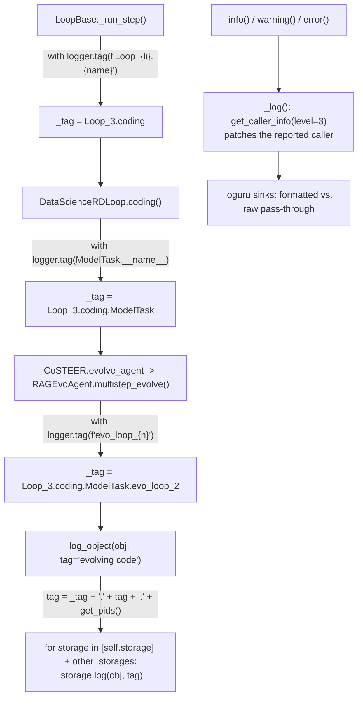

# RDAgentLog: tag-scoped structured logging for a concurrent R&D loop

## Overview

`RDAgentLog` is the concrete class behind the [`rdagent_logger`](rdagent-log.md) singleton, and it exposes
exactly four verbs: [`info`](../catalog/rdagent/log/logger.md#RDAgentLog.info),
[`warning`](../catalog/rdagent/log/logger.md#RDAgentLog.warning), and
[`error`](../catalog/rdagent/log/logger.md#RDAgentLog.error) (human narration through `loguru`), plus
[`log_object`](../catalog/rdagent/log/logger.md#RDAgentLog.log_object) (structured, replayable data handed
to `Storage`). The four verbs are simple; what makes this page worth writing is *how* dozens of unrelated
call sites — an experiment-generation strategy, a Co-STEER evolving round, an LLM chat session, a workflow
step — each get their messages filed under a distinct, nested namespace without ever passing a namespace
parameter explicitly. That namespace is built fresh on every call from two ingredients: a `ContextVar`-based
tag stack that callers push onto with `with logger.tag(...)`, and a process-id chain that disambiguates
concurrent writers. Both `Storage` overrides in [`rdagent-log-base.md`](rdagent-log-base.md) end up turning
this composed namespace directly into a filesystem path.

## Diagram

## Design rationale (why it's built this way)

The tag stack has to survive concurrency that a plain instance attribute couldn't. The workflow engine runs
several loop iterations at once as `asyncio` tasks, and individual steps can additionally be offloaded to a
`ProcessPoolExecutor` (`_run_step`'s `force_subproc` option). A mutable instance attribute would leak tag
state between concurrently-running loops; a `ContextVar` instead gives each `asyncio` task — and, per the
class's own docstring, each forked subprocess — its own independent tag stack. That is why
[`_run_step`](../catalog/rdagent/utils/workflow/loop.md#LoopBase._run_step) can safely open a
`Loop_{li}.{step_name}` scope around a step that might run in a different OS process without any of its
sibling loop iterations' messages bleeding into it.

The split between the text verbs and `log_object` is about audience and lifetime, not importance: `info`/
`warning`/`error` are for a human watching stdout *right now*, while `log_object` is for durable, structured
records read back later by the `Storage.iter_msg` consumers on the
[`rdagent-log-base.md`](rdagent-log-base.md) page. Yet both paths compose the *exact same* namespace
formula — `f"{self._tag}.{tag}.{self.get_pids()}"` — so a narration line and a structured object logged
inside the same `with logger.tag(...)` scope land under the same tag prefix and can be correlated later.

Two more small but load-bearing choices live inside [`info`](../catalog/rdagent/log/logger.md#RDAgentLog.info)/
[`warning`](../catalog/rdagent/log/logger.md#RDAgentLog.warning)/[`error`](../catalog/rdagent/log/logger.md#RDAgentLog.error):
each delegates to a private `_log` that walks the call stack three frames up before recording the "caller"
attribution, so console output shows the *user's* call site (e.g.
`rdagent.oai.backend.base:build_messages_and_create_chat_completion:455`) rather than `_log`'s own location
inside `logger.py`; and each accepts a `raw` flag that routes the message to a second `loguru` sink
registered with `format="{message}"`, bypassing the normal `timestamp | level | caller` formatting entirely
— for printing already-formatted text (e.g. colored progress banners) verbatim.

> [!inferred] Across the call sites in this subgraph, `info` is called roughly five times as often as
> `warning` and roughly six times as often as `error` (by call-site count). That skew reads as a convention:
> `warning` is reserved for recoverable control-flow deviations the loop routes around itself (timeouts,
> `skip_loop_error`, retries), and `error` for conditions the caller does not attempt to handle inline.

## Entry points

- [`_run_step`](../catalog/rdagent/utils/workflow/loop.md#LoopBase._run_step) — opens the outermost,
  per-step tag scope (`Loop_{li}.{step_name}`) that every other call site's messages nest inside for the
  duration of one workflow step.
- [`multistep_evolve`](../catalog/rdagent/core/evolving_agent.md#RAGEvoAgent.multistep_evolve) — opens an
  `evo_loop_{n}` scope per Co-STEER evolving round, nested inside whatever step scope `_run_step` already
  opened.
- [`coding`](../catalog/rdagent/scenarios/data_science/loop.md#DataScienceRDLoop.coding) — opens a scope
  keyed by the pending task's class name (e.g. `ModelTask`), so a single `coding` step's messages are still
  separable by which sub-component (data loader, feature, model, ensemble, workflow, pipeline) produced
  them.
- [`build_chat_completion`](../catalog/rdagent/oai/backend/base.md#ChatSession.build_chat_completion) —
  opens a `session_{conversation_id}` scope, independent of the loop/step scopes above, for a standalone
  multi-turn chat session.
- [`build_cls_from_json_with_retry`](../catalog/rdagent/utils/agent/workflow.md#build_cls_from_json_with_retry)
  — a representative retry-driven call site: it calls
  [`warning`](../catalog/rdagent/log/logger.md#RDAgentLog.warning) on each failed parse/validation attempt
  and [`log_object`](../catalog/rdagent/log/logger.md#RDAgentLog.log_object) is reached via the completion
  call it retries, so a replayed trace preserves every attempt, not just the one that stuck.

## Mechanism (step-by-step)

1. Any call site reaches one of the four verbs on the shared singleton (established in
   [`rdagent-log.md`](rdagent-log.md)). The text verbs
   ([`info`](../catalog/rdagent/log/logger.md#RDAgentLog.info),
   [`warning`](../catalog/rdagent/log/logger.md#RDAgentLog.warning),
   [`error`](../catalog/rdagent/log/logger.md#RDAgentLog.error)) and
   [`log_object`](../catalog/rdagent/log/logger.md#RDAgentLog.log_object) both compose the same tag formula
   before doing anything backend-specific.
2. The text path additionally rewrites the reported call-site three frames up the stack and chooses between
   the formatted `loguru` sink and the raw pass-through sink depending on the `raw` flag — described above
   and grounded in [`info`](../catalog/rdagent/log/logger.md#RDAgentLog.info)/
   [`warning`](../catalog/rdagent/log/logger.md#RDAgentLog.warning)/
   [`error`](../catalog/rdagent/log/logger.md#RDAgentLog.error)'s own bodies.
3. The structured path, [`log_object`](../catalog/rdagent/log/logger.md#RDAgentLog.log_object), loops over
   `[self.storage] + self.other_storages` and calls `.log(obj, tag=...)` on each — one call durably records
   to every configured backend (`FileStorage` always; `WebStorage` too, whenever a dashboard port is
   configured) without the caller needing to know how many backends exist or which ones.
4. Tag scopes nest at natural loop boundaries, confirmed at four real call sites:
   [`_run_step`](../catalog/rdagent/utils/workflow/loop.md#LoopBase._run_step) opens `Loop_{li}.{step_name}`
   at the top of every step; nested inside it, for coding steps specifically,
   [`coding`](../catalog/rdagent/scenarios/data_science/loop.md#DataScienceRDLoop.coding) opens a further
   scope keyed by the pending task's class name; nested inside *that* (for evolvable components),
   [`multistep_evolve`](../catalog/rdagent/core/evolving_agent.md#RAGEvoAgent.multistep_evolve) opens
   `evo_loop_{n}` per round. A fourth, independent scope,
   [`build_chat_completion`](../catalog/rdagent/oai/backend/base.md#ChatSession.build_chat_completion)'s
   `session_{conversation_id}`, exists for LLM chat sessions outside the loop/step hierarchy entirely.
5. Because the tag stack is a `ContextVar` rather than an instance attribute, concurrently-running
   `asyncio` tasks (parallel loop iterations under
   [`run`](../catalog/rdagent/utils/workflow/loop.md#LoopBase.run)) and steps dispatched into a
   `ProcessPoolExecutor` via [`_run_step`](../catalog/rdagent/utils/workflow/loop.md#LoopBase._run_step)'s
   `force_subproc` path each see their own, independently-nested tag stack — nesting composes correctly even
   when the step happens to execute in a different OS process.
6. Retry-driven call sites, such as
   [`build_cls_from_json_with_retry`](../catalog/rdagent/utils/agent/workflow.md#build_cls_from_json_with_retry)
   and [`hypothesis_gen`](../catalog/rdagent/scenarios/data_science/proposal/exp_gen/proposal.md#DSProposalV2ExpGen.hypothesis_gen)/
   [`hypothesis_rewrite`](../catalog/rdagent/scenarios/data_science/proposal/exp_gen/proposal.md#DSProposalV2ExpGen.hypothesis_rewrite)
   (both `@wait_retry`-wrapped), call `warning` on each failed attempt and reach `log_object` again on
   success — every attempt gets its own timestamped message under the same tag scope, so a replayed trace
   shows every failed attempt, not just the one that stuck.

## Key data structures

The only state this class adds beyond what [`rdagent-log-base.md`](rdagent-log-base.md) already covers
(`self.storage` / `self.other_storages`) is the composed-tag formula itself:
`f"{self._tag}.{tag}.{self.get_pids()}"`, where `self._tag` is the current value of the `ContextVar`-backed
tag stack and `get_pids()` renders the process-id chain from the current process back to the main process
as a `-`-joined string. That formula is the single mechanism both `info`/`warning`/`error` and `log_object`
share.

## Dynamics (design intent)

`ContextVar` semantics mean tag scopes are correctly isolated across concurrently-scheduled `asyncio` tasks
and are copied (not shared) into forked subprocesses, per the class's own docstring — a scope opened in a
parent process before a fork is still visible to the child, but subsequent mutations in either do not cross
back. The raw-mode bypass (`.opt(raw=raw)` routed to a `format="{message}"` sink) exists purely for console
ergonomics and has no bearing on what gets recorded to `Storage` — `log_object`'s fan-out is unaffected by
whether the text-log path is in raw or formatted mode.

## Edge cases

- If a call site logs without first opening a `with logger.tag(...)` scope, its messages are filed under
  whatever tag happens to be ambient (possibly empty) rather than raising — under-scoping is silent, not an
  error.
- Retried LLM calls (via `@wait_retry`-wrapped methods or
  [`build_cls_from_json_with_retry`](../catalog/rdagent/utils/agent/workflow.md#build_cls_from_json_with_retry))
  leave one message per attempt under the same base tag; nothing in the tag itself marks which attempt was
  the one ultimately accepted — a reader has to correlate against the downstream result/feedback object to
  tell them apart.

## Open questions

- OS process-id reuse across separate process lifetimes could, in principle, alias two unrelated runs' pid
  chains into the same directory name; this cannot be confirmed or ruled out from static reading alone.
- Whether a failing `other_storages` backend (dynamically loaded per `LOG_SETTINGS.storages`) can abort the
  rest of a `log_object` fan-out, or whether backends are isolated from one another's failures, is not shown
  in this packet's subgraph.

## See also

- [`rdagent-log.md`](rdagent-log.md) — the singleton facade every call site here reaches through.
- [`rdagent-log-base.md`](rdagent-log-base.md) — the `Message`/`Storage` schema `log_object` writes into.
- [`rdagent-log-timer.md`](rdagent-log-timer.md) — the sibling singleton built the same
  `SingletonBaseClass` way.
- [`../../../concepts/research-development-loop.md`](../../../concepts/research-development-loop.md) — the
  Research/Development phases whose step and evolving-round boundaries define the tag scopes above.
