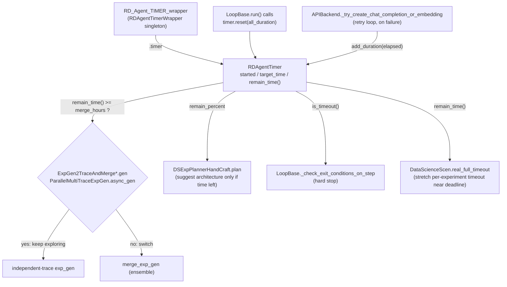

# RDAgentTimer: the wall-clock budget behind explore-early, exploit-late planning

## Overview

[`RDAgentTimer`](../catalog/rdagent/log/timer.md#RDAgentTimer) is a minimal countdown clock — `started`,
`target_time`, [`remain_time`](../catalog/rdagent/log/timer.md#RDAgentTimer.remain_time)(),
[`is_timeout`](../catalog/rdagent/log/timer.md#RDAgentTimer.is_timeout)() — wrapped in a second process-wide
singleton, [`RDAgentTimerWrapper`](../catalog/rdagent/log/timer.md#RDAgentTimerWrapper) (the module instance
[`RD_Agent_TIMER_wrapper`](../catalog/rdagent/log/timer.md#RD_Agent_TIMER_wrapper.RD_Agent_TIMER_wrapper)),
so any code anywhere can ask "how much wall-clock budget is left?" without the timer being threaded through
as a parameter. The clock itself is unremarkable; what makes it worth a dedicated page is *where* its output
gets read. Three different experiment-generation strategies and a multi-trace router all compare
`remain_time()` against a `merge_hours` threshold, on every single proposal call, to decide whether to keep
branching independent exploration traces or switch to a merge/ensemble generator. That comparison, evaluated
fresh at every iteration rather than following a fixed schedule, *is* the mechanism behind the paper's
"explore early, exploit late" planning described in [`wiki/sources/rd-agent.md`](../../../sources/rd-agent.md).

## Diagram

## Design rationale (why it's built this way)

The timer is a global singleton for the same reason [`rdagent_logger`](rdagent-log.md) is: both
[`RDAgentTimerWrapper`](../catalog/rdagent/log/timer.md#RDAgentTimerWrapper) and
[`RDAgentLog`](../catalog/rdagent/log/logger.md#RDAgentLog) subclass the same
[`SingletonBaseClass`](../catalog/rdagent/core/utils.md#SingletonBaseClass), so deeply nested Research-side
code — [`hypothesis_select_with_llm`](../catalog/rdagent/scenarios/data_science/proposal/exp_gen/proposal.md#DSProposalV2ExpGen.hypothesis_select_with_llm),
[`real_full_timeout`](../catalog/rdagent/scenarios/data_science/scen/__init__.md#DataScienceScen.real_full_timeout),
[`plan`](../catalog/rdagent/scenarios/data_science/proposal/exp_gen/planner/__init__.md#DSExpPlannerHandCraft.plan)
— can reach either the shared clock or the shared logger without either being passed down as a constructor
argument. [`remain_time`](../catalog/rdagent/log/timer.md#RDAgentTimer.remain_time)() does not track time
continuously; it recomputes on demand by subtracting `datetime.now()` from a `target_time` fixed once at
[`reset`](../catalog/rdagent/log/timer.md#RDAgentTimer.reset) — no background ticker thread, no
synchronization beyond ordinary attribute reads, safe to call from any of the many read sites below.

The single most interesting decision in this subgraph is that a *failed* LLM call does not cost the R&D
loop any of its budget. Inside
[`_try_create_chat_completion_or_embedding`](../catalog/rdagent/oai/backend/base.md#APIBackend._try_create_chat_completion_or_embedding)'s
retry loop, when an attempt raises (rate limit, timeout, transient API error), the code sleeps the
recommended backoff and then — only if the timer has
[`started`](../catalog/rdagent/log/timer.md#RDAgentTimer.started) — calls
[`add_duration`](../catalog/rdagent/log/timer.md#RDAgentTimer.add_duration) with exactly the elapsed time of
that failed attempt, pushing `target_time` forward by the same amount. The "explore early, exploit late"
clock therefore measures real R&D progress, not wall-clock time lost to a flaky provider — a run that hits a
string of rate limits does not get starved of its actual planning budget because of it.

Session resumption is the other place the singleton indirection pays off:
`RDAgentTimerWrapper`'s [`replace_timer`](../catalog/rdagent/log/timer.md#RDAgentTimerWrapper.replace_timer)
swaps the *entire* `RDAgentTimer` object wholesale, and `LoopBase`'s own
[`load`](../catalog/rdagent/utils/workflow/loop.md#LoopBase.load) exposes a `replace_timer: bool` parameter
(default `True`) that lets a caller choose between resuming the checkpointed countdown or starting the
current process's timer fresh instead — useful if a session is being restarted with a deliberately renewed
budget rather than continued.

## Entry points

- [`async_gen`](../catalog/rdagent/scenarios/data_science/proposal/exp_gen/router/__init__.md#ParallelMultiTraceExpGen.async_gen)
  — reads `remain_time()` at the top of its parent-selection loop to decide between the trace scheduler
  (exploration) and a leaf-based fallback selection once the budget is tight.
- [`gen`](../catalog/rdagent/scenarios/data_science/proposal/exp_gen/merge.md#ExpGen2TraceAndMergeV2.gen) /
  [`gen`](../catalog/rdagent/scenarios/data_science/proposal/exp_gen/merge.md#ExpGen2TraceAndMergeV3.gen) /
  [`gen`](../catalog/rdagent/scenarios/data_science/proposal/exp_gen/merge.md#ExpGen2TraceAndMerge.gen) —
  three merge-strategy variants that each gate on `timer.remain_time() >= timedelta(hours=merge_hours)`
  before choosing between independent exploration and the merge/ensemble generator.
- [`plan`](../catalog/rdagent/scenarios/data_science/proposal/exp_gen/planner/__init__.md#DSExpPlannerHandCraft.plan)
  — reads `remain_percent` (`remain_time() / all_duration`) to decide whether it is still early enough in
  the budget to suggest a model-architecture change.
- [`_check_exit_conditions_on_step`](../catalog/rdagent/utils/workflow/loop.md#LoopBase._check_exit_conditions_on_step)
  — the hard stop: raises a loop-termination error once
  [`is_timeout`](../catalog/rdagent/log/timer.md#RDAgentTimer.is_timeout)() is true, independent of the
  softer `merge_hours` gating above.
- [`real_full_timeout`](../catalog/rdagent/scenarios/data_science/scen/__init__.md#DataScienceScen.real_full_timeout)
  — the same clock read in the opposite direction: it *lengthens* an individual experiment's own runner
  timeout as the overall remaining budget shrinks relative to a configured ratio.

## Mechanism (step-by-step)

1. [`run`](../catalog/rdagent/utils/workflow/loop.md#LoopBase.run) initializes the clock exactly once, when
   a caller supplies `all_duration` and the timer has not already
   [`started`](../catalog/rdagent/log/timer.md#RDAgentTimer.started): it calls
   [`reset`](../catalog/rdagent/log/timer.md#RDAgentTimer.reset), which parses a duration string (`"12h"`,
   `"3d"`, plain seconds) or accepts a `timedelta` directly, sets `target_time = now + duration`, and flips
   `started = True`.
2. Every later read goes through [`remain_time`](../catalog/rdagent/log/timer.md#RDAgentTimer.remain_time)(),
   which — only if `started` — recomputes `_remain_time_duration` via
   [`update_remain_time`](../catalog/rdagent/log/timer.md#RDAgentTimer.update_remain_time) and returns it;
   if never started, it returns `None`. Call sites like
   [`plan`](../catalog/rdagent/scenarios/data_science/proposal/exp_gen/planner/__init__.md#DSExpPlannerHandCraft.plan)
   explicitly guard on `.started` (falling back to `remain_percent = 1.0`, i.e. treat the budget as fully
   available) so "no duration configured" degrades cleanly instead of crashing.
3. The merge-strategy [`gen`](../catalog/rdagent/scenarios/data_science/proposal/exp_gen/merge.md#ExpGen2TraceAndMergeV2.gen)
   methods each hold their own local reference to
   [`RD_Agent_TIMER_wrapper`](../catalog/rdagent/log/timer.md#RD_Agent_TIMER_wrapper.RD_Agent_TIMER_wrapper)'s
   [`timer`](../catalog/rdagent/log/timer.md#RDAgentTimerWrapper.timer) and log the remaining time before
   making their explore-vs-merge branch decision — so every proposal call leaves a remain-time breadcrumb
   tying this mechanism directly back to the tag-scoped record described in
   [`rdagent-log-logger.md`](rdagent-log-logger.md).
4. On a failed LLM call,
   [`_try_create_chat_completion_or_embedding`](../catalog/rdagent/oai/backend/base.md#APIBackend._try_create_chat_completion_or_embedding)
   calls [`add_duration`](../catalog/rdagent/log/timer.md#RDAgentTimer.add_duration) with the elapsed attempt
   time, but only when [`started`](../catalog/rdagent/log/timer.md#RDAgentTimer.started) is true — making
   this rebate mechanism a no-op for runs with no configured budget (e.g. local development without
   `--all_duration`).
5. Independent of all the above, [`_check_exit_conditions_on_step`](../catalog/rdagent/utils/workflow/loop.md#LoopBase._check_exit_conditions_on_step)
   checks `self.timer.started` then `self.timer.is_timeout()` at the end of every step and raises a
   termination error if it fires — a hard stop that fires even if a merge strategy upstream had (incorrectly)
   decided to keep exploring.
6. Session checkpointing round-trips the clock:
   [`dump`](../catalog/rdagent/utils/workflow/loop.md#LoopBase.dump) calls
   [`update_remain_time`](../catalog/rdagent/log/timer.md#RDAgentTimer.update_remain_time) immediately
   before pickling `self`, so the persisted remaining-time reflects the checkpoint moment rather than a
   stale value from whenever `reset` last ran; [`load`](../catalog/rdagent/utils/workflow/loop.md#LoopBase.load)'s
   `replace_timer` flag then decides whether the reloaded
   [`timer`](../catalog/rdagent/utils/workflow/loop.md#LoopBase.timer) attribute keeps counting down from
   that checkpoint or is swapped for a fresh one.

## Key data structures

[`RDAgentTimer`](../catalog/rdagent/log/timer.md#RDAgentTimer) holds four fields:
[`started`](../catalog/rdagent/log/timer.md#RDAgentTimer.started) (a plain bool),
[`target_time`](../catalog/rdagent/log/timer.md#RDAgentTimer.target_time) (the fixed instant the countdown
expires), `all_duration` (the originally configured budget, used to compute `remain_percent` at several read
sites), and [`_remain_time_duration`](../catalog/rdagent/log/timer.md#RDAgentTimer._remain_time_duration)
(the last-computed cache, refreshed by `update_remain_time`). More than one module keeps its own convenience
alias to the same shared clock rather than calling through the wrapper each time — e.g.
[`global_timer`](../catalog/rdagent/scenarios/data_science/proposal/exp_gen/select/expand.md#LimitTimeCKPSelector.global_timer)
in the checkpoint-selection code points at the identical
[`RD_Agent_TIMER_wrapper`](../catalog/rdagent/log/timer.md#RD_Agent_TIMER_wrapper.RD_Agent_TIMER_wrapper).`timer`
instance.

## Dynamics (design intent)

[`log_workflow_state`](../catalog/rdagent/utils/workflow/tracking.md#WorkflowTracker.log_workflow_state)
periodically mirrors `remain_time()`/`remain_percent` (and, separately,
`RD_Agent_TIMER_wrapper.api_fail_count` / `latest_api_fail_time`, incremented on the same failure path that
triggers `add_duration`) into MLflow when enabled — so the timer's state is observable outside the trace
log too, on the same cadence as the workflow step boundary. Nothing in this subgraph shows the timer being
read or written from more than one *logical* place at a time (all consumers read through the same
`RD_Agent_TIMER_wrapper.timer` reference), so the "dynamics" here are about read frequency and staleness,
not lock contention: `remain_time()` always recomputes from `datetime.now()`, so no reader can observe a
value staler than its own call.

## Edge cases

- `remain_time()` before [`reset`](../catalog/rdagent/log/timer.md#RDAgentTimer.reset) has ever run returns
  `None`, not zero or a negative `timedelta` — callers must check `.started` or handle `None` explicitly;
  most of the entry points above only run after `run()` has already configured `all_duration`, but
  `plan`'s explicit `if timer.started else 1.0` shows the guard is not automatic.
- [`restart_by_remain_time`](../catalog/rdagent/log/timer.md#RDAgentTimer.restart_by_remain_time) only works
  if `_remain_time_duration` was already populated by a prior `remain_time()`/`update_remain_time()` call;
  invoked cold, it logs a warning ("No remaining time to restart the timer.") and does nothing rather than
  raising.

## Open questions

> [!inferred] Nothing visible in this subgraph bounds how many times
> [`add_duration`](../catalog/rdagent/log/timer.md#RDAgentTimer.add_duration) can push `target_time` forward
> over the life of a run. A pathological stretch of repeated API failures would, by this mechanism, extend
> the deadline indefinitely rather than eventually forcing a hard stop — this reads as a plausible edge case
> rather than a confirmed bug, since it was not exercised in anything read here.
- `all_duration` itself is never listed as a subgraph term even though `remain_percent` computations at
  several entry points divide by it; its exact mutability contract beyond what `reset` sets is not grounded
  in this packet.

## See also

- [`rdagent-log.md`](rdagent-log.md) — the sibling singleton (`rdagent_logger`) built the same
  `SingletonBaseClass` way, and the destination of the remain-time breadcrumbs mentioned above.
- [`rdagent-log-logger.md`](rdagent-log-logger.md) — how those breadcrumbs get tag-scoped and persisted.
- [`../../../sources/rd-agent.md`](../../../sources/rd-agent.md) — the paper's "explore early, exploit late"
  planning description this timer implements.
- [`../../../concepts/research-development-loop.md`](../../../concepts/research-development-loop.md) — the
  FC-Planning component this clock is read from.
- [`../../../concepts/closed-loop-experiment-design.md`](../../../concepts/closed-loop-experiment-design.md)
  — the feedback loop whose pacing this budget gates.
