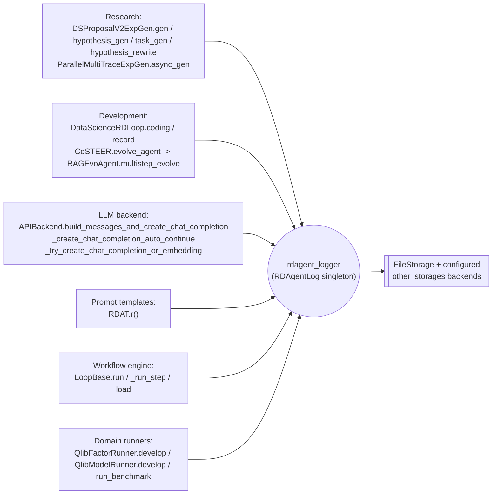

# rdagent.log: the shared facade every stage of the R&D loop writes through

## Overview

`rdagent/log/__init__.py` is four lines long, and that is the point: it constructs one process-wide
object, [`rdagent_logger`](../catalog/rdagent/log/__init__.md#rdagent_logger.rdagent_logger), and every
other module in the repo imports that same instance (`from rdagent.log import rdagent_logger as logger`)
rather than instantiating its own logger. The "logging package," in other words, is not a set of
call-and-forget utility functions — it is a hub node in the import graph. Pulling the symbol subgraph for
this packet reads like a cross-section of the entire industrial R&D loop: Research-side proposal
generation ([`hypothesis_gen`](../catalog/rdagent/scenarios/data_science/proposal/exp_gen/proposal.md#DSProposalV2ExpGen.hypothesis_gen),
[`task_gen`](../catalog/rdagent/scenarios/data_science/proposal/exp_gen/proposal.md#DSProposalV2ExpGen.task_gen),
[`hypothesis_rewrite`](../catalog/rdagent/scenarios/data_science/proposal/exp_gen/proposal.md#DSProposalV2ExpGen.hypothesis_rewrite)),
Development-side coding and evolution
([`coding`](../catalog/rdagent/scenarios/data_science/loop.md#DataScienceRDLoop.coding),
[`evolve_agent`](../catalog/rdagent/components/coder/CoSTEER/__init__.md#CoSTEER.evolve_agent),
[`multistep_evolve`](../catalog/rdagent/core/evolving_agent.md#RAGEvoAgent.multistep_evolve)), the LLM
backend itself
([`build_messages_and_create_chat_completion`](../catalog/rdagent/oai/backend/base.md#APIBackend.build_messages_and_create_chat_completion)),
and the async workflow engine that drives all of it
([`run`](../catalog/rdagent/utils/workflow/loop.md#LoopBase.run),
[`_run_step`](../catalog/rdagent/utils/workflow/loop.md#LoopBase._run_step)) — all funnel through this one
singleton. Understanding this packet is less about tracing a call chain and more about recognizing that
*everything interesting the R&D loop does eventually calls this object*.

## Diagram

## Design rationale (why it's built this way)

A framework this size cannot afford dependency-injecting a logger through every constructor — CoSTEER
evaluators, exp-gen strategies, LLM backends, and domain runners across Qlib/data-science/finetune/RL
scenarios would all need a `logger` parameter threaded in, multiplying signatures for no benefit. A
module-level singleton built at import time sidesteps that entirely: any file writes
`from rdagent.log import rdagent_logger as logger` and immediately holds the same object every other
module holds. The cost of that convenience is that logging becomes a piece of *global* state (see
[`rdagent-log-logger.md`](rdagent-log-logger.md) for how tag scoping keeps that safe across concurrent
loops and forked subprocesses).

One consequence worth calling out: prompt rendering is itself a logging event. Every LLM prompt in the
system is built with the shared Jinja template renderer [`r`](../catalog/rdagent/utils/agent/tpl.md#RDAT.r)
(`T(...).r(**context)`), and `r`'s body ends with a call to `logger.log_object(...)` tagged `"debug_tpl"` —
logging the template URI, the raw template, the render context, and the fully rendered text *before* any
LLM call happens. So every prompt is captured twice: once at render time (via `r`, tagged `debug_tpl`) and
again wherever the completion actually fires (e.g.
[`build_messages_and_create_chat_completion`](../catalog/rdagent/oai/backend/base.md#APIBackend.build_messages_and_create_chat_completion)).
That redundancy is deliberate — a rendered-but-never-sent prompt (one that failed a downstream retry
before the API call happened) is still recoverable from the trace.

## Entry points

- [`hypothesis_gen`](../catalog/rdagent/scenarios/data_science/proposal/exp_gen/proposal.md#DSProposalV2ExpGen.hypothesis_gen),
  [`task_gen`](../catalog/rdagent/scenarios/data_science/proposal/exp_gen/proposal.md#DSProposalV2ExpGen.task_gen),
  and [`hypothesis_rewrite`](../catalog/rdagent/scenarios/data_science/proposal/exp_gen/proposal.md#DSProposalV2ExpGen.hypothesis_rewrite) —
  the Research-side entry points; each is a `@wait_retry`-wrapped LLM call, so every retry attempt reaches
  `rdagent_logger` independently, not just the final accepted result.
- [`coding`](../catalog/rdagent/scenarios/data_science/loop.md#DataScienceRDLoop.coding) and
  [`record`](../catalog/rdagent/scenarios/data_science/loop.md#DataScienceRDLoop.record) — the
  Development-side steps of `DataScienceRDLoop`; `record` is where a finished (or failed) experiment's
  `(exp, feedback)` pair is synced into the trace DAG, and it logs regardless of which branch (success vs.
  `CoderError`/`RunnerError`) was taken.
- [`evolve_agent`](../catalog/rdagent/components/coder/CoSTEER/__init__.md#CoSTEER.evolve_agent) /
  [`multistep_evolve`](../catalog/rdagent/core/evolving_agent.md#RAGEvoAgent.multistep_evolve) — Co-STEER's
  code-evolution loop; control reaches the logger once per evolving round, independent of the
  Research-side entry points above.
- [`_run_step`](../catalog/rdagent/utils/workflow/loop.md#LoopBase._run_step) — the workflow engine's
  per-step boundary; every step of every loop iteration passes through here before dispatching to whatever
  step function (`direct_exp_gen`, `coding`, `running`, `feedback`, `record`) runs next, making it the one
  place from which the *shape* of a full R&D-loop iteration becomes visible in the log.
- [`build_messages_and_create_chat_completion`](../catalog/rdagent/oai/backend/base.md#APIBackend.build_messages_and_create_chat_completion) —
  every LLM call in the system, across all scenarios, passes through the backend layer this belongs to.

## Mechanism (step-by-step)

1. A loop iteration begins at [`_run_step`](../catalog/rdagent/utils/workflow/loop.md#LoopBase._run_step),
   which logs the start of the step and (via a tag scope detailed in
   [`rdagent-log-logger.md`](rdagent-log-logger.md)) fixes the namespace every log call made *during* this
   step will be filed under.
2. On the Research side, [`async_gen`](../catalog/rdagent/scenarios/data_science/proposal/exp_gen/router/__init__.md#ParallelMultiTraceExpGen.async_gen)
   and [`gen`](../catalog/rdagent/scenarios/data_science/proposal/exp_gen/proposal.md#DSProposalV2ExpGen.gen)
   drive [`hypothesis_gen`](../catalog/rdagent/scenarios/data_science/proposal/exp_gen/proposal.md#DSProposalV2ExpGen.hypothesis_gen)
   and [`task_gen`](../catalog/rdagent/scenarios/data_science/proposal/exp_gen/proposal.md#DSProposalV2ExpGen.task_gen);
   each renders prompts through [`r`](../catalog/rdagent/utils/agent/tpl.md#RDAT.r) (logged once as
   `debug_tpl`) and then calls the LLM backend (logged again on the way out).
3. On the Development side, [`coding`](../catalog/rdagent/scenarios/data_science/loop.md#DataScienceRDLoop.coding)
   hands each pending task to a component coder, which (for evolvable components) drives
   [`evolve_agent`](../catalog/rdagent/components/coder/CoSTEER/__init__.md#CoSTEER.evolve_agent)'s
   [`multistep_evolve`](../catalog/rdagent/core/evolving_agent.md#RAGEvoAgent.multistep_evolve) — one log
   entry per evolving round, holding the current code/feedback pair.
4. Every call above that talks to an LLM ultimately reaches
   [`build_messages_and_create_chat_completion`](../catalog/rdagent/oai/backend/base.md#APIBackend.build_messages_and_create_chat_completion) →
   [`_create_chat_completion_auto_continue`](../catalog/rdagent/oai/backend/base.md#APIBackend._create_chat_completion_auto_continue) →
   [`_try_create_chat_completion_or_embedding`](../catalog/rdagent/oai/backend/base.md#APIBackend._try_create_chat_completion_or_embedding),
   which logs the attempt, any retry, and any failure — so API flakiness is visible in the trace
   independent of which of the dozens of call sites above triggered it.
5. [`record`](../catalog/rdagent/scenarios/data_science/loop.md#DataScienceRDLoop.record) closes the
   iteration: it logs the outcome (success or exception) and syncs it into the trace DAG so the next
   iteration's [`async_gen`](../catalog/rdagent/scenarios/data_science/proposal/exp_gen/router/__init__.md#ParallelMultiTraceExpGen.async_gen)
   can read it back — this is the write side of the `(parents, idea, code, score)` tuple the RD-Agent paper
   describes appending to its exploration graph `G` (see [`wiki/sources/rd-agent.md`](../../../sources/rd-agent.md));
   the graph itself lives in the `Trace` object, but every value in that tuple passed through
   `rdagent_logger` on its way there.

> [!inferred] The packet's subgraph shows *that* these dozens of call sites reach `rdagent_logger`; it does
> not show the reverse direction (how a reader reconstructs the `Trace`/DAG from the log after the fact).
> That reconstruction is a property of `FileStorage`/`Storage.iter_msg` and the UI layer, covered in
> [`rdagent-log-base.md`](rdagent-log-base.md).

## Key data structures

This packet has no data structures of its own — `rdagent_logger` is a bound reference to the single
`RDAgentLog` instance. Its internal storage backends, the `Message` schema, and the tag-scoping mechanism
that gives each call site above a distinct namespace live in [`rdagent-log-base.md`](rdagent-log-base.md)
and [`rdagent-log-logger.md`](rdagent-log-logger.md) respectively.

## Dynamics (design intent)

Because `rdagent_logger` is shared, and the workflow engine runs multiple loop iterations concurrently
(`asyncio` tasks, optionally offloaded to a `ProcessPoolExecutor` via `_run_step`'s `force_subproc`), many
of the call sites above can be *in flight at the same time*, writing through the same object. Nothing in
this packet's subgraph enforces ordering between them — the ordering guarantee (which log entry belongs to
which loop/step/subprocess) comes entirely from the tag + pid-chain scheme described in
[`rdagent-log-logger.md`](rdagent-log-logger.md), not from anything in this facade layer.

## Edge cases

- [`load`](../catalog/rdagent/utils/workflow/loop.md#LoopBase.load) restores a `LoopBase` from a pickled
  session file; because `rdagent_logger` is a singleton keyed off class identity (not off the restored
  object's own state — see the `SingletonBaseClass` discussion in
  [`rdagent-log-timer.md`](rdagent-log-timer.md)), a resumed run reattaches to the *current process's*
  logger rather than a serialized one — logging state is never itself part of what gets checkpointed.
- Deprecated code paths still log: `DeprecBackend._create_chat_completion_inner_function` reaches
  `rdagent_logger` exactly like the current LiteLLM backend does, so old and new backends are both fully
  represented in the trace if a run mixes them.

## Open questions

- The subgraph does not show whether `rdagent_logger` calls originating from *inside* an LLM
  response/tool-use path are distinguished from calls made by the surrounding orchestration code — both
  look identical from this packet alone.
- Whether every one of the ~40 call sites in this subgraph wraps its calls in a `with logger.tag(...)`
  scope (so its messages are attributable to a specific loop/step) or logs at whatever tag happens to be
  ambient is not visible from this packet; see [`rdagent-log-logger.md`](rdagent-log-logger.md) for the
  four call sites confirmed by reading source.

## See also

- [`rdagent-log-base.md`](rdagent-log-base.md) — the `Message`/`Storage` schema everything logged here
  eventually lands in.
- [`rdagent-log-logger.md`](rdagent-log-logger.md) — how `RDAgentLog` turns a call like `logger.info(...)`
  or `logger.log_object(...)` into a namespaced, replayable record.
- [`rdagent-log-timer.md`](rdagent-log-timer.md) — the sibling singleton (`RD_Agent_TIMER_wrapper`) many of
  the same Research-side call sites consult alongside the logger.
- [`../../../sources/rd-agent.md`](../../../sources/rd-agent.md) — the paper this repo implements.
- [`../../../concepts/research-development-loop.md`](../../../concepts/research-development-loop.md) — the
  Research/Development split whose every stage writes through this facade.
