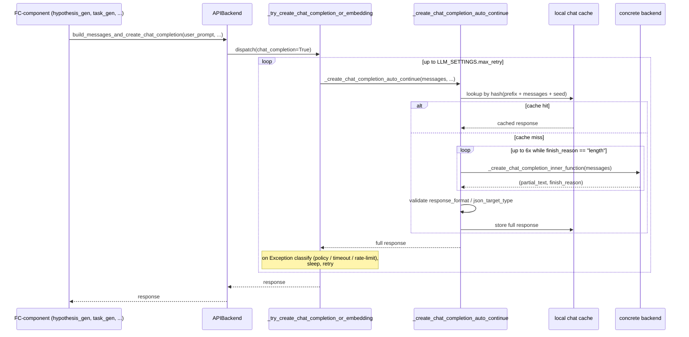

# APIBackend — the hardened call surface every FC-component talks to an LLM through

## Overview
`APIBackend` is the abstract base class that turns "call an LLM" into a hardened operation: retried,
cached, silently continued past a token-limit truncation, and validated against a requested response
format — all *before* a single provider SDK call happens. Every one of the ~40 Research/Development
components this repo's Research→Development split is built from — `hypothesis_gen`, `task_gen`,
`generate_feedback`, the many `implement_one_task` coders, `hypothesis_rewrite`,
`get_sota_exp_to_submit` — funnels through this one class rather than talking to OpenAI/Azure/LiteLLM
directly. The class is a template method: it implements everything cross-cutting itself, and asks a
concrete backend (LiteLLM-backed by default) for exactly four primitives. That split is what lets the
same retry/cache/continuation machinery serve wildly different providers without duplication.

## Diagram


## Design rationale (why it's built this way)
- **Template method, four primitives.** [`_create_chat_completion_inner_function`](../catalog/rdagent/oai/backend/litellm.md#LiteLLMAPIBackend._create_chat_completion_inner_function)
  and its much older sibling [`_create_chat_completion_inner_function`](../catalog/rdagent/oai/backend/deprec.md#DeprecBackend._create_chat_completion_inner_function)
  are the *only* thing that differs between the current LiteLLM-routed backend and the deprecated
  direct-Azure/local-Llama2 backend. Everything above them — [`build_messages_and_create_chat_completion`](../catalog/rdagent/oai/backend/base.md#APIBackend.build_messages_and_create_chat_completion),
  [`_try_create_chat_completion_or_embedding`](../catalog/rdagent/oai/backend/base.md#APIBackend._try_create_chat_completion_or_embedding),
  [`_create_chat_completion_auto_continue`](../catalog/rdagent/oai/backend/base.md#APIBackend._create_chat_completion_auto_continue) —
  is provider-agnostic, so swapping providers never touches retry, cache, or continuation logic.
- **Truncation is repaired, not raised.** The docstring on `_create_chat_completion_auto_continue` says
  it plainly: "Call the chat completion function and automatically continue the conversation if the
  finish_reason is length." Rather than fail a whole FC step because a model ran out of `max_tokens`
  mid-JSON or mid-code, the backend re-issues the call with the partial assistant turn appended (up to 6
  times) and concatenates. A component like `task_gen`, which asks for a full coding sketch in one JSON
  blob, would otherwise be one long response away from silently returning truncated garbage.
- **Retry is provider-aware, not blind exponential backoff.** `_try_create_chat_completion_or_embedding`
  classifies the exception before deciding what to do: a content-policy violation counts against a
  separate, much stricter [`LLM_SETTINGS`](../catalog/rdagent/oai/llm_conf.md#LLM_SETTINGS)-configured
  limit than a timeout; a `RateLimitError` whose message names an explicit "retry after N seconds" wins
  over the locally configured wait — the provider's own hint overrides the default backoff.
- **Two nested loops, two different jobs.** A reader skimming once will conflate the *retry* loop (outer,
  handles failures, bounded by `max_retry`) with the *auto-continue* loop (inner, handles a **successful**
  call whose `finish_reason` was `"length"`, bounded to 6 attempts). They compose but solve different
  problems — retry never touches a `finish_reason`, auto-continue never touches an exception.

## Entry points
- [`build_messages_and_create_chat_completion`](../catalog/rdagent/oai/backend/base.md#APIBackend.build_messages_and_create_chat_completion) —
  the one-shot entry point almost every FC-component uses: render a prompt (via the sibling templating
  layer), call this with `user_prompt`/`system_prompt`, get a string back. [`hypothesis_gen`](../catalog/rdagent/scenarios/data_science/proposal/exp_gen/proposal.md#DSProposalV2ExpGen.hypothesis_gen),
  [`task_gen`](../catalog/rdagent/scenarios/data_science/proposal/exp_gen/proposal.md#DSProposalV2ExpGen.task_gen),
  [`generate_feedback`](../catalog/rdagent/scenarios/data_science/dev/feedback.md#DSExperiment2Feedback.generate_feedback),
  [`hypothesis_rewrite`](../catalog/rdagent/scenarios/data_science/proposal/exp_gen/proposal.md#DSProposalV2ExpGen.hypothesis_rewrite),
  and [`get_sota_exp_to_submit`](../catalog/rdagent/scenarios/data_science/proposal/exp_gen/select/submit.md#AutoSOTAexpSelector.get_sota_exp_to_submit)
  all reach it directly.
- [`build_chat_completion`](../catalog/rdagent/oai/backend/base.md#ChatSession.build_chat_completion) —
  the *stateful*, multi-turn entry point, reached via `APIBackend().build_chat_session(...)`. It persists
  the growing message list keyed by a conversation id so a caller can keep talking across calls (used
  where a component needs genuine back-and-forth rather than one prompt→one answer), and every coder's
  [`implement_one_task`](../catalog/rdagent/components/coder/data_science/pipeline/__init__.md#PipelineMultiProcessEvolvingStrategy.implement_one_task)-style
  method that needs a running session reaches it the same way.
- [`_try_create_chat_completion_or_embedding`](../catalog/rdagent/oai/backend/base.md#APIBackend._try_create_chat_completion_or_embedding) —
  the shared core both entry points above funnel into; it is also where the (separate, non-chat)
  embedding path joins the same retry machinery.

## Mechanism (step-by-step)
1. **Message assembly and logging.** [`build_messages_and_create_chat_completion`](../catalog/rdagent/oai/backend/base.md#APIBackend.build_messages_and_create_chat_completion)
   builds the message list, dispatches into the retry core, and — win or lose — logs the full exchange
   (system/user/response/timestamps) via [`log_object`](../catalog/rdagent/log/logger.md#RDAgentLog.log_object)
   under tag `"debug_llm"`, which is what feeds the trace UI's LLM inspector.
2. **Retry loop classifies, doesn't just retry.** [`_try_create_chat_completion_or_embedding`](../catalog/rdagent/oai/backend/base.md#APIBackend._try_create_chat_completion_or_embedding)
   runs up to [`LLM_SETTINGS`](../catalog/rdagent/oai/llm_conf.md#LLM_SETTINGS)`.max_retry` times. On
   exception it inspects the message text for provider-specific signatures (a missing literal "json" in
   the prompt when JSON mode is requested; "maximum context length" for over-long embedding input) before
   falling back to a generic sleep-and-retry, logging each attempt via [`warning`](../catalog/rdagent/log/logger.md#RDAgentLog.warning).
3. **Cache check keyed by prompt + a seed.** Inside that loop, [`_create_chat_completion_auto_continue`](../catalog/rdagent/oai/backend/base.md#APIBackend._create_chat_completion_auto_continue)
   hashes `chat_cache_prefix + json(messages) + seed` and checks the local cache first — a cache hit
   skips the provider call entirely and still gets logged via [`info`](../catalog/rdagent/log/logger.md#RDAgentLog.info)
   with [`LogColors`](../catalog/rdagent/log/utils/__init__.md#LogColors) coloring so cached vs. live
   responses are visually distinguishable in the terminal/log stream (the coloring is terminated with
   [`END`](../catalog/rdagent/log/utils/__init__.md#LogColors.END)).
4. **Continuation on truncation.** On a cache miss, the same method calls the concrete backend's
   [`_create_chat_completion_inner_function`](../catalog/rdagent/oai/backend/litellm.md#LiteLLMAPIBackend._create_chat_completion_inner_function)
   (or its [deprecated counterpart](../catalog/rdagent/oai/backend/deprec.md#DeprecBackend._create_chat_completion_inner_function)
   for the older Azure/local-Llama2 path) up to 6 times, concatenating partial responses whenever
   `finish_reason == "length"`, before moving on to format validation and a cache write.
5. **Time and failure accounting feed the whole loop's clock.** Every retry that consumes wall time is
   folded into [`RD_Agent_TIMER_wrapper`](../catalog/rdagent/log/timer.md#RD_Agent_TIMER_wrapper.RD_Agent_TIMER_wrapper)'s
   [`timer`](../catalog/rdagent/log/timer.md#RDAgentTimerWrapper.timer) — meaning time burned retrying a
   flaky LLM call is charged against the *same* wall-clock budget the whole experiment trial races
   against, not treated as free overhead.

## Key data structures
- **The `(response, finish_reason)` contract.** Every concrete backend's `_create_chat_completion_inner_function`
  must return this tuple; `finish_reason` is the only signal the continuation loop uses to decide whether
  to keep going, so a backend that doesn't surface it correctly silently breaks auto-continue.
- **`response_format: dict | Type[BaseModel] | None`.** The one knob threaded through
  `_create_chat_completion_auto_continue` that turns on JSON-mode enforcement or a Pydantic schema
  validation pass on the assembled response before it's handed back or cached.
- **Settings-driven construction.** Every `APIBackend` subclass reads its cache/retry flags from
  [`LLM_SETTINGS`](../catalog/rdagent/oai/llm_conf.md#LLM_SETTINGS) at `__init__` time unless the caller
  overrides them explicitly — see the sibling [rdagent-oai-llm_conf](rdagent-oai-llm_conf.md) page for
  what's actually configurable, and [`ExtendedBaseSettings`](../catalog/rdagent/core/conf.md#ExtendedBaseSettings)
  for how those settings resolve across backend subclasses.

## Dynamics (design intent)
The retry loop is strictly sequential, not concurrent — one call at a time, `max_retry` bounded. Backoff
is a flat `retry_wait_seconds` by default, overridden only when a `RateLimitError` explicitly names a wait
time. The auto-continue loop is a *separate*, inner, fixed-length-6 loop that only ever fires on a
successful-but-truncated response; it is not a retry in the failure sense. A helper like
[`build_cls_from_json_with_retry`](../catalog/rdagent/utils/agent/workflow.md#build_cls_from_json_with_retry)
sits one layer above both loops, adding its own outer retry for cases where the LLM's JSON parses fine but
fails Pydantic validation against the target class — a third, independent retry tier for schema mismatches
that this class's own retry/continuation logic doesn't attempt to fix.

## Edge cases
- `chat_completion` and `embedding` are two separate booleans on `_try_create_chat_completion_or_embedding`
  guarded by an assert that only one is true — an awkward two-flag calling convention rather than an enum,
  inherited by every caller.
- Over-long embedding input is truncated **once**; a second failure after truncation raises immediately
  with an explicit remediation message pointing at a specific settings field, rather than truncating
  further.
- A content-policy violation is fatal after just `LLM_SETTINGS.violation_fail_limit` occurrences — far
  stricter than the timeout limit — reflecting that a real policy block is unlikely to resolve on retry,
  while a timeout might.
- A litellm streaming quirk is worked around explicitly: even when `finish_reason == "stop"`, an odd count
  of `` ``` `` fences in the accumulated response is treated as an unclosed code block and reclassified as
  `"length"` so the continuation loop kicks in anyway — the source itself flags this as a temporary
  litellm-bug workaround.

## Open questions
- The multi-strategy JSON/code-block extraction and repair that runs before a response is accepted (direct
  parse, code-fence extraction, Python-literal-to-JSON fixups) lives in helper logic not enumerated in this
  packet's subgraph — read `rdagent/oai/backend/base.py` directly for the exact fallback chain.
- Why the dynamic-dispatch factory that actually constructs a concrete `APIBackend` lives in a separate
  module rather than as a classmethod here is addressed on the [rdagent-oai-llm_utils](rdagent-oai-llm_utils.md)
  page (the source itself flags it with a TODO).

## See also
- [rdagent-oai-llm_conf — the settings every call above reads from](rdagent-oai-llm_conf.md)
- [rdagent-oai-llm_utils — how `APIBackend()` resolves to a concrete class](rdagent-oai-llm_utils.md)
- [rdagent-utils-agent-tpl — how the prompts handed to `build_messages_and_create_chat_completion` get built](rdagent-utils-agent-tpl.md)
