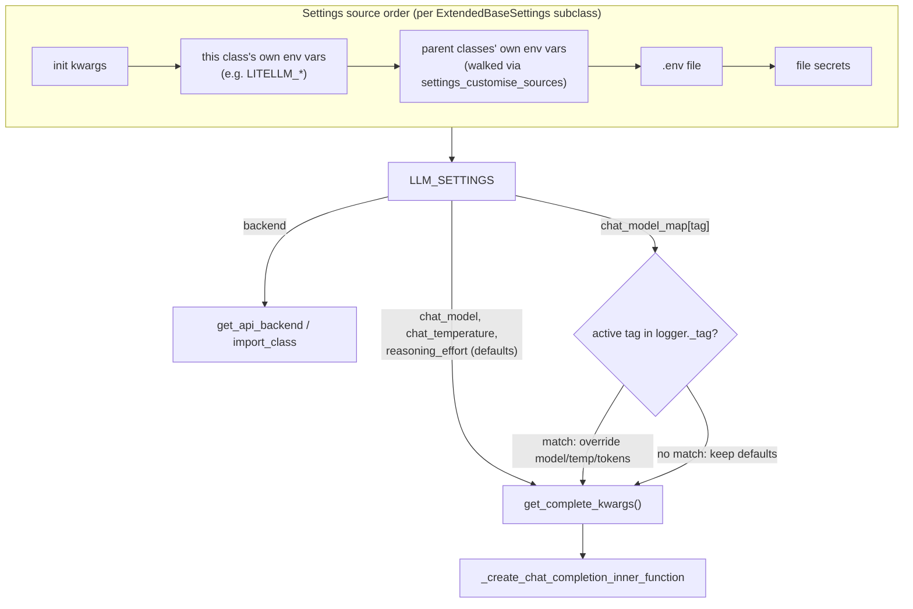

# LLMSettings — the one dial panel behind every LLM call, plus a per-call-site override trick

## Overview
`LLM_SETTINGS`, a singleton instance of [`LLMSettings`](../catalog/rdagent/oai/llm_conf.md#LLMSettings),
is the config object every LLM-touching piece of RD-Agent reads from: which chat/embedding model, which
concrete backend class to dynamically load, retry/cache behavior, token budgets, and — the interesting
part — a `chat_model_map` that lets *individual* LLM calls anywhere in the Research/Development pipeline
be silently rerouted to a cheaper or stronger model based on which logging tag is active when the call
happens, with zero changes to any of the ~40 call sites that make up `hypothesis_gen`, `task_gen`,
`generate_feedback`, and the coder `evaluate`/`implement_one_task` methods. A second, less visible
mechanism — [`ExtendedBaseSettings`](../catalog/rdagent/core/conf.md#ExtendedBaseSettings)'s custom
environment-source resolution — is what lets each concrete backend (LiteLLM, the deprecated Azure/local
backend) keep its own env-var namespace while still inheriting values set at the generic level.

## Diagram

## Design rationale (why it's built this way)
- **Layered env-var namespacing.** [`ExtendedBaseSettings`](../catalog/rdagent/core/conf.md#ExtendedBaseSettings)
  overrides `settings_customise_sources` to walk a settings class's own base classes and insert an
  `EnvSettingsSource` for *each ancestor's own env prefix*, in addition to the subclass's. This is why
  `LiteLLMSettings(LLMSettings)` can declare `env_prefix = "LITELLM_"` and still fall back to whatever was
  configured generically on [`LLMSettings`](../catalog/rdagent/oai/llm_conf.md#LLMSettings) — every field
  doesn't need to be re-set per backend, only the ones that actually differ. [`CoSTEERSettings`](../catalog/rdagent/components/coder/CoSTEER/config.md#CoSTEERSettings),
  [`BasePropSetting`](../catalog/rdagent/components/workflow/conf.md#BasePropSetting), and
  [`DSCoderCoSTEERSettings`](../catalog/rdagent/components/coder/data_science/conf.md#DSCoderCoSTEERSettings)
  all lean on the same base class for the same reason — this is a repo-wide settings pattern, not a
  one-off for LLM config.
- **`chat_model_map` reuses the *logging* tag stack as a free routing key.** [`get_complete_kwargs`](../catalog/rdagent/oai/backend/litellm.md#LiteLLMAPIBackend.get_complete_kwargs)
  scans `chat_model_map` and overrides `model`/`temperature`/`max_tokens`/`reasoning_effort` for the first
  tag it finds active in `logger._tag`. None of the ~40 call sites that eventually reach
  [`_create_chat_completion_auto_continue`](../catalog/rdagent/oai/backend/base.md#APIBackend._create_chat_completion_auto_continue)
  pass a "which phase am I in" parameter explicitly — but they *do* already run inside a `with
  logger.tag(...)` block for logging purposes, so the settings layer piggybacks on that existing context
  instead of adding a new parameter everywhere. The same tag-scanning pattern is implemented independently
  a second time in the deprecated backend's own [`chat_model_map`](../catalog/rdagent/oai/backend/deprec.md#DeprecBackend.chat_model_map)
  handling — evidence this is a deliberate, repeated idea rather than a one-off hack.
  > [!inferred]
  > This is the natural lever for the cost discipline the accompanying paper claims (full R&D-Agent(Q)
  > cycles staying under $10 — see [rd-agent (paper)](../../../sources/rd-agent.md)): route
  > high-volume, routine calls (per-file coder feedback, which runs many times per experiment loop) to a
  > cheaper model via a tag match, and reserve a stronger/more expensive model for the calls that matter
  > strategically (hypothesis generation). The source does not itself state this is *why* the field
  > exists, and it ships with no default entries — so it's read here as a capability, not a documented
  > policy.
- **Token limit is a live-computed property, not a constant, on the current backend.** The base default
  [`chat_token_limit`](../catalog/rdagent/oai/backend/base.md#APIBackend.chat_token_limit) is a flat
  `100_000`, and the field comment on it admits the number "might increase in the future version of gpt."
  [`LiteLLMAPIBackend`](../catalog/rdagent/oai/backend/litellm.md#LiteLLMAPIBackend.chat_token_limit)
  overrides it by querying LiteLLM's live model registry for `max_input_tokens`/`max_output_tokens` and
  computing headroom, falling back to the static default only if that lookup fails — so upgrading
  `chat_model` doesn't require hand-updating a token-limit constant.
- **Reasoning-model support is a config field, not a backend hack.** `reasoning_effort` (`"low"|"medium"|"high"|None`)
  flows straight into `get_complete_kwargs`'s `CompleteKwargs`, and a separate `reasoning_think_rm` flag
  strips leading `<think>...</think>` blocks in `_create_chat_completion_auto_continue` — first-class
  support for o-series/DeepSeek-R1-style reasoning models rather than a special-cased backend branch.

## Entry points
- [`LLM_SETTINGS`](../catalog/rdagent/oai/llm_conf.md#LLM_SETTINGS) — the module-level singleton every
  other symbol on this page ultimately reads; constructed once at import time, read everywhere.
- [`LLMSettings`](../catalog/rdagent/oai/llm_conf.md#LLMSettings) — the class itself, subclassed by
  concrete backends to add or namespace fields (e.g. LiteLLM's settings subclass), reached whenever a new
  backend integration is wired in.
- [`get_complete_kwargs`](../catalog/rdagent/oai/backend/litellm.md#LiteLLMAPIBackend.get_complete_kwargs) —
  reached on every concrete chat call, immediately before the provider SDK call, to resolve the *effective*
  model/temperature/token-limit/reasoning_effort for that specific invocation.
- [`get_api_backend`](../catalog/rdagent/oai/llm_utils.md#get_api_backend) — reached whenever any
  component asks for a working backend instance; it reads `LLM_SETTINGS.backend` to decide which concrete
  class to dynamically import and construct (see the sibling llm_utils page).

## Mechanism (step-by-step)
1. **Construction resolves settings across a layered source order.** When [`LLMSettings`](../catalog/rdagent/oai/llm_conf.md#LLMSettings)
   (or a subclass) is instantiated, [`ExtendedBaseSettings`](../catalog/rdagent/core/conf.md#ExtendedBaseSettings)'s
   `settings_customise_sources` inserts an env source per ancestor class before dotenv/secrets, so a
   backend-specific subclass's own env vars win, but generic env vars set on the base class are still
   visible as a fallback.
2. **The central knobs are read by name everywhere.** [`LLM_SETTINGS`](../catalog/rdagent/oai/llm_conf.md#LLM_SETTINGS)`.`[`chat_model`](../catalog/rdagent/oai/llm_conf.md#LLMSettings.chat_model),
   [`use_chat_cache`](../catalog/rdagent/oai/llm_conf.md#LLMSettings.use_chat_cache) (and its instance-level
   mirror [`use_chat_cache`](../catalog/rdagent/oai/backend/base.md#APIBackend.use_chat_cache) on the
   backend itself), and [`log_llm_chat_content`](../catalog/rdagent/oai/llm_conf.md#LLMSettings.log_llm_chat_content)
   are consulted directly inside [`_build_messages`](../catalog/rdagent/oai/backend/base.md#APIBackend._build_messages),
   [`build_chat_completion_message`](../catalog/rdagent/oai/backend/base.md#ChatSession.build_chat_completion_message),
   and the retry/continuation core described on the [rdagent-oai-backend-base](rdagent-oai-backend-base.md)
   page — this settings object and that mechanism page are really two views of one system.
3. **Per-call override happens right before the provider call, not at config-load time.** [`get_complete_kwargs`](../catalog/rdagent/oai/backend/litellm.md#LiteLLMAPIBackend.get_complete_kwargs)
   re-reads `chat_model_map` on *every* call, not once at startup, so an operator can flip which tag maps
   to which model between experiment loops without restarting anything.
4. **Backend selection is itself just a config field.** [`get_api_backend`](../catalog/rdagent/oai/llm_utils.md#get_api_backend)
   reads [`LLM_SETTINGS`](../catalog/rdagent/oai/llm_conf.md#LLM_SETTINGS)`.backend` (a dotted class-path
   string, `"rdagent.oai.backend.LiteLLMAPIBackend"` by default) to decide which concrete `APIBackend`
   subclass every `APIBackend()` call site actually gets.
5. **Token budget resolution is delegated, not hard-coded.** [`chat_token_limit`](../catalog/rdagent/oai/backend/base.md#APIBackend.chat_token_limit)
   on the base class simply returns the flat settings value, while [`chat_token_limit`](../catalog/rdagent/oai/backend/litellm.md#LiteLLMAPIBackend.chat_token_limit)
   on the concrete backend overrides it with a live-registry lookup — callers like
   [`get_sota_exp_to_submit`](../catalog/rdagent/scenarios/data_science/proposal/exp_gen/select/submit.md#AutoSOTAexpSelector.get_sota_exp_to_submit)
   (which stops accumulating SOTA-experiment context once the running prompt would exceed the limit) get
   whichever value the active backend actually computes.

## Key data structures
- **`LLMSettings`** — a large flat field surface that, on inspection, spans five backend eras: generic
  chat/embedding config, Azure-specific fields, GCR-hosted-endpoint fields, offline-Llama-2 fields, and
  the current LiteLLM-routed defaults. Fields like `gcr_endpoint_type`, `llama2_ckpt_dir`, and
  `phi3_128k_endpoint` still exist even though they belong to superseded backends — this settings object
  is a superset config for every backend the project ever supported, not a lean config for the current one.
- **`chat_model_map: dict[str, dict[str, str]]`** — the one piece of genuinely dynamic *routing* state in
  an otherwise static settings bag; keys are tag substrings, values are partial overrides
  (`model`/`temperature`/`max_tokens`/`reasoning_effort`).
- **`Literal["low","medium","high"] | None` `reasoning_effort`** — a constrained enum-like field rather
  than a free string, so a malformed value fails validation at settings-construction time instead of
  reaching the provider call.

## Dynamics (design intent)
`chat_model_map` is scanned in dict-iteration (insertion) order and the *first* matching tag wins — the
loop `break`s immediately, so if two configured tags could both match the currently active tag stack, the
one declared earlier in the map wins regardless of specificity; an operator relying on this needs to order
overrides deliberately. Separately, `settings_customise_sources`'s source ordering means a subclass's own
env var always outranks a same-named env var set at a more generic ancestor level — "more specific"
consistently beats "more generic," mirroring normal method-resolution intuition even though pydantic
settings classes don't do this across separate classes by default.

## Edge cases
- An unrecognized `reasoning_effort` value inside a `chat_model_map` entry is *not* rejected — `get_complete_kwargs`
  silently falls through to `None` rather than raising, a softer failure mode than the strict validation
  the field itself gets when set directly on `LLMSettings`.
- Two deprecated backend eras (Azure token-provider auth, GCR-hosted Llama2/Phi endpoints) still occupy
  real, non-optional-looking fields on this settings object even though [`LiteLLMAPIBackend`](../catalog/rdagent/oai/backend/litellm.md#LiteLLMAPIBackend.get_complete_kwargs)
  is the default path today — a reader who lands on this file expecting a lean, current-only config will
  be surprised by how much of it is legacy surface.
- `use_auto_chat_cache_seed_gen` changes cache-hit behavior for *identical* repeated prompts (letting the
  same question get different cached answers across "rounds"); its interaction with genuinely parallel
  loop execution (`RDAgentSettings.step_semaphore` allowing `multi_proc_n > 1`) isn't settled by this
  packet.

## Open questions
- Whether `chat_model_map` is exercised in any of this repo's own default configs, or is purely an
  ops/bench-tuning knob left for downstream users to populate, isn't answered by the source — no entries
  ship by default.
- The exact set of tags the running loop pushes via `logger.tag(...)` (and therefore which strings are
  meaningful keys in `chat_model_map`) lives in the logging subsystem, outside this packet's subgraph.

## See also
- [rdagent-oai-backend-base — the retry/cache/continuation mechanism these settings configure](rdagent-oai-backend-base.md)
- [rdagent-oai-llm_utils — how `LLM_SETTINGS.backend` becomes a concrete instance](rdagent-oai-llm_utils.md)
- [rd-agent (paper) — the cost figures this settings layer is the likely lever for](../../../sources/rd-agent.md)
