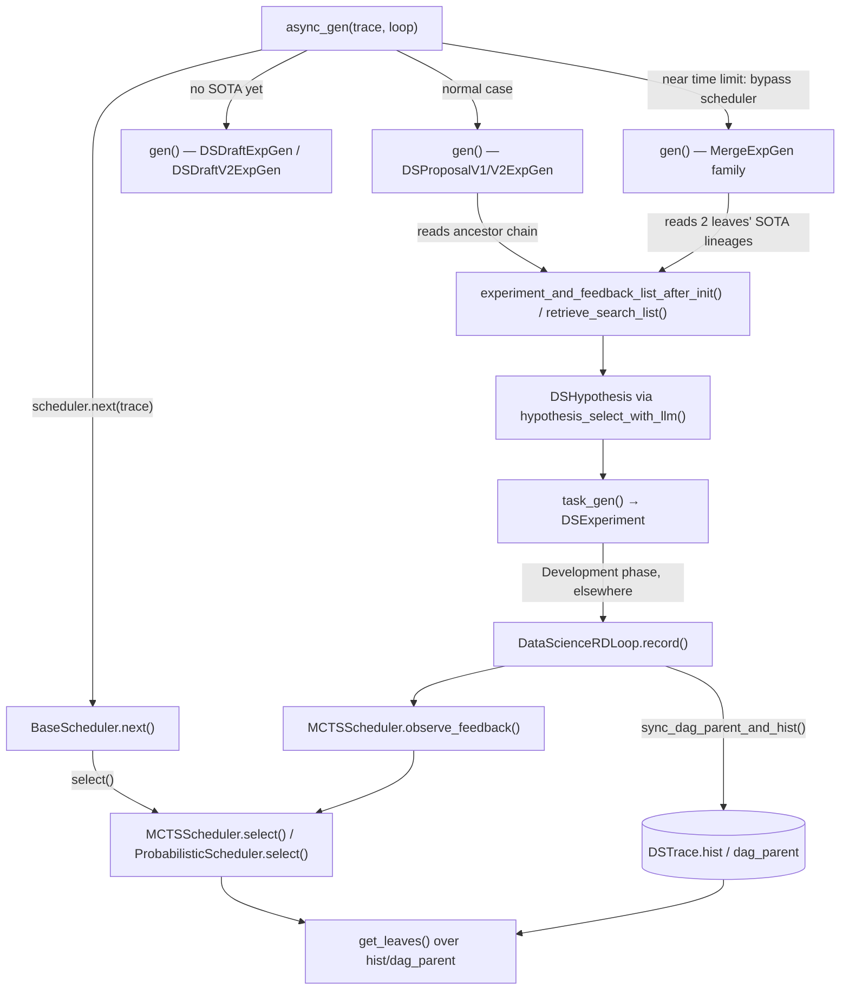

# DSTrace — the data-science exploration DAG and its ExpGen proposers

<!-- connect:up:begin -->
> **Cross-repo concept:** part of [closed-loop-experiment-design](../../../concepts/closed-loop-experiment-design.md), [research-development-loop](../../../concepts/research-development-loop.md) across this wiki's repos.
<!-- connect:up:end -->

## Overview
[`DSTrace`](../catalog/rdagent/scenarios/data_science/proposal/exp_gen/base.md#DSTrace) is the data-science
scenario's concrete instantiation of the object Algorithm 1 calls `G` — the growing graph of
`(parents, idea, code, score)` records described in [`rd-agent.md`](../../../sources/rd-agent.md). Where the
generic [`Trace`](../catalog/rdagent/core/proposal.md#Trace) is effectively a flat
[`hist`](../catalog/rdagent/core/proposal.md#Trace.hist) list, `DSTrace` adds a parent-index array turning
that history into a branching DAG, which a family of `ExpGen` subclasses (proposal, draft, merge, naive
variants — each contributing its own [`gen`](../catalog/rdagent/scenarios/data_science/proposal/exp_gen/proposal.md#DSProposalV2ExpGen.gen)
method, cited throughout below) read to build the next hypothesis, and a family of schedulers (each
contributing a [`select`](../catalog/rdagent/scenarios/data_science/proposal/exp_gen/trace_scheduler.md#MCTSScheduler.select)
method) use to decide *which* branch to expand next. This one file is where the paper's abstract
"exploration-path structuring" (chain vs. tree vs. adaptive DAG) and "reasoning pipeline" (dataset analysis →
hypothesis → trade-off assessment) become concrete, runnable Python for the data-science scenario.

## Diagram

## Design rationale (why it's built this way)
`DSTrace` adds `dag_parent` (extended via [`sync_dag_parent_and_hist`](../catalog/rdagent/scenarios/data_science/proposal/exp_gen/base.md#DSTrace.sync_dag_parent_and_hist))
precisely so several sub-traces can be explored in parallel and later recombined, rather than the base
`Trace`'s implicit single chain. [`get_leaves`](../catalog/rdagent/scenarios/data_science/proposal/exp_gen/base.md#DSTrace.get_leaves)
computes "nodes with no children" generically from that parent array — and its own docstring/comment names
the current limitation directly: *"If we implement the most correct merging logic, merge[ing] 2 traces[,]
will result in a single trace(2 traces currently)"* — the author flagging, in source, that today's merge
semantics are a simplification of the eventual design.

[`experiment_and_feedback_list_after_init`](../catalog/rdagent/scenarios/data_science/proposal/exp_gen/base.md#DSTrace.experiment_and_feedback_list_after_init)
exists as a distinct read path from raw [`hist`](../catalog/rdagent/scenarios/data_science/proposal/exp_gen/base.md#DSTrace.hist)
or [`retrieve_search_list`](../catalog/rdagent/scenarios/data_science/proposal/exp_gen/base.md#DSTrace.retrieve_search_list)
because it doesn't just filter — it *segments* the ancestor chain by whether a "final component" (the last
stage of `COMPLETE_ORDER`, read directly on `DSTrace`) has ever been reached, splitting history into an
accepted-SOTA sub-list and a "failed since SOTA" sub-list that get rendered into two separately-framed prompt
sections. A failure before the pipeline was ever complete doesn't carry the same weight as a failure after it
was — this is the concrete mechanism behind the paper's "reasoning pipeline" needing not just *what happened*
but *how far the pipeline got* before it happened.

Scheduling — `MCTSScheduler`'s and `ProbabilisticScheduler`'s
[`select`](../catalog/rdagent/scenarios/data_science/proposal/exp_gen/trace_scheduler.md#MCTSScheduler.select) —
is deliberately a separate object from any `ExpGen`: which *branch* to expand next (a property of the DAG's
shape and past rewards) varies independently of *what hypothesis* to propose once a branch is fixed (a
property of the LLM reasoning pipeline). `BaseScheduler`'s
[`next`](../catalog/rdagent/scenarios/data_science/proposal/exp_gen/trace_scheduler.md#BaseScheduler.next)
is awaited once per iteration before any `gen` call, so the two concerns compose rather than being
intertwined in one method.

The merge machinery splits into two roles. The three *dispatcher* variants — `ExpGen2TraceAndMerge`,
`ExpGen2TraceAndMergeV2`, `ExpGen2TraceAndMergeV3` (each contributing its own
[`gen`](../catalog/rdagent/scenarios/data_science/proposal/exp_gen/merge.md#ExpGen2TraceAndMerge.gen)) — each
hold both a single-branch `exp_gen` and an inner merge generator, and independently re-check the same
`DS_RD_SETTING.merge_hours` wall-clock condition that
[`async_gen`](../catalog/rdagent/scenarios/data_science/proposal/exp_gen/router/__init__.md#ParallelMultiTraceExpGen.async_gen)
also checks — while time remains they delegate straight to the single-branch proposer; once time is
short (and ≥2 leaves/sub-traces exist) they hand off to their inner merge generator. Those inner merge
generators — `MergeExpGen`, `MergeExpGen_MultiTrace`, and `ExpGen2Hypothesis` (each with its own
[`gen`](../catalog/rdagent/scenarios/data_science/proposal/exp_gen/merge.md#MergeExpGen.gen)) — do *not*
consult the timer themselves; when invoked they unconditionally recombine two (or more) branches' SOTA
lineages into one new experiment. Keeping merge logic as its own swappable `ExpGen` implementation, with the identical
`gen(trace, plan) -> `[`DSExperiment`](../catalog/rdagent/scenarios/data_science/experiment/experiment.md#DSExperiment)
signature as the single-branch proposers (`DSProposalV1ExpGen`'s and `DSProposalV2ExpGen`'s own
[`gen`](../catalog/rdagent/scenarios/data_science/proposal/exp_gen/proposal.md#DSProposalV2ExpGen.gen), and a
minimal `NaiveExpGen`'s [`gen`](../catalog/rdagent/scenarios/data_science/proposal/exp_gen/naive.md#NaiveExpGen.gen)
baseline), is what lets the codebase carry all of these side by side, swappable via configuration, without
`DSTrace` or the schedulers needing to know which one is active.

## Entry points
- [`DSTrace`](../catalog/rdagent/scenarios/data_science/proposal/exp_gen/base.md#DSTrace) — constructed once
  per [`DataScienceScen`](../catalog/rdagent/scenarios/data_science/scen/__init__.md#DataScienceScen) run and
  threaded through every `ExpGen`/scheduler/feedback call for that run's lifetime.
- `ParallelMultiTraceExpGen`'s [`async_gen`](../catalog/rdagent/scenarios/data_science/proposal/exp_gen/router/__init__.md#ParallelMultiTraceExpGen.async_gen) —
  the per-iteration orchestrator reached from the loop's ExpGen step: it throttles by how many loops are
  already unfinished against the configured parallelism before doing anything else.
- `DSProposalV2ExpGen`'s [`gen`](../catalog/rdagent/scenarios/data_science/proposal/exp_gen/proposal.md#DSProposalV2ExpGen.gen) —
  the default Research-phase proposer, reached once a scheduler has already set `trace`'s current selection
  for this iteration.
- `DataScienceRDLoop`'s [`record`](../catalog/rdagent/scenarios/data_science/loop.md#DataScienceRDLoop.record) —
  the loop step that closes the cycle, taking the just-developed
  [`DSExperiment`](../catalog/rdagent/scenarios/data_science/experiment/experiment.md#DSExperiment) and its
  [`ExperimentFeedback`](../catalog/rdagent/core/proposal.md#ExperimentFeedback) and folding them back into
  `DSTrace`.

## Mechanism (step-by-step)
1. `ParallelMultiTraceExpGen`'s
   [`async_gen`](../catalog/rdagent/scenarios/data_science/proposal/exp_gen/router/__init__.md#ParallelMultiTraceExpGen.async_gen)
   is called once per loop iteration; it first checks the number of not-yet-finished loops already in flight
   against the configured parallelism, deferring if the budget is full.
2. It normally delegates branch selection to `BaseScheduler`'s
   [`next`](../catalog/rdagent/scenarios/data_science/proposal/exp_gen/trace_scheduler.md#BaseScheduler.next)
   on the configured scheduler — but once the shared timer's remaining time drops under
   `DS_RD_SETTING.merge_hours` hours, it stops consulting the scheduler and instead directly targets whichever
   leaf traces back to the trace's recorded `sota_exp_to_submit`: exploration gives way to "keep refining the
   one branch intended for submission" as the deadline nears.
3. [`next`](../catalog/rdagent/scenarios/data_science/proposal/exp_gen/trace_scheduler.md#BaseScheduler.next)
   itself is a polling loop: it repeatedly calls the scheduler's
   [`select`](../catalog/rdagent/scenarios/data_science/proposal/exp_gen/trace_scheduler.md#MCTSScheduler.select)
   until a non-`None` leaf tuple comes back, `await`-sleeping and retrying if every leaf is currently claimed
   by another in-flight loop — this is what lets several concurrently running loop workers (see
   [`rdagent-utils-workflow-loop`](rdagent-utils-workflow-loop.md)) expand *different* branches of the same
   DAG without colliding.
4. `MCTSScheduler`'s
   [`select`](../catalog/rdagent/scenarios/data_science/proposal/exp_gen/trace_scheduler.md#MCTSScheduler.select)
   either opens a brand-new root if the DAG has fewer independent sub-traces than its target count, or scores
   candidate nodes with a PUCT-style `Q + U` (a visit-adjusted value estimate plus an
   exploration bonus derived from a softmax over each node's potential) and returns the single best-scoring
   node. Note the candidate set differs by scheduler: `MCTSScheduler`'s `select` scores over *every* recorded
   node index (`range(len(`[`hist`](../catalog/rdagent/scenarios/data_science/proposal/exp_gen/base.md#DSTrace.hist)`))`),
   not only the current leaves, whereas `ProbabilisticScheduler`'s own
   [`select`](../catalog/rdagent/scenarios/data_science/proposal/exp_gen/trace_scheduler.md#ProbabilisticScheduler.select)
   restricts its candidates to the
   [`get_leaves`](../catalog/rdagent/scenarios/data_science/proposal/exp_gen/base.md#DSTrace.get_leaves)
   output. `ProbabilisticScheduler` shares the same "new root or score candidates" shape but samples
   proportionally to potential via `random.choices` instead of always taking the argmax — one is stochastic
   exploration, the other deterministic best-first with an explicit bonus term.
5. If enabled, `async_gen` also calls `DSExpPlannerHandCraft`'s
   [`plan`](../catalog/rdagent/scenarios/data_science/proposal/exp_gen/planner/__init__.md#DSExpPlannerHandCraft.plan)
   before generating; `plan` is a hand-coded rule keyed on remaining-time percentage and whether a SOTA
   already exists (draft mode vs. suggest-architecture mode), not itself an LLM call.
6. With a branch selected, a proposer such as `DSProposalV2ExpGen`'s
   [`gen`](../catalog/rdagent/scenarios/data_science/proposal/exp_gen/proposal.md#DSProposalV2ExpGen.gen)
   reads that branch's ancestor chain via
   [`experiment_and_feedback_list_after_init`](../catalog/rdagent/scenarios/data_science/proposal/exp_gen/base.md#DSTrace.experiment_and_feedback_list_after_init)
   and [`retrieve_search_list`](../catalog/rdagent/scenarios/data_science/proposal/exp_gen/base.md#DSTrace.retrieve_search_list),
   selects a hypothesis via its own
   [`hypothesis_select_with_llm`](../catalog/rdagent/scenarios/data_science/proposal/exp_gen/proposal.md#DSProposalV2ExpGen.hypothesis_select_with_llm)
   — which itself factors in how much wall-clock time remains to decide how conservative to be — producing a
   [`DSHypothesis`](../catalog/rdagent/scenarios/data_science/proposal/exp_gen/base.md#DSHypothesis), then
   turns it into an executable unit via its own
   [`task_gen`](../catalog/rdagent/scenarios/data_science/proposal/exp_gen/proposal.md#DSProposalV2ExpGen.task_gen),
   which wraps the result in a
   [`DSExperiment`](../catalog/rdagent/scenarios/data_science/experiment/experiment.md#DSExperiment) — the
   object that then leaves this packet's mechanism and enters the Development phase.
7. Once the Development phase finishes, `DataScienceRDLoop`'s
   [`record`](../catalog/rdagent/scenarios/data_science/loop.md#DataScienceRDLoop.record) attaches the result
   under whichever branch the experiment was actually generated against (via the experiment's own recorded
   local selection, not whatever the trace's selection happens to be at record time) and calls
   [`sync_dag_parent_and_hist`](../catalog/rdagent/scenarios/data_science/proposal/exp_gen/base.md#DSTrace.sync_dag_parent_and_hist)
   to append `(exp, feedback)` to
   [`hist`](../catalog/rdagent/scenarios/data_science/proposal/exp_gen/base.md#DSTrace.hist) and the matching
   parent pointer to `dag_parent`; on an exception path it wraps the error via
   [`ExperimentFeedback`](../catalog/rdagent/core/proposal.md#ExperimentFeedback)'s own `from_exception`
   classmethod instead of an LLM-authored feedback object.
8. Several `ExpGen` implementations short-circuit the single-branch path entirely: when merging is enabled
   and time allows, e.g. `ExpGen2Hypothesis`'s
   [`gen`](../catalog/rdagent/scenarios/data_science/proposal/exp_gen/merge.md#ExpGen2Hypothesis.gen) pulls
   `sota_experiment_fb` for the current leaf *and* a sibling leaf, describes each branch's history via
   [`experiment_and_feedback_list_after_init`](../catalog/rdagent/scenarios/data_science/proposal/exp_gen/base.md#DSTrace.experiment_and_feedback_list_after_init),
   and asks the LLM to propose a hypothesis recombining both branches' best ideas into one — the DAG's
   branching structure is what makes "which two branches" a first-class question this step has to answer.
9. After recording, `MCTSScheduler`'s
   [`observe_feedback`](../catalog/rdagent/scenarios/data_science/proposal/exp_gen/trace_scheduler.md#MCTSScheduler.observe_feedback)
   reads the just-recorded pair back out of
   [`hist`](../catalog/rdagent/scenarios/data_science/proposal/exp_gen/base.md#DSTrace.hist), derives a
   scalar reward from the feedback's acceptance (optionally score-weighted, gated by
   `DS_RD_SETTING.enable_score_reward`), and updates the visited branch's running statistics — so the next
   [`select`](../catalog/rdagent/scenarios/data_science/proposal/exp_gen/trace_scheduler.md#MCTSScheduler.select)
   call sees an updated value estimate for every ancestor of the node just recorded.

## Key data structures
- [`DSTrace`](../catalog/rdagent/scenarios/data_science/proposal/exp_gen/base.md#DSTrace) — extends the base
  [`Trace`](../catalog/rdagent/core/proposal.md#Trace) with a parent-index array turning
  [`hist`](../catalog/rdagent/scenarios/data_science/proposal/exp_gen/base.md#DSTrace.hist) into a DAG; also
  tracks `sota_exp_to_submit` (the globally-best experiment intended for submission) and
  `uncommitted_experiments` (experiments generated but not yet folded into `hist`, keyed by loop id).
- [`hist`](../catalog/rdagent/scenarios/data_science/proposal/exp_gen/base.md#DSTrace.hist) — list of
  `(`[`DSExperiment`](../catalog/rdagent/scenarios/data_science/experiment/experiment.md#DSExperiment)`,`
  [`ExperimentFeedback`](../catalog/rdagent/core/proposal.md#ExperimentFeedback)`)` pairs (or `None`); the
  literal record of every attempted experiment.
- [`DSHypothesis`](../catalog/rdagent/scenarios/data_science/proposal/exp_gen/base.md#DSHypothesis) — extends
  the base [`Hypothesis`](../catalog/rdagent/core/proposal.md#Hypothesis) with `component` (which
  `COMPLETE_ORDER` stage this targets), `problem_name`/`problem_desc`/`problem_label`, and an `appendix`;
  its `__str__` renders a structured, prompt-ready summary rather than a raw field dump.
- [`Trace`](../catalog/rdagent/core/proposal.md#Trace) (base class) — `NEW_ROOT = ()` and
  `SEL_LATEST_SOTA = (-1,)` are the two selection sentinels `DSTrace` inherits; every `ExpGen`/scheduler uses
  these instead of raw indices when it means "start a fresh branch" or "whatever's most recently recorded."
- [`ExperimentFeedback`](../catalog/rdagent/core/proposal.md#ExperimentFeedback) /
  [`HypothesisFeedback`](../catalog/rdagent/core/proposal.md#HypothesisFeedback) — the closed-loop's feedback
  objects: a `decision` bool plus `reason` and optional `exception`;
  [`HypothesisFeedback`](../catalog/rdagent/core/proposal.md#HypothesisFeedback) adds `observations`,
  `hypothesis_evaluation`, `new_hypothesis`, and `acceptable` for the richer LLM-produced critique used
  mid-pipeline.

## Dynamics (design intent)
`BaseScheduler`'s [`next`](../catalog/rdagent/scenarios/data_science/proposal/exp_gen/trace_scheduler.md#BaseScheduler.next)
is explicitly a polling loop (`while True: ... await asyncio.sleep(1)`) rather than an event or condition
variable, so under high parallelism several loop workers may briefly re-check the same leaf-availability
state before one successfully claims it via the schedulers' shared uncommitted-status bookkeeping.

> [!inferred] The tests that reference this packet's subgraph
> (`mixed_model_trace`/`mixed_factor_trace`/`test_model_filtering`/`test_factor_filtering`/`test_code_inspection`,
> all in `test/qlib/test_model_factor_proposal.py`) exercise the *base*
> [`Trace`](../catalog/rdagent/core/proposal.md#Trace)/[`Hypothesis`](../catalog/rdagent/core/proposal.md#Hypothesis)
> via the qlib scenario, not `DSTrace` itself or its schedulers. The DAG-specific dynamics described above
> (scheduler selection, merge dispatch, feedback back-propagation) are read from source only, not confirmed
> by an observed test run for the data-science scenario specifically.

## Edge cases
- [`get_leaves`](../catalog/rdagent/scenarios/data_science/proposal/exp_gen/base.md#DSTrace.get_leaves)'s own
  comment flags that merging two traces currently collapses them into one, so a property like
  `sub_trace_count` (derived from `get_leaves`, read directly on `DSTrace`) can under-report how many
  independent explorations a user believes are still running once a merge has happened.
- [`has_component`](../catalog/rdagent/scenarios/data_science/proposal/exp_gen/base.md#DSTrace.has_component)
  asserts every experiment's `hypothesis` is a
  [`DSHypothesis`](../catalog/rdagent/scenarios/data_science/proposal/exp_gen/base.md#DSHypothesis) —
  *"Hypothesis should be DSHypothesis (and not None)"* — so any path that left an
  [`Experiment`](../catalog/rdagent/core/experiment.md#Experiment)'s
  [`hypothesis`](../catalog/rdagent/core/experiment.md#Experiment.hypothesis) `None` or a plain
  [`Hypothesis`](../catalog/rdagent/core/proposal.md#Hypothesis) on a
  [`DSExperiment`](../catalog/rdagent/scenarios/data_science/experiment/experiment.md#DSExperiment) would
  crash this assertion rather than have `has_component` return `False` gracefully.
- [`experiment_and_feedback_list_after_init`](../catalog/rdagent/scenarios/data_science/proposal/exp_gen/base.md#DSTrace.experiment_and_feedback_list_after_init)
  reads `getattr(fb, "decision", False)` rather than `fb.decision` directly — a defensive guard for feedback
  objects that might not carry a `decision` attribute at all, rather than assuming every
  [`ExperimentFeedback`](../catalog/rdagent/core/proposal.md#ExperimentFeedback) always does.
- [`sync_dag_parent_and_hist`](../catalog/rdagent/scenarios/data_science/proposal/exp_gen/base.md#DSTrace.sync_dag_parent_and_hist)
  treats a current-selection index of `-1` as a live alias for "the most recently recorded node," resolving
  it to `len(hist) - 1` only at the moment of recording — so a caller can set the trace's selection to
  `Trace.SEL_LATEST_SOTA`/`(-1,)` without knowing the concrete index in advance, but that resolution is
  deferred, not immediate.

## Open questions
- Neither [`sync_dag_parent_and_hist`](../catalog/rdagent/scenarios/data_science/proposal/exp_gen/base.md#DSTrace.sync_dag_parent_and_hist)
  nor `MCTSScheduler`'s
  [`observe_feedback`](../catalog/rdagent/scenarios/data_science/proposal/exp_gen/trace_scheduler.md#MCTSScheduler.observe_feedback)
  in this subgraph shows the full condition under which `async_gen` picks a merge-wrapped `ExpGen` over a
  plain single-branch one beyond the `DS_RD_SETTING.merge_hours` time gate visible in the merge classes' own
  `gen` bodies — the router's full dispatch logic beyond that gate is only partially covered by this
  packet's cited symbols.
- This packet's Evidence shows no test exercising `DSTrace`'s DAG methods or either scheduler directly (see
  Dynamics); whether the PUCT scoring in `MCTSScheduler`'s `select` or the softmax sampling in
  `ProbabilisticScheduler`'s `select` behaves as intended under real concurrent load isn't confirmed by an
  observed test run.

## See also
- [`rdagent-utils-workflow-loop`](rdagent-utils-workflow-loop.md) — the generic loop engine whose
  Research-phase step this packet's `async_gen`/`ExpGen` machinery implements for the data-science scenario.
- [`rdagent-utils-env`](rdagent-utils-env.md) — the execution substrate the Development phase uses once this
  packet's `gen` methods hand off a `DSExperiment`.
- [`rd-agent.md`](../../../sources/rd-agent.md) — the paper's FC-Exploration-Path-Structuring and
  FC-Reasoning-Pipeline components this file concretely implements.
- [`agentic-tree-search`](../../../concepts/agentic-tree-search.md),
  [`closed-loop-experiment-design`](../../../concepts/closed-loop-experiment-design.md),
  [`hypothesis-generation`](../../../concepts/hypothesis-generation.md), and
  [`research-development-loop`](../../../concepts/research-development-loop.md) — the cross-repo concept
  pages this mechanism instantiates.
