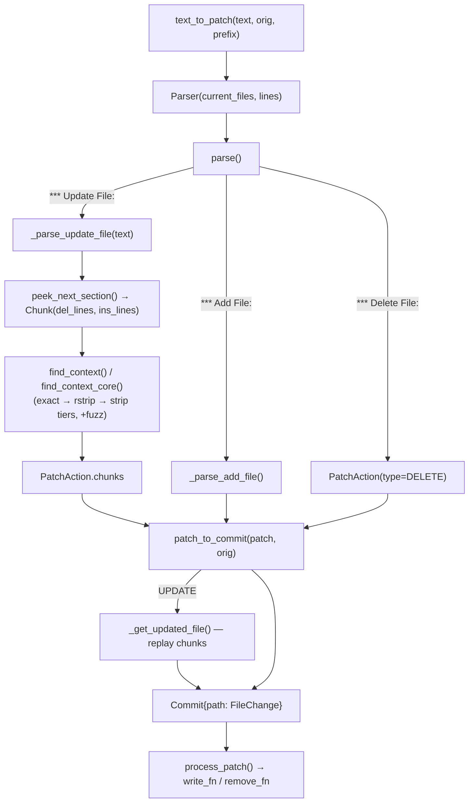

# apply_patch — fuzzy context-diff parsing for LLM-authored edits

Turns an LLM-authored `*** Begin Patch ... *** End Patch` text block — a context-diff format, not a unified
diff with line numbers — into concrete before/after file contents an editing step can write, by locating
each hunk's context lines *by content* in the current file rather than trusting any line number the model
claims.

## Overview
The whole design bets against trusting an LLM's line numbers. Instead of `@@ -12,4 +12,6 @@`-style line
ranges, each hunk in this format carries only a symbol/section name and a block of ` `/`+`/`-`-prefixed
context lines; [`text_to_patch`](../catalog/rdagent/utils/agent/apply_patch.md#text_to_patch) and
[`Parser`](../catalog/rdagent/utils/agent/apply_patch.md#Parser) locate where that context actually sits in
the *current* file's text via [`find_context`](../catalog/rdagent/utils/agent/apply_patch.md#find_context)/[`find_context_core`](../catalog/rdagent/utils/agent/apply_patch.md#find_context_core),
in three progressively looser tiers, and apply the hunk relative to wherever it was actually found — never
to whatever position the model implied. [`patch_to_commit`](../catalog/rdagent/utils/agent/apply_patch.md#patch_to_commit)
then materializes the parsed [`Patch`](../catalog/rdagent/utils/agent/apply_patch.md#Patch) into a concrete
[`Commit`](../catalog/rdagent/utils/agent/apply_patch.md#Commit) of old/new file contents, which
[`process_patch`](../catalog/rdagent/utils/agent/apply_patch.md#process_patch) applies through
caller-supplied I/O functions — so the parsing/resolution logic can run entirely in memory, independent of
any real filesystem.

## Diagram

## Design rationale (why it's built this way)
Context-matching instead of line-number-trusting exists because an LLM regularly gets exact line numbers
wrong — especially for a hunk after an earlier hunk in the same patch has already shifted line offsets — so
every hunk instead carries its own local context and is located by content search
([`find_context`](../catalog/rdagent/utils/agent/apply_patch.md#find_context)/[`find_context_core`](../catalog/rdagent/utils/agent/apply_patch.md#find_context_core))
at parse time; edits are then applied relative to `orig_index` (the position *found*, on
[`Chunk`](../catalog/rdagent/utils/agent/apply_patch.md#Chunk)), never a claimed line number.

[`find_context_core`](../catalog/rdagent/utils/agent/apply_patch.md#find_context_core) tries three
progressively looser equality tiers in order — exact line match, then `.rstrip()`-equal, then fully
`.strip()`-equal — accepting whitespace drift (trailing spaces, reindentation) rather than failing a patch
outright, while recording *how much* slack was needed as [`fuzz`](../catalog/rdagent/utils/agent/apply_patch.md#Parser.fuzz)
(accumulated on [`Parser`](../catalog/rdagent/utils/agent/apply_patch.md#Parser) and returned alongside the
parsed patch by [`text_to_patch`](../catalog/rdagent/utils/agent/apply_patch.md#text_to_patch)). Nothing in
this module thresholds on that value itself — it is reported, not enforced (see Open questions).

[`patch_to_commit`](../catalog/rdagent/utils/agent/apply_patch.md#patch_to_commit) is a distinct step from
actually writing anything: it resolves every [`PatchAction`](../catalog/rdagent/utils/agent/apply_patch.md#PatchAction)
into a [`FileChange`](../catalog/rdagent/utils/agent/apply_patch.md#FileChange) carrying concrete
`old_content`/`new_content` entirely in memory, and only [`process_patch`](../catalog/rdagent/utils/agent/apply_patch.md#process_patch)
touches I/O — via caller-injected `open_fn`/`write_fn`/`remove_fn` rather than calling `open()` directly
itself. That separation is what lets the parsing and chunk-resolution logic (the interesting, error-prone
half of this module) run and be tested against an in-memory `current_files` dict with no filesystem
involved at all.

## Entry points
- [`text_to_patch`](../catalog/rdagent/utils/agent/apply_patch.md#text_to_patch) — the real parse entry:
  validates the `*** Begin Patch`/`*** End Patch` sentinels (normalized through
  [`_norm`](../catalog/rdagent/utils/agent/apply_patch.md#Parser._norm), which strips a trailing `\r` so
  CRLF input round-trips the same as LF), then builds a
  [`Parser`](../catalog/rdagent/utils/agent/apply_patch.md#Parser) seeded with the file contents present
  before this patch ([`current_files`](../catalog/rdagent/utils/agent/apply_patch.md#Parser.current_files))
  and hands it to [`parse`](../catalog/rdagent/utils/agent/apply_patch.md#Parser.parse).
- [`patch_to_commit`](../catalog/rdagent/utils/agent/apply_patch.md#patch_to_commit) — reached once parsing
  finishes; turns the parsed [`Patch`](../catalog/rdagent/utils/agent/apply_patch.md#Patch) into a
  [`Commit`](../catalog/rdagent/utils/agent/apply_patch.md#Commit) with concrete file contents.
- [`process_patch`](../catalog/rdagent/utils/agent/apply_patch.md#process_patch) — the composed,
  caller-facing entry: resolves which paths the patch text touches, loads them via a caller-supplied
  `open_fn`, calls [`text_to_patch`](../catalog/rdagent/utils/agent/apply_patch.md#text_to_patch) then
  [`patch_to_commit`](../catalog/rdagent/utils/agent/apply_patch.md#patch_to_commit), and applies the result
  through caller-supplied `write_fn`/`remove_fn`.

## Mechanism (step-by-step)
1. [`text_to_patch`](../catalog/rdagent/utils/agent/apply_patch.md#text_to_patch) checks that the first and
   last lines (after [`_norm`](../catalog/rdagent/utils/agent/apply_patch.md#Parser._norm)) are the begin/end
   sentinels, raising [`DiffError`](../catalog/rdagent/utils/agent/apply_patch.md#DiffError) immediately if
   not, then constructs a [`Parser`](../catalog/rdagent/utils/agent/apply_patch.md#Parser) with `index=1`
   (skipping the begin sentinel) and calls [`parse`](../catalog/rdagent/utils/agent/apply_patch.md#Parser.parse).
2. [`parse`](../catalog/rdagent/utils/agent/apply_patch.md#Parser.parse) loops until
   [`is_done`](../catalog/rdagent/utils/agent/apply_patch.md#Parser.is_done) sees the end sentinel: each
   iteration tries, in order, to [`read_str`](../catalog/rdagent/utils/agent/apply_patch.md#Parser.read_str)
   an `"*** Update File: "`, `"*** Delete File: "`, then `"*** Add File: "` prefix. The matching branch
   dispatches to [`_parse_update_file`](../catalog/rdagent/utils/agent/apply_patch.md#Parser._parse_update_file)
   (recording an optional `"*** Move to: "` rename onto the resulting
   [`PatchAction`](../catalog/rdagent/utils/agent/apply_patch.md#PatchAction)'s
   [`move_path`](../catalog/rdagent/utils/agent/apply_patch.md#PatchAction.move_path)) or
   [`_parse_add_file`](../catalog/rdagent/utils/agent/apply_patch.md#Parser._parse_add_file); a line matching
   none of the three prefixes raises [`DiffError`](../catalog/rdagent/utils/agent/apply_patch.md#DiffError)
   naming the offending line via [`_cur_line`](../catalog/rdagent/utils/agent/apply_patch.md#Parser._cur_line).
3. [`_parse_update_file`](../catalog/rdagent/utils/agent/apply_patch.md#Parser._parse_update_file) processes
   one file's hunks: it optionally reads an `"@@ "` def-line via
   [`read_str`](../catalog/rdagent/utils/agent/apply_patch.md#Parser.read_str) and, when that exact string
   isn't already found among consumed lines, falls back to a stripped-equality search costing one
   [`fuzz`](../catalog/rdagent/utils/agent/apply_patch.md#Parser.fuzz) point; for every hunk it calls
   [`peek_next_section`](../catalog/rdagent/utils/agent/apply_patch.md#peek_next_section) to slice that
   hunk's context/insert/delete lines into [`Chunk`](../catalog/rdagent/utils/agent/apply_patch.md#Chunk)s,
   then [`find_context`](../catalog/rdagent/utils/agent/apply_patch.md#find_context) to locate them in the
   file — raising [`DiffError`](../catalog/rdagent/utils/agent/apply_patch.md#DiffError) rather than
   guessing if that search returns `-1`.
4. [`find_context`](../catalog/rdagent/utils/agent/apply_patch.md#find_context) special-cases
   end-of-file-anchored hunks: it first tries matching against the file's *tail*, and only falls back to a
   normal scan from `start` via [`find_context_core`](../catalog/rdagent/utils/agent/apply_patch.md#find_context_core)
   if that fails — adding a fixed `10_000` fuzz penalty in the fallback case, so an EOF-anchored hunk found
   mid-file is heavily disfavored (via reported `fuzz`) without being outright rejected.
5. Once every hunk for a path resolves into `PatchAction`'s [`chunks`](../catalog/rdagent/utils/agent/apply_patch.md#PatchAction.chunks),
   [`_get_updated_file`](../catalog/rdagent/utils/agent/apply_patch.md#_get_updated_file) replays them
   against the original text in order: for each [`Chunk`](../catalog/rdagent/utils/agent/apply_patch.md#Chunk)
   it copies untouched lines up to [`orig_index`](../catalog/rdagent/utils/agent/apply_patch.md#Chunk.orig_index),
   splices in [`ins_lines`](../catalog/rdagent/utils/agent/apply_patch.md#Chunk.ins_lines), and skips
   `len(`[`del_lines`](../catalog/rdagent/utils/agent/apply_patch.md#Chunk.del_lines)`)` original lines —
   raising [`DiffError`](../catalog/rdagent/utils/agent/apply_patch.md#DiffError) if a later chunk's
   `orig_index` doesn't strictly advance past the previous one (an overlap guard).
6. [`patch_to_commit`](../catalog/rdagent/utils/agent/apply_patch.md#patch_to_commit) walks every path in the
   parsed `Patch`'s [`actions`](../catalog/rdagent/utils/agent/apply_patch.md#Patch.actions) and, keyed on
   [`ActionType`](../catalog/rdagent/utils/agent/apply_patch.md#ActionType)
   ([`ADD`](../catalog/rdagent/utils/agent/apply_patch.md#ActionType.ADD) /
   [`DELETE`](../catalog/rdagent/utils/agent/apply_patch.md#ActionType.DELETE) /
   [`UPDATE`](../catalog/rdagent/utils/agent/apply_patch.md#ActionType.UPDATE)), builds the matching
   [`FileChange`](../catalog/rdagent/utils/agent/apply_patch.md#FileChange): `DELETE` records only
   [`old_content`](../catalog/rdagent/utils/agent/apply_patch.md#FileChange.old_content); `ADD` requires a
   non-`None` [`new_file`](../catalog/rdagent/utils/agent/apply_patch.md#PatchAction.new_file) or raises
   [`DiffError`](../catalog/rdagent/utils/agent/apply_patch.md#DiffError); `UPDATE` calls
   [`_get_updated_file`](../catalog/rdagent/utils/agent/apply_patch.md#_get_updated_file) and carries the
   action's [`move_path`](../catalog/rdagent/utils/agent/apply_patch.md#PatchAction.move_path) through onto
   the `FileChange`.
7. [`process_patch`](../catalog/rdagent/utils/agent/apply_patch.md#process_patch) is the only place all of
   the above runs connected to real I/O: it re-checks the begin sentinel, resolves and loads the paths the
   patch touches, calls [`text_to_patch`](../catalog/rdagent/utils/agent/apply_patch.md#text_to_patch) then
   [`patch_to_commit`](../catalog/rdagent/utils/agent/apply_patch.md#patch_to_commit), and applies the
   resulting [`Commit`](../catalog/rdagent/utils/agent/apply_patch.md#Commit) through the caller-supplied
   write/remove callables.

## Key data structures
- [`Patch`](../catalog/rdagent/utils/agent/apply_patch.md#Patch) /
  [`PatchAction`](../catalog/rdagent/utils/agent/apply_patch.md#PatchAction) — the parsed-but-unapplied
  representation: one `PatchAction` per path, carrying its
  [`ActionType`](../catalog/rdagent/utils/agent/apply_patch.md#ActionType), its
  [`chunks`](../catalog/rdagent/utils/agent/apply_patch.md#PatchAction.chunks) (Update only), and
  [`new_file`](../catalog/rdagent/utils/agent/apply_patch.md#PatchAction.new_file)/[`move_path`](../catalog/rdagent/utils/agent/apply_patch.md#PatchAction.move_path).
- [`Commit`](../catalog/rdagent/utils/agent/apply_patch.md#Commit) /
  [`FileChange`](../catalog/rdagent/utils/agent/apply_patch.md#FileChange) — the resolved representation:
  concrete [`old_content`](../catalog/rdagent/utils/agent/apply_patch.md#FileChange.old_content)/[`new_content`](../catalog/rdagent/utils/agent/apply_patch.md#FileChange.new_content)
  per path, ready to write, and inspectable before any write happens.
- [`Chunk`](../catalog/rdagent/utils/agent/apply_patch.md#Chunk) — one contiguous hunk:
  [`orig_index`](../catalog/rdagent/utils/agent/apply_patch.md#Chunk.orig_index) (where it was *found*, not
  where the model said it was), [`del_lines`](../catalog/rdagent/utils/agent/apply_patch.md#Chunk.del_lines)/[`ins_lines`](../catalog/rdagent/utils/agent/apply_patch.md#Chunk.ins_lines).
- [`Parser`](../catalog/rdagent/utils/agent/apply_patch.md#Parser) — the mutable cursor over the patch text:
  [`index`](../catalog/rdagent/utils/agent/apply_patch.md#Parser.index) (current line),
  [`lines`](../catalog/rdagent/utils/agent/apply_patch.md#Parser.lines),
  [`current_files`](../catalog/rdagent/utils/agent/apply_patch.md#Parser.current_files) (path → original
  content), [`patch`](../catalog/rdagent/utils/agent/apply_patch.md#Parser.patch) (being built),
  [`fuzz`](../catalog/rdagent/utils/agent/apply_patch.md#Parser.fuzz) (running total of matching slack
  used), and an optional [`prefix`](../catalog/rdagent/utils/agent/apply_patch.md#Parser.prefix) applied to
  every path in the patch.

## Dynamics (design intent)
`fuzz` is purely additive and informational within this module: [`text_to_patch`](../catalog/rdagent/utils/agent/apply_patch.md#text_to_patch)
returns `parser.fuzz` alongside the parsed [`Patch`](../catalog/rdagent/utils/agent/apply_patch.md#Patch),
but nothing in this subgraph reads that value back to reject or warn on an over-fuzzy match — accumulating
and reporting the slack used is this module's whole contribution; deciding whether a given fuzz level is
acceptable is left entirely to the caller.

> [!inferred] No test in the repo's configured test paths references this subgraph, so the parsing and
> fuzzy-matching behavior described above (the three equality tiers, the EOF-hunk fallback penalty, the
> overlap guard in `_get_updated_file`) is read directly from source rather than confirmed by an observed
> test run.

## Edge cases
- A second `Update`/`Delete`/`Add` action against a path already present in `Patch`'s
  [`actions`](../catalog/rdagent/utils/agent/apply_patch.md#Patch.actions) raises
  [`DiffError`](../catalog/rdagent/utils/agent/apply_patch.md#DiffError) in
  [`parse`](../catalog/rdagent/utils/agent/apply_patch.md#Parser.parse) rather than merging or overwriting
  the earlier action.
- `ADD` for a path already present in `current_files`, or `UPDATE`/`DELETE` for a path *not* present in
  `current_files`, both raise [`DiffError`](../catalog/rdagent/utils/agent/apply_patch.md#DiffError) from
  [`parse`](../catalog/rdagent/utils/agent/apply_patch.md#Parser.parse) — a patch cannot silently create a
  file that already exists or edit one that doesn't.
- [`_parse_add_file`](../catalog/rdagent/utils/agent/apply_patch.md#Parser._parse_add_file) requires *every*
  line in an Add section to start with `+`; a line that doesn't raises
  [`DiffError`](../catalog/rdagent/utils/agent/apply_patch.md#DiffError) immediately — an Add section is not
  itself diff-shaped, it's the literal new file content uniformly prefixed.
- [`patch_to_commit`](../catalog/rdagent/utils/agent/apply_patch.md#patch_to_commit) raises
  [`DiffError`](../catalog/rdagent/utils/agent/apply_patch.md#DiffError) if an `ADD` action's
  [`new_file`](../catalog/rdagent/utils/agent/apply_patch.md#PatchAction.new_file) is `None` — a state that
  shouldn't arise from [`_parse_add_file`](../catalog/rdagent/utils/agent/apply_patch.md#Parser._parse_add_file)
  but is checked anyway as a defensive invariant at the parse/commit boundary.
- CRLF input is normalized via [`_norm`](../catalog/rdagent/utils/agent/apply_patch.md#Parser._norm)
  wherever a line is compared against a literal prefix, but
  [`read_line`](../catalog/rdagent/utils/agent/apply_patch.md#Parser.read_line) and the raw
  [`lines`](../catalog/rdagent/utils/agent/apply_patch.md#Parser.lines) list still return the
  *un-normalized* line — a downstream consumer that doesn't re-normalize could still observe a stray `\r`.

## Open questions
- Nothing in this packet's subgraph shows how a patch text is first extracted from an LLM's raw response, or
  who supplies `process_patch`'s `open_fn`/`write_fn`/`remove_fn` inside the coding workflow — that
  connective code lives in the agent-output-parsing utilities outside this packet, so the link from "LLM
  emits a `*** Begin Patch` block" to "this parser runs on it" is not grounded here by a cited symbol.
- Whether any caller rejects a patch whose reported `fuzz` exceeds some threshold (rather than always
  accepting it) isn't settled by this subgraph — see Dynamics.

## See also
- [`rdagent-utils-workflow-loop`](rdagent-utils-workflow-loop.md) — apply_patch is one of the mechanics
  available to whatever coding-workflow step a concrete `LoopBase` subclass defines to turn a proposed idea
  into runnable code.
- [`rd-agent.md`](../../../sources/rd-agent.md) — FC-Coding-Workflow, the paper's name for the "idea → runnable
  code" component this utility supports.
