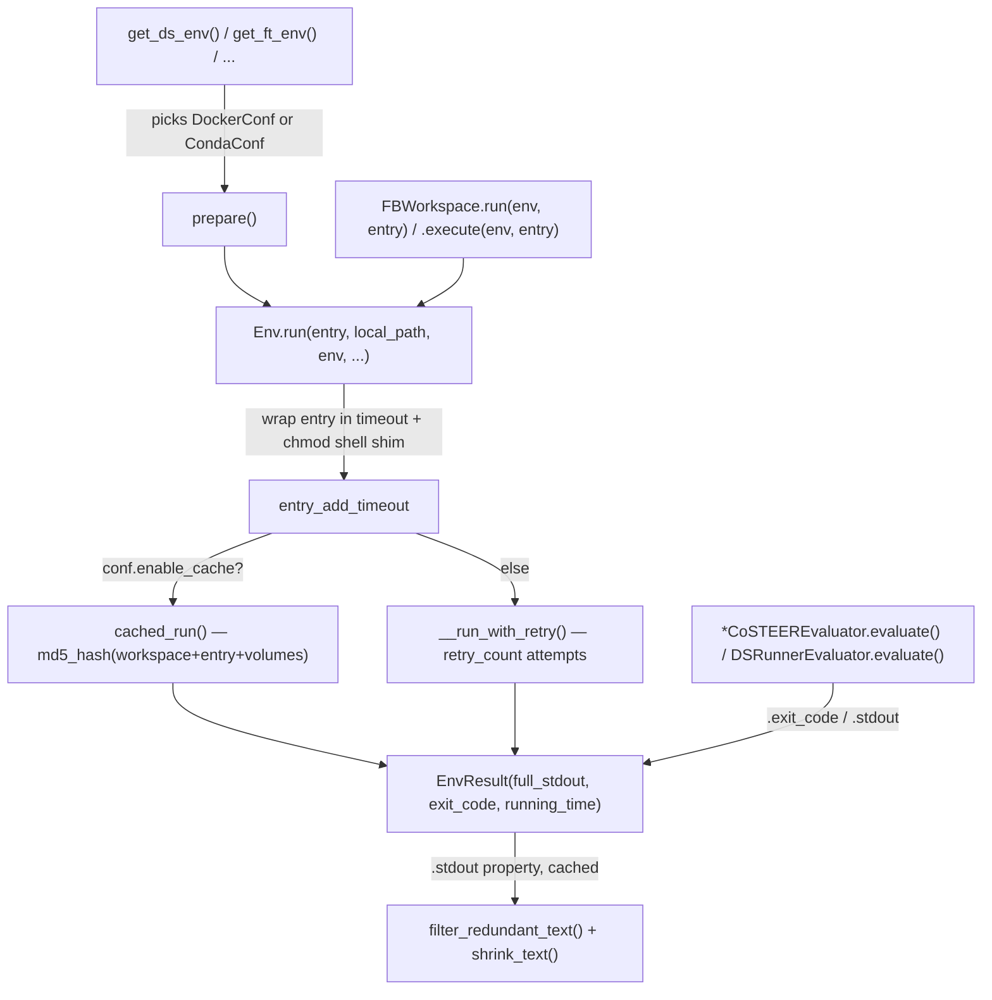

# Env — the sandboxed execution substrate for the Development phase

<!-- connect:up:begin -->
> **Cross-repo concept:** part of [research-development-loop](../../../concepts/research-development-loop.md) across this wiki's repos.
<!-- connect:up:end -->
## Overview
`Env` is RD-Agent's single abstraction for "run this candidate solution somewhere isolated and tell me
exactly what happened" — a Docker container by default, or a local conda environment for scenarios where
GPU-driver/toolchain compatibility makes containers impractical (LLM finetuning, RL post-training). Every
scenario builds its own `Env` via a factory ([`get_ds_env`](../catalog/rdagent/components/coder/data_science/conf.md#get_ds_env),
[`get_ft_env`](../catalog/rdagent/components/coder/finetune/conf.md#get_ft_env),
[`get_model_env`](../catalog/rdagent/components/coder/model_coder/conf.md#get_model_env),
[`get_factor_env`](../catalog/rdagent/components/coder/factor_coder/config.md#get_factor_env)) that picks a
concrete [`conf`](../catalog/rdagent/utils/env.md#Env.conf), but every one of those factories converges on
the same two calls — [`run`](../catalog/rdagent/utils/env.md#Env.run) in and an `EnvResult` (
[`exit_code`](../catalog/rdagent/utils/env.md#EnvResult.exit_code) /
[`stdout`](../catalog/rdagent/utils/env.md#EnvResult.stdout)) out — so the entire Development-phase "coding
workflow" and "evaluation strategy" (every `*Evaluator.evaluate` in the codebase) is built on one narrow,
backend-agnostic contract: give me stdout, an exit code, and a running time, no matter what actually executed
the code.

## Diagram

## Design rationale (why it's built this way)
[`run`](../catalog/rdagent/utils/env.md#Env.run) never hands the caller's `entry` command straight to the
backend. It always wraps it in one `/bin/sh -c '...'` invocation that (a) applies
`timeout --kill-after=10 <period>` around the command (skipped only when `running_timeout_period` is
`None`), so a runaway candidate solution cannot hang an entire loop iteration, and (b) captures that
command's own exit code into a shell variable *before* running a `chmod -R 777` pass over the mount path
(Docker only — `isinstance(self.conf, `[`DockerConf`](../catalog/rdagent/utils/env.md#DockerConf)`)`) and
only then re-exits with the saved code. The chmod exists because a container frequently writes files as a
different UID than the host process that later needs to read them; capturing the exit code *before* chmod
runs is what keeps a candidate's real success/failure signal from being clobbered by that housekeeping step.
[`DockerConf`](../catalog/rdagent/utils/env.md#DockerConf) carries an `exclude_chmod_paths` list precisely so
read-only mounts (e.g. the input dataset) aren't touched by that blanket 777.

Caching is opt-in per call (`conf.enable_cache`, read on [`DockerConf`](../catalog/rdagent/utils/env.md#DockerConf),
default `True`) and keys on *content*, not identity: [`cached_run`](../catalog/rdagent/utils/env.md#Env.cached_run)
hashes every `.py`/`.csv`/`.yaml` file's contents plus the entry string and extra volumes via
[`md5_hash`](../catalog/rdagent/utils/__init__.md#md5_hash), because each candidate solution lives in a
throwaway, UUID-named workspace directory — there is no stable path or timestamp to key on, only the code
and data actually present. A cache hit unpickles a stored `EnvResult` and re-extracts a zipped workspace-diff
rather than re-executing, which is what makes iterating on an evaluator's *prompt* (without touching the
candidate code) cheap during development.

The `EnvResult`'s [`stdout`](../catalog/rdagent/utils/env.md#EnvResult.stdout) is not the raw output stored
in `full_stdout`. It lazily computes and caches a truncated view by first running
[`filter_redundant_text`](../catalog/rdagent/utils/__init__.md#filter_redundant_text) — which strips ANSI
escapes and progress-bar noise, then *iteratively asks an LLM* (via
[`APIBackend`](../catalog/rdagent/oai/llm_utils.md#APIBackend) and
[`build_messages_and_create_chat_completion`](../catalog/rdagent/oai/backend/base.md#APIBackend.build_messages_and_create_chat_completion))
for additional regex patterns to filter, up to three rounds, whenever the shrunk text still exceeds the
backend's token budget. Stdout compression here is not purely mechanical truncation; part of it is itself an
LLM call, reusing the same [`T`](../catalog/rdagent/utils/agent/tpl.md#T)/[`r`](../catalog/rdagent/utils/agent/tpl.md#RDAT.r)
templating machinery the rest of the codebase uses for prompts.

## Entry points
- [`run`](../catalog/rdagent/utils/env.md#Env.run) — the single execution funnel; every other entry point
  below eventually calls this.
- [`get_ds_env`](../catalog/rdagent/components/coder/data_science/conf.md#get_ds_env) — the data-science
  scenario's factory, called at the top of every data-science evaluator's `evaluate` (e.g.
  [`evaluate`](../catalog/rdagent/scenarios/data_science/dev/runner/eval.md#DSRunnerEvaluator.evaluate) on
  `DSRunnerEvaluator`, or the identically-shaped
  [`evaluate`](../catalog/rdagent/components/coder/data_science/pipeline/eval.md#PipelineCoSTEEREvaluator.evaluate)
  on `PipelineCoSTEEREvaluator`,
  [`evaluate`](../catalog/rdagent/components/coder/data_science/workflow/eval.md#WorkflowGeneralCaseSpecEvaluator.evaluate)
  on `WorkflowGeneralCaseSpecEvaluator`,
  [`evaluate`](../catalog/rdagent/components/coder/data_science/model/eval.md#ModelGeneralCaseSpecEvaluator.evaluate)
  on `ModelGeneralCaseSpecEvaluator`,
  [`evaluate`](../catalog/rdagent/components/coder/data_science/raw_data_loader/eval.md#DataLoaderCoSTEEREvaluator.evaluate)
  on `DataLoaderCoSTEEREvaluator`, and
  [`evaluate`](../catalog/rdagent/components/coder/data_science/ensemble/eval.md#EnsembleCoSTEEREvaluator.evaluate)
  on `EnsembleCoSTEEREvaluator`) — before any of them touch `Env` directly.
- [`run`](../catalog/rdagent/core/experiment.md#FBWorkspace.run) /
  [`execute`](../catalog/rdagent/core/experiment.md#FBWorkspace.execute) (on `FBWorkspace`) — the
  workspace-level wrapper reached once a candidate solution's files are ready: it calls its own `prepare()`
  and `inject_files()` first, then delegates straight into `Env.run`, always passing
  `env={"PYTHONPATH": "./"}`.
- [`check_output`](../catalog/rdagent/utils/env.md#Env.check_output) — the stdout-only convenience entry
  used by setup/health-check code that doesn't need `exit_code`/`running_time` (e.g. `QTDockerEnv`'s own
  [`prepare`](../catalog/rdagent/utils/env.md#QTDockerEnv.prepare) uses it to download Qlib's reference
  dataset the first time it's needed).

## Mechanism (step-by-step)
1. A scenario factory (e.g. [`get_ds_env`](../catalog/rdagent/components/coder/data_science/conf.md#get_ds_env))
   instantiates a concrete `Env` with a [`conf`](../catalog/rdagent/utils/env.md#Env.conf) — a
   [`DockerConf`](../catalog/rdagent/utils/env.md#DockerConf) or a conda config — sets its `extra_volumes`
   and timeout, then calls a `prepare` override: `DockerEnv`'s own
   [`prepare`](../catalog/rdagent/utils/env.md#DockerEnv.prepare) pulls or builds the image only if it isn't
   already present; `QTDockerEnv`'s [`prepare`](../catalog/rdagent/utils/env.md#QTDockerEnv.prepare)
   additionally downloads Qlib's data via `check_output` the first time; `BenchmarkCondaEnv`'s
   [`prepare`](../catalog/rdagent/utils/env.md#BenchmarkCondaEnv.prepare) and `FTCondaEnv`'s
   [`prepare`](../catalog/rdagent/utils/env.md#FTCondaEnv.prepare) instead install conda-environment
   dependencies once per environment name — so `prepare` is deliberately backend-specific one-time setup,
   not a generic no-op.
2. [`run`](../catalog/rdagent/utils/env.md#Env.run) merges any per-call `env` dict onto
   `conf.env_dict`, defaults a missing `entry` to `conf.default_entry`, and — if the entry string itself
   contains a shell pipe (`"|"`) — logs a [`warning`](../catalog/rdagent/log/logger.md#RDAgentLog.warning)
   that the resulting `exit_code` will only reflect the pipeline's last command.
3. [`run`](../catalog/rdagent/utils/env.md#Env.run) wraps that entry in the timeout+chmod shell shim
   described in Design rationale, and — if `conf.redirect_stdout_to_file` is set — additionally appends a
   `> <hash>.log 2>&1` redirect so the command's own stdout never mixes with the backend's own log stream.
4. Depending on `conf.enable_cache`, `run` calls either
   [`cached_run`](../catalog/rdagent/utils/env.md#Env.cached_run) (content-hash lookup, described above) or
   the private retry wrapper directly for an uncached execution.
5. [`__run_with_retry`](../catalog/rdagent/utils/env.md#Env.__run_with_retry) calls the backend-specific
   execution (outside this packet's subgraph) up to `conf.retry_count + 1` times, sleeping
   `conf.retry_wait_seconds` between attempts, and — if the measured wall time comes within one second of
   `conf.running_timeout_period` — appends an explicit "the process is killed" note to the returned log,
   which is the observable signal that the timeout shim from step 3 actually fired.
6. Whichever path ran, the result becomes an `EnvResult`: `full_stdout`,
   [`exit_code`](../catalog/rdagent/utils/env.md#EnvResult.exit_code), and `running_time` stored as-is, plus
   a lazily computed [`stdout`](../catalog/rdagent/utils/env.md#EnvResult.stdout) property that filters and
   shrinks the raw text (cached per distinct `full_stdout` value, so repeated reads don't re-run the
   LLM-assisted filter). `run` also scrubs any literal absolute workspace path out of the returned stdout,
   replacing it with the literal string `<WORKSPACE_PATH>` before returning.
7. Every Development-phase caller reads back through the same two fields:
   [`execute`](../catalog/rdagent/core/experiment.md#FBWorkspace.execute) (on `FBWorkspace`) returns just
   `result.stdout`, while every `*Evaluator.evaluate` reads both
   [`exit_code`](../catalog/rdagent/utils/env.md#EnvResult.exit_code) and
   [`stdout`](../catalog/rdagent/utils/env.md#EnvResult.stdout) off the `EnvResult` returned by
   `.run(env=env, entry=...)` to build the structured feedback the Research phase's next hypothesis will
   read.

## Key data structures
- `EnvResult` — `full_stdout` / [`exit_code`](../catalog/rdagent/utils/env.md#EnvResult.exit_code) /
  `running_time`, plus the cached, filtered [`stdout`](../catalog/rdagent/utils/env.md#EnvResult.stdout)
  view; the one object every evaluator and every human debugging a failed run reads.
- [`conf`](../catalog/rdagent/utils/env.md#Env.conf) — the per-`Env` configuration object;
  [`DockerConf`](../catalog/rdagent/utils/env.md#DockerConf) alone carries `extra_volumes` (its own
  docstring: accepts either `{host_path: container_path}` or `{host_path: {"bind":..., "mode":...}}`),
  `extra_volume_mode` (default `"ro"` — only the mount path itself is writable by default),
  `exclude_chmod_paths`, `enable_gpu` (default `True`), `mem_limit` (default `"48g"`), `enable_cache`
  (default `True`), and `retry_count`/`retry_wait_seconds` (defaults 5 / 10s).
- [`get_ft_env`](../catalog/rdagent/components/coder/finetune/conf.md#get_ft_env) — a representative
  scenario factory: it maps an `operation` string (`"data_processing"` / `"micro_batch"` /
  `"full_training"`) onto a different configured timeout before constructing the `Env`, so one factory
  serves several distinct phases of the same finetune workflow with phase-appropriate patience.

## Dynamics (design intent)
[`test_run`](../catalog/test/utils/test_env.md#EnvUtils.test_run) exercises the timeout shim directly: it
configures `running_timeout_period=1` and runs `sleep 2` against a `QTDockerEnv`, asserting `exit_code ==
124` — the standard exit code `timeout(1)` itself returns on a kill — confirming the shell-shim wrapping in
`run` (step 3 above) does propagate that specific code back through `EnvResult`'s
[`exit_code`](../catalog/rdagent/utils/env.md#EnvResult.exit_code) rather than, say, the Docker exec call's
own default failure code. The same test also confirms the ordinary success path (`echo "Hello, World!"` →
`exit_code == 0`, `"Hello, World!"` present in `stdout`) and an invalid-command failure path (non-zero
`exit_code`) against a live Docker backend.

[`test_conda_error`](../catalog/test/utils/test_env.md#EnvUtils.test_conda_error) exercises the conda
backend with a Python script that raises a `UnicodeDecodeError` on invalid bytes, asserting `exit_code == 1`
and that the literal `"bytes can only contain ASCII literal characters"` message is present in `stdout` — a
concrete case of the codebase relying on the *executed program's own* error text propagating through
`EnvResult.stdout` unmodified enough for a downstream LLM evaluator to read it.

[`run_benchmark_simple`](../catalog/test/finetune/test_benchmark.md#run_benchmark_simple) and
[`run_benchmark_api`](../catalog/test/finetune/test_benchmark_api.md#run_benchmark_api) show the same `Env`
contract reused for a use case beyond coder evaluation entirely — LLM finetune benchmarking — confirming
`conf`/`run`/`exit_code`/`stdout` are exercised identically whether the caller is a `*CoSTEEREvaluator` or a
standalone benchmark script.

## Edge cases
- [`extract_info_from_docker`](../catalog/rdagent/scenarios/finetune/scen/llama_factory_manager.md#LLaMAFactoryManager.extract_info_from_docker)
  treats a non-zero [`exit_code`](../catalog/rdagent/utils/env.md#EnvResult.exit_code) from `run` as an
  unconditional `RuntimeError` — a sharp contrast with every `*Evaluator.evaluate`, which instead packages a
  non-zero exit code into structured feedback for the *next* Research iteration. Not every `Env` caller
  participates in the closed research/development loop; setup and health-check code paths treat execution
  failure as fatal instead.
- `DockerEnv`'s [`refresh_env`](../catalog/rdagent/utils/env.md#DockerEnv.refresh_env) force-removes the
  configured Docker image (and prunes dangling images/build cache) before calling its own
  [`prepare`](../catalog/rdagent/utils/env.md#DockerEnv.prepare) again — the only way, within this subgraph,
  to force a stale image to be rebuilt/re-pulled rather than reused.
- [`run`](../catalog/rdagent/utils/env.md#Env.run)'s shell-pipe warning only fires on a literal `"|"`
  substring in `entry` — it does not distinguish a pipe inside a quoted string from an actual shell pipeline,
  so a command that merely contains a `|` character in, say, a regex argument would still trigger the
  warning even though its exit code is not actually ambiguous.
- [`cached_run`](../catalog/rdagent/utils/env.md#Env.cached_run)'s hash key is built from `.py`/`.csv`/`.yaml`
  file contents plus `entry` and `extra_volumes` only — any other file extension a candidate solution reads
  or writes is invisible to the cache key, so changing (say) a `.json` config without touching any hashed
  file would silently reuse a stale cached result.

## Open questions
- The concrete per-backend execution call (`_run` on `DockerEnv`/`LocalEnv`) that `__run_with_retry` invokes
  is outside this packet's cited subgraph, so exact container lifecycle details (network mode, GPU device
  request selection, volume-mount timing) are not grounded here by a citable symbol.
- Whether `enable_cache`'s content hash is ever invalidated by anything other than the hashed file set
  changing (e.g. an explicit cache-clear command) isn't shown by this subgraph.

## See also
- [`rdagent-utils-workflow-loop`](rdagent-utils-workflow-loop.md) — the loop whose Development-phase steps
  are the primary callers of `Env.run`/`FBWorkspace.run`.
- [`rd-agent.md`](../../../sources/rd-agent.md) — FC-Coding-Workflow and FC-Evaluation-Strategy, the paper's
  names for what this module implements.
- [`research-development-loop`](../../../concepts/research-development-loop.md) — the cross-repo concept
  page this module's role in the Development phase instantiates.
