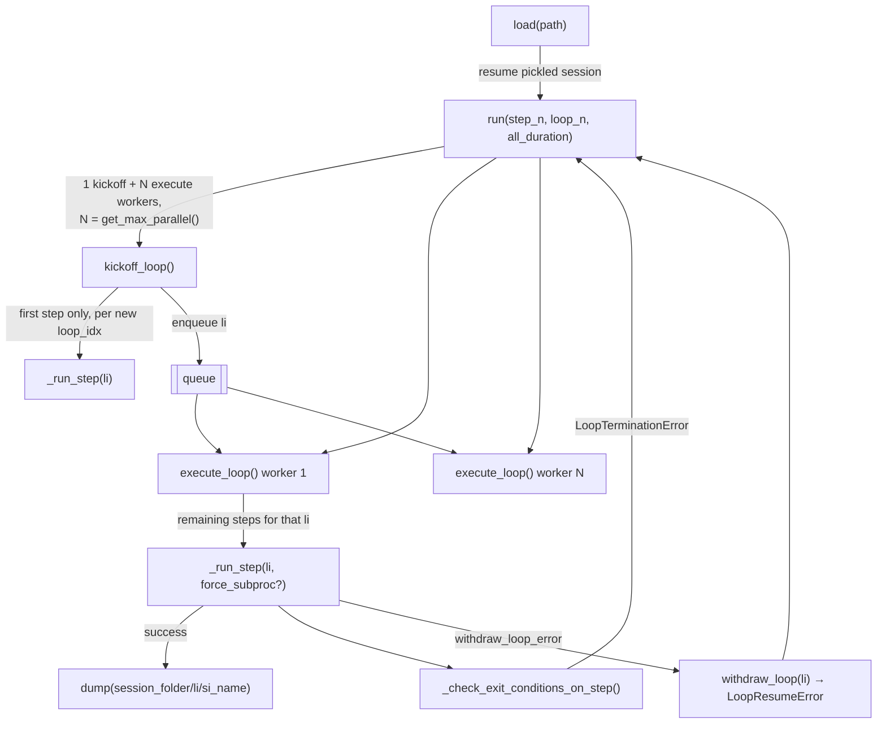

# LoopBase — the generic async engine behind Algorithm 1's R&D loop

<!-- connect:up:begin -->
> **Cross-repo concept:** part of [closed-loop-experiment-design](../../../concepts/closed-loop-experiment-design.md), [research-development-loop](../../../concepts/research-development-loop.md) across this wiki's repos.
<!-- connect:up:end -->
## Overview
Every scenario RD-Agent ships — qlib factors/models/quant, Kaggle, data science, LLM finetuning, RL
post-training — is, mechanically, the *same* loop: [`LoopBase`](../catalog/rdagent/utils/workflow/loop.md#LoopBase)
in `rdagent/utils/workflow/loop.py`. A concrete scenario subclasses it and simply writes ordinary methods
(one per stage); the base class turns whatever methods it finds into an ordered `steps` pipeline and runs
them as an async producer/consumer system, so "define Algorithm 1's Research→Development stages" reduces to
"define Python methods with the right names" — the scheduling, retry, timeout, resumability, and error-routing
machinery is entirely generic and lives here, once. This is, concretely, the paper's Algorithm 1
("while time remains: Planning → SelectParents → Memory Context → Reasoning Pipeline → Dev → Eval", appending
`(parents, idea, code, score)` to a graph `G`) — see [`rd-agent.md`](../../../sources/rd-agent.md) for the
paper-level description; this page grounds the *implementation* the paper's prose describes.

## Diagram

## Design rationale (why it's built this way)
[`LoopBase`](../catalog/rdagent/utils/workflow/loop.md#LoopBase)'s own docstring states its one hard
assumption plainly: "The last step is responsible for recording information!!!!" — every step-name list a
scenario defines is trusted to end with whatever closes the loop (writes the new `(parents, idea, code,
score)` record). Nothing in this class *enforces* that ordering; it is a convention the rest of the design
leans on, which is why record-like steps get special-cased elsewhere (see Dynamics).

A metaclass (outside this packet's cited subgraph) inspects each subclass's plain public methods at
class-creation time and installs them, in declaration order and deduplicated down the inheritance chain, as
[`steps`](../catalog/rdagent/utils/workflow/loop.md#LoopBase.steps) — so a concrete scenario "defines
Algorithm 1's stages" simply by writing methods on its `Loop` subclass; `LoopBase` itself never names a
single stage. That genericity is the point: [`RDLoop`](../catalog/rdagent/components/workflow/rd_loop.md#RDLoop)
(cited below) is one concrete instantiation built on top of `hypothesis_gen`/`coder`/`runner`/`summarizer`
components, and scenario-specific loops such as `DataScienceRDLoop` are another — both drive through the
exact same [`run`](../catalog/rdagent/utils/workflow/loop.md#LoopBase.run)/[`_run_step`](../catalog/rdagent/utils/workflow/loop.md#LoopBase._run_step)
machinery.

`run` deliberately splits into one [`kickoff_loop`](../catalog/rdagent/utils/workflow/loop.md#LoopBase.kickoff_loop)
coroutine plus several [`execute_loop`](../catalog/rdagent/utils/workflow/loop.md#LoopBase.execute_loop)
workers rather than one coroutine per loop iteration end-to-end. `kickoff_loop` only ever runs a loop's
*first* step (by convention, ExpGen/Research) before handing the loop index off to a queue — so a slow
Development phase for loop 3 never blocks loop 4's Research phase from starting, up to
[`get_max_parallel`](../catalog/rdagent/core/conf.md#RDAgentSettings.get_max_parallel)'s configured
concurrency. This is the concrete mechanism behind running several exploration branches of the trace DAG
concurrently (see [`rdagent-scenarios-data_science-proposal-exp_gen-base`](rdagent-scenarios-data_science-proposal-exp_gen-base.md)
for what "branch" means at the data-science scenario level).

`_run_step`'s `force_subproc` path — running a step in a `ProcessPoolExecutor` via `copy.deepcopy` of both
the function and its input dict — carries an explicit author comment worth quoting: "Using deepcopy is to
avoid triggering errors like 'RuntimeError: dictionary changed size during iteration' … Some content in
`self.loop_prev_out[li]` may be in the middle of being changed." That is, isolating a step into a subprocess
isn't (only) about CPU parallelism; it's a defensive measure against a shared, mutable, cross-coroutine
dictionary being read while another coroutine is still writing into it.

## Entry points
- [`main`](../catalog/rdagent/app/data_science/loop.md#main) (and the sibling `main` functions for
  [qlib factor](../catalog/rdagent/app/qlib_rd_loop/factor.md#main),
  [qlib model](../catalog/rdagent/app/qlib_rd_loop/model.md#main),
  [qlib quant](../catalog/rdagent/app/qlib_rd_loop/quant.md#main),
  [kaggle](../catalog/rdagent/app/kaggle/loop.md#main),
  [LLM finetune](../catalog/rdagent/app/finetune/llm/loop.md#main), and
  [RL post-training](../catalog/rdagent/app/rl/loop.md#main)) — every scenario's CLI entry point, which
  either constructs a fresh concrete `Loop` or calls [`load`](../catalog/rdagent/utils/workflow/loop.md#LoopBase.load)
  against a session path, then calls [`run`](../catalog/rdagent/utils/workflow/loop.md#LoopBase.run).
- [`run`](../catalog/rdagent/utils/workflow/loop.md#LoopBase.run) — the loop's true entry point regardless
  of scenario: starts the timer if a duration was given, then spawns
  [`kickoff_loop`](../catalog/rdagent/utils/workflow/loop.md#LoopBase.kickoff_loop) and
  [`execute_loop`](../catalog/rdagent/utils/workflow/loop.md#LoopBase.execute_loop) workers together.
- [`load`](../catalog/rdagent/utils/workflow/loop.md#LoopBase.load) — reached whenever a scenario `main`
  is given a `path` argument (e.g. `$LOG_PATH/__session__/1/0_propose`); unpickles a previously
  [`dump`](../catalog/rdagent/utils/workflow/loop.md#LoopBase.dump)ed `LoopBase` and optionally checks out
  a fresh log directory. `DataScienceRDLoop`'s own
  [`load`](../catalog/rdagent/scenarios/data_science/loop.md#DataScienceRDLoop.load)
  overrides it to also re-attach a knowledge base after the base restore runs.

## Mechanism (step-by-step)
1. [`run`](../catalog/rdagent/utils/workflow/loop.md#LoopBase.run) initializes the wall-clock budget (calling
   [`reset`](../catalog/rdagent/log/timer.md#RDAgentTimer.reset) on the shared
   [`timer`](../catalog/rdagent/utils/workflow/loop.md#LoopBase.timer) only if a duration was passed and no
   timer is already running), applies any `step_n`/`loop_n` overrides, empties the queue, and resets
   [`loop_idx`](../catalog/rdagent/utils/workflow/loop.md#LoopBase.loop_idx) to `0` — so re-running an
   already-partially-completed loop always restarts kickoff from the beginning even though individual loop
   indices may already have finished steps recorded.
2. It then spawns exactly one [`kickoff_loop`](../catalog/rdagent/utils/workflow/loop.md#LoopBase.kickoff_loop)
   task and `N = `[`get_max_parallel`](../catalog/rdagent/core/conf.md#RDAgentSettings.get_max_parallel)`()`
   [`execute_loop`](../catalog/rdagent/utils/workflow/loop.md#LoopBase.execute_loop) worker tasks together
   via `asyncio.gather`, inside a `try`/`except`/`finally` that distinguishes two custom exceptions from an
   ordinary crash (see step 6).
3. [`kickoff_loop`](../catalog/rdagent/utils/workflow/loop.md#LoopBase.kickoff_loop) advances the *next*
   loop index: if this is the first time loop `li` is touched (`step_idx[li] == 0`), it runs only that loop's
   first step via [`_run_step`](../catalog/rdagent/utils/workflow/loop.md#LoopBase._run_step) — by convention
   ExpGen, i.e. the Research phase deciding when to stop producing new candidate experiments — then always
   enqueues `li` and increments [`loop_idx`](../catalog/rdagent/utils/workflow/loop.md#LoopBase.loop_idx),
   yielding control (`asyncio.sleep(0)`) so waiting workers get scheduled.
4. Each [`execute_loop`](../catalog/rdagent/utils/workflow/loop.md#LoopBase.execute_loop) worker dequeues a
   loop index (or exits on the `SENTINEL` value) and drives that loop's remaining
   [`steps`](../catalog/rdagent/utils/workflow/loop.md#LoopBase.steps) to completion: every step except the
   last runs through [`_run_step`](../catalog/rdagent/utils/workflow/loop.md#LoopBase._run_step) with
   `force_subproc` set from a global setting (so non-final steps may run isolated in a subprocess), while the
   assumed-last "record" step always runs inline in the worker's own coroutine.
5. [`_run_step`](../catalog/rdagent/utils/workflow/loop.md#LoopBase._run_step) is the actual unit of work: it
   looks up the current step name from [`step_idx`](../catalog/rdagent/utils/workflow/loop.md#LoopBase.step_idx)/[`steps`](../catalog/rdagent/utils/workflow/loop.md#LoopBase.steps),
   logs progress through [`log_workflow_state`](../catalog/rdagent/utils/workflow/tracking.md#WorkflowTracker.log_workflow_state),
   stamps the loop index into [`loop_prev_out`](../catalog/rdagent/utils/workflow/loop.md#LoopBase.loop_prev_out)
   *before* calling the step function (so every step is aware of which loop it belongs to), then calls that
   step (`await`ed if async, otherwise sync, or deep-copied into a `ProcessPoolExecutor` if `force_subproc`)
   with the loop's accumulated prior output dict as its only argument.
6. Two configurable exception classes change control flow instead of propagating: `skip_loop_error` jumps the
   *current* loop forward to its `feedback` step (or the last step if none exists) and stores the exception
   under a sentinel key rather than crashing, while `withdraw_loop_error` calls
   [`withdraw_loop`](../catalog/rdagent/utils/workflow/loop.md#LoopBase.withdraw_loop) — which reloads the
   *entire* pickled state from the previous loop's *earliest* (lowest-step-index) [`dump`](../catalog/rdagent/utils/workflow/loop.md#LoopBase.dump)
   (it selects that dump via `min(...)` keyed on the step-index prefix, not the latest one)
   — and raises `LoopResumeError`, which [`run`](../catalog/rdagent/utils/workflow/loop.md#LoopBase.run)
   catches by cancelling every outstanding task and restarting `kickoff_loop`/`execute_loop` from
   `loop_idx = 0`. A single loop's error can therefore tear down and restart the *whole* async fleet, not
   just that loop.
7. On success, `_run_step` advances `step_idx` for that loop, updates the progress bar, and — only when the
   step actually ran forward — calls [`dump`](../catalog/rdagent/utils/workflow/loop.md#LoopBase.dump) to
   pickle the entire `LoopBase` instance to `session_folder/<li>/<si>_<name>`, then calls
   [`_check_exit_conditions_on_step`](../catalog/rdagent/utils/workflow/loop.md#LoopBase._check_exit_conditions_on_step).
8. [`_check_exit_conditions_on_step`](../catalog/rdagent/utils/workflow/loop.md#LoopBase._check_exit_conditions_on_step)
   decrements a remaining-`step_n` counter (raising `LoopTerminationError` once exhausted) and, if the
   [`timer`](../catalog/rdagent/utils/workflow/loop.md#LoopBase.timer) has [`started`](../catalog/rdagent/log/timer.md#RDAgentTimer.started),
   raises the same error once [`is_timeout`](../catalog/rdagent/log/timer.md#RDAgentTimer.is_timeout)
   returns true — this is the literal "while time remains" of Algorithm 1: the check runs after *every*
   step, not just at a loop boundary, so a long-running step can still be the one that trips it.
9. [`load`](../catalog/rdagent/utils/workflow/loop.md#LoopBase.load) resumes a pickled session: it locates
   the latest step dump under a session folder if given a directory, unpickles it, optionally truncates
   trailing logs when `checkout=True`, and — if the restored session's
   [`timer`](../catalog/rdagent/utils/workflow/loop.md#LoopBase.timer) had
   [`started`](../catalog/rdagent/log/timer.md#RDAgentTimer.started) — either
   [`replace_timer`](../catalog/rdagent/log/timer.md#RDAgentTimerWrapper.replace_timer)s the process-global
   timer with the session's and calls [`restart_by_remain_time`](../catalog/rdagent/log/timer.md#RDAgentTimer.restart_by_remain_time)
   (so a resumed run keeps counting down from where it left off, not from a fresh full duration), or keeps
   the caller's fresh timer instead, depending on the `replace_timer` argument.
   `DataScienceRDLoop`'s own [`load`](../catalog/rdagent/scenarios/data_science/loop.md#DataScienceRDLoop.load)
   layers scenario-specific rehydration on top of this: after calling the base restore it logs the current
   competition via [`log_object`](../catalog/rdagent/log/logger.md#RDAgentLog.log_object) and, if a knowledge
   base is enabled, re-attaches one to [`trace`](../catalog/rdagent/scenarios/data_science/loop.md#DataScienceRDLoop.trace)
   (a [`DSTrace`](../catalog/rdagent/scenarios/data_science/proposal/exp_gen/base.md#DSTrace) instance —
   see [`rdagent-scenarios-data_science-proposal-exp_gen-base`](rdagent-scenarios-data_science-proposal-exp_gen-base.md)).

## Key data structures
- [`steps`](../catalog/rdagent/utils/workflow/loop.md#LoopBase.steps) — the ordered list of step-method
  names a concrete scenario contributes; `LoopBase` never hardcodes what a step *does*, only that it exists
  and (by convention) ends with a recording step.
- [`step_idx`](../catalog/rdagent/utils/workflow/loop.md#LoopBase.step_idx) /
  [`loop_idx`](../catalog/rdagent/utils/workflow/loop.md#LoopBase.loop_idx) — per-loop "next step to run" and
  "next loop to kick off" counters; together they are the resumable position in the whole workflow.
- [`loop_prev_out`](../catalog/rdagent/utils/workflow/loop.md#LoopBase.loop_prev_out) — nested
  `{loop_idx: {step_name: result}}` dict: this *is* the paper's `(parents, idea, code, score)` payload as it
  flows between steps within one loop, before a recording step folds it into permanent state.
- [`loop_trace`](../catalog/rdagent/utils/workflow/loop.md#LoopBase.loop_trace) — per-loop list of
  start/end timestamps per step, independent of `loop_prev_out`, used purely for timing/observability.
- [`session_folder`](../catalog/rdagent/utils/workflow/loop.md#LoopBase.session_folder) — where
  [`dump`](../catalog/rdagent/utils/workflow/loop.md#LoopBase.dump) writes one pickle per successfully
  completed step, which is what makes `path`-based resume (`$LOG_PATH/__session__/1/0_propose`) possible at
  step granularity, not just loop granularity.
- [`timer`](../catalog/rdagent/utils/workflow/loop.md#LoopBase.timer) (an
  [`RD_Agent_TIMER_wrapper`](../catalog/rdagent/log/timer.md#RD_Agent_TIMER_wrapper.RD_Agent_TIMER_wrapper)-backed
  [`timer`](../catalog/rdagent/log/timer.md#RDAgentTimerWrapper.timer)) — the wall-clock budget that
  both [`_check_exit_conditions_on_step`](../catalog/rdagent/utils/workflow/loop.md#LoopBase._check_exit_conditions_on_step)
  and every scenario's own planning logic read from.
- [`RDLoop`](../catalog/rdagent/components/workflow/rd_loop.md#RDLoop) — the first concrete `LoopBase`
  subclass in the codebase, wiring generic `hypothesis_gen`/`coder`/`runner`/`summarizer` components and a
  base `Trace` (outside this packet's subgraph) onto the engine described above.

## Dynamics (design intent)
`run`'s two custom exceptions produce two different blast radii on failure: `LoopTerminationError` is a
clean, expected stop condition (step/time budget exhausted) that `run` catches, cancels all tasks for, and
exits normally from — logging a warning and (per source) terminating any leftover subprocesses, since
"coroutine-based workflow can't automatically stop subprocesses" spawned by `force_subproc`.
`LoopResumeError`, by contrast, is a full-fleet reset: it is only ever raised after
[`withdraw_loop`](../catalog/rdagent/utils/workflow/loop.md#LoopBase.withdraw_loop) has already overwritten
`self.__dict__` with a previously dumped state, and `run` responds by resetting `loop_idx` to `0` and
re-entering the `while True` retry loop with fresh `kickoff_loop`/`execute_loop` tasks — i.e. one loop's
unrecoverable error rolls the *entire* running session back to its last good on-disk snapshot rather than
just retrying that one loop.

Per-step-name concurrency (visible in [`_run_step`](../catalog/rdagent/utils/workflow/loop.md#LoopBase._run_step)'s
semaphore acquisition) is deliberately asymmetric: most steps share
[`RD_AGENT_SETTINGS`](../catalog/rdagent/core/conf.md#RD_AGENT_SETTINGS)'s configured parallelism, but the
source pins concurrency to `1` specifically for steps named `record`/`feedback`, with an inline author
comment explaining why — the record step is "always the last step to modify the global environment," and
`feedback`/`record` share a comparison target that would otherwise be read and written inconsistently by
overlapping loop iterations. This is read directly from source rather than confirmed by a test, since
[`_run_step`](../catalog/rdagent/utils/workflow/loop.md#LoopBase._run_step) is not exercised by any test in
this packet's Evidence.

> [!inferred] The evidence table for this packet shows only `DS_RD_SETTING`, `competition`, and
> `RD_AGENT_SETTINGS` referenced by tests (`test_competition_template`, `test_checkpoint_roundtrip`,
> and several `data_science/test_eval.py` tests) — none of them exercise `run`/`_run_step`/`kickoff_loop`/`execute_loop`
> directly, so the concurrency and error-routing behavior described above is a reading of the source, not an
> observed test outcome.

## Edge cases
- `force_subproc=True` deep-copies both the step function and `loop_prev_out[li]` before handing them to a
  `ProcessPoolExecutor`, specifically (per the author's own comment) to dodge `RuntimeError: dictionary
  changed size during iteration` from another coroutine mutating that same dict concurrently — a
  same-process race the deep-copy sidesteps rather than fixes at the source.
- [`withdraw_loop`](../catalog/rdagent/utils/workflow/loop.md#LoopBase.withdraw_loop) looks for the previous
  loop's *earliest* dumped step (the minimum step-index prefix, via `min(...)`) under
  `session_folder/<loop_idx - 1>`; if that directory has no dumped step files
  at all, it logs an error and re-raises a bare `raise` with no exception object attached — a rollback with
  nothing to roll back to fails loudly rather than silently continuing.
- [`dump`](../catalog/rdagent/utils/workflow/loop.md#LoopBase.dump) unconditionally calls
  `RD_Agent_TIMER_wrapper.timer.update_remain_time()` before pickling if the timer has
  [`started`](../catalog/rdagent/log/timer.md#RDAgentTimer.started) — so every on-disk snapshot carries an
  accurate remaining-time value as of that step, which is what lets
  [`restart_by_remain_time`](../catalog/rdagent/log/timer.md#RDAgentTimer.restart_by_remain_time) resume
  counting down correctly after a [`load`](../catalog/rdagent/utils/workflow/loop.md#LoopBase.load).
- [`load`](../catalog/rdagent/utils/workflow/loop.md#LoopBase.load)'s `checkout` argument has three distinct
  behaviors (`True`, `False`, or a path) documented directly in its own docstring: reuse-and-truncate,
  reuse-and-keep, or fork to a new path leaving the original untouched — a caller passing the wrong one can
  silently either destroy trailing logs it meant to keep or keep logs it meant to discard.

## Open questions
- [`LoopBase`](../catalog/rdagent/utils/workflow/loop.md#LoopBase)'s own docstring lists an explicit
  "Unsolved problem": *"Global variable synchronization when `force_subproc` is `True` — Timer"* — the class
  author flags, in the source itself, that the shared timer's state is not guaranteed consistent across a
  subprocess-isolated step, without this packet's subgraph showing a resolution.
- This packet's subgraph does not include the metaclass that builds `steps` from a subclass's method names,
  so the exact rule for *which* public methods get excluded (beyond `load`/`dump`) is not grounded here by a
  citable symbol.
- Which concrete method names a given scenario (e.g. `DataScienceRDLoop`) assigns to `steps`, and how those
  names map onto the paper's six FC-components, is scenario-specific and outside this subgraph; see
  [`rdagent-scenarios-data_science-proposal-exp_gen-base`](rdagent-scenarios-data_science-proposal-exp_gen-base.md)
  for the data-science Research-phase half of that mapping.

## See also
- [`rd-agent.md`](../../../sources/rd-agent.md) — the paper's Algorithm 1 and six-FC-component description
  this engine implements.
- [`rdagent-utils-env`](rdagent-utils-env.md) — the sandboxed execution substrate the Development-phase
  steps this loop drives typically call into.
- [`rdagent-scenarios-data_science-proposal-exp_gen-base`](rdagent-scenarios-data_science-proposal-exp_gen-base.md) —
  the data-science scenario's concrete `DSTrace`/`ExpGen` machinery that runs as this loop's Research-phase
  steps.
- [`research-development-loop`](../../../concepts/research-development-loop.md) and
  [`closed-loop-experiment-design`](../../../concepts/closed-loop-experiment-design.md) — the cross-repo
  concept pages this mechanism instantiates.
