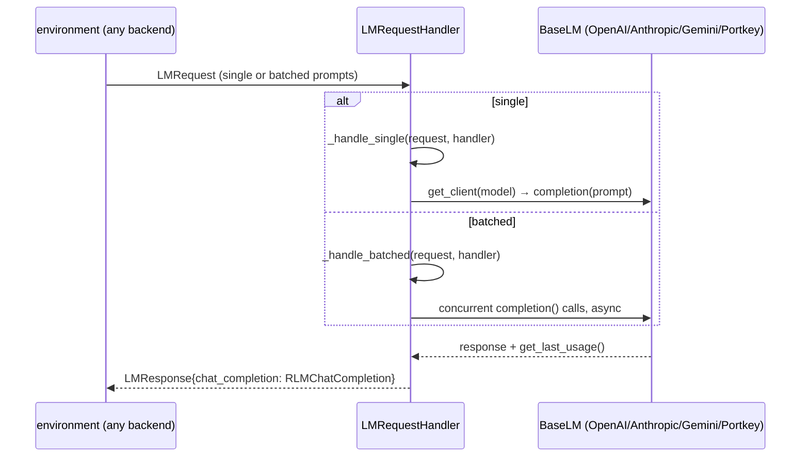

# LMHandler — the socket server that lets sandboxed code reach a model

## Overview

[`LMHandler`](../catalog/rlm/core/lm_handler.md#LMHandler) is the piece that makes environment isolation
possible at all: the REPL executing model-generated code may be a subprocess, a Docker container, or a
sandbox on an entirely different machine, so it cannot hold a Python reference to the model client. Instead,
[`RLM._spawn_completion_context`](rlm-core-rlm.md) starts an `LMHandler` as a background **socket server**
and passes only `(host, port)` into the environment; any `llm_query`/`rlm_query` call the model's generated
code makes is really a network request to this server, which does hold the real
[`BaseLM`](../catalog/rlm/clients/base_lm.md#BaseLM) client and dispatches on its behalf.

## Diagram

## Design rationale (why it's built this way)

**A request/response protocol, not a shared-memory call, is what makes `IsolatedEnv` backends possible.**
Every backend — local subprocess or remote sandbox — reaches the model the same way: serialize an
[`LMRequest`](../catalog/rlm/core/comms_utils.md#LMRequest), send it to the handler's socket address, get an
[`LMResponse`](../catalog/rlm/core/comms_utils.md#LMResponse) back. For the isolated backends (Modal, Prime,
Daytona, E2B — see [`rlm-environments-base_env`](rlm-environments-base_env.md)) this request has to cross a
tunnel or a broker/poll loop; for local backends it's a same-host socket call. The handler doesn't know or
care which — the isolation boundary is entirely absorbed by this one abstraction.

**Batched requests are handled concurrently, not serially.** [`_handle_batched`](../catalog/rlm/core/lm_handler.md#LMRequestHandler._handle_batched)
is explicitly documented as using async for concurrency, and the test suite
([`test_lm_handler_batched_many_prompts_semaphore_cap`](../catalog/tests/test_lm_handler.md#test_lm_handler_batched_many_prompts_semaphore_cap))
confirms a semaphore caps how many of those concurrent calls run at once — this is the mechanism underneath
`rlm_query_batched`, letting a single line of model-generated code fan out many sub-calls without the
handler serializing them one at a time.

**Partial failure in a batch is data, not an exception.** [`test_lm_handler_batched_partial_failure`](../catalog/tests/test_lm_handler.md#test_lm_handler_batched_partial_failure)
establishes that one failing call in a batch returns an error for *that slot only*; the rest of the batch
still succeeds and returns normally — a batched sub-call fan-out doesn't abort the whole line of generated
code because one of N sub-calls hit an error.

## Entry points
- [`LMRequestHandler.handle`](../catalog/rlm/core/lm_handler.md#LMRequestHandler.handle) — the socket
  handler entry point; parses an incoming `LMRequest` and dispatches to `_handle_single` or
  `_handle_batched` depending on whether `prompt` is singular or a list.
- [`LMHandler.get_client`](../catalog/rlm/core/lm_handler.md#LMHandler.get_client) — resolves which
  registered [`BaseLM`](../catalog/rlm/clients/base_lm.md#BaseLM) client answers a request, by model name —
  this is the mechanism behind `RLM._subcall`'s per-sub-call model override (see
  [`rlm-core-rlm`](rlm-core-rlm.md)).

## Mechanism (step-by-step)
1. **[`RLM._spawn_completion_context`](../catalog/rlm/core/rlm.md#RLM._spawn_completion_context) constructs
   the client(s), wraps them in an [`LMHandler`](../catalog/rlm/core/lm_handler.md#LMHandler), and calls
   `start()`** — a background thread running the socket server, returning `(host, port)`.
2. **Additional backends passed via `other_backends`/`other_backend_kwargs` are registered into the same
   [`LMHandler`](../catalog/rlm/core/lm_handler.md#LMHandler)** by model name, so one running handler can
   answer requests for more than one downstream model — this is what lets a parent RLM's generated code call
   `rlm_query(prompt, model="gpt-5-mini")` and have it resolved without spinning up a second handler.
3. **A request arrives at [`LMRequestHandler.handle`](../catalog/rlm/core/lm_handler.md#LMRequestHandler.handle)**,
   is parsed into an `LMRequest` (carrying `prompt`, optional `model`, and depth metadata), and routed to
   [`_handle_single`](../catalog/rlm/core/lm_handler.md#LMRequestHandler._handle_single) or
   [`_handle_batched`](../catalog/rlm/core/lm_handler.md#LMRequestHandler._handle_batched).
4. **The handler resolves a client via `get_client`, calls `completion()`, and reads back
   `get_last_usage()`** to build a [`RLMChatCompletion`](../catalog/rlm/core/types.md#RLMChatCompletion) —
   the same return type `RLM._subcall` produces, so from the REPL's point of view a plain LM call and a
   recursive sub-call look identical.
5. **The result is wrapped in an `LMResponse` and sent back over the socket**, where the environment
   deserializes it into whatever the model's generated code sees (typically bound as a variable it can
   inspect or print) — the same [`RLMChatCompletion`](../catalog/rlm/core/types.md#RLMChatCompletion) shape
   throughout.

## Key data structures
- [`LMRequest`](../catalog/rlm/core/comms_utils.md#LMRequest) — `prompt`, `model`, plus depth metadata; the
  wire format every environment backend sends regardless of isolation level.
- [`LMResponse`](../catalog/rlm/core/comms_utils.md#LMResponse) — carries a `chat_completion` field holding
  the resulting `RLMChatCompletion`, or an error for that slot.

## Dynamics (design intent)
The client abstraction ([`BaseLM`](../catalog/rlm/clients/base_lm.md#BaseLM)) is model-agnostic by design —
its docstring states sub-calls are handled "in a model-agnostic way" — which is exactly what lets `LMHandler`
register an arbitrary mix of OpenAI/Anthropic/Gemini/Portkey clients under different model names and route
each incoming request to the right one without the REPL-side code needing to know which vendor backs which
model name.

## Edge cases
- Batched requests degrade gracefully per-slot (see Design rationale) rather than failing the whole batch —
  a caller processing batched results still needs to check each slot for an error individually.
- The handler is started fresh per `completion()` call unless `persistent=True` on the parent `RLM`, in
  which case it's part of the reused `_persistent_env` state — see
  [`rlm-core-rlm`](rlm-core-rlm.md) for the persistence contract.

## Open questions
- The exact socket protocol (framing, serialization format) was not resolved from this packet's subgraph —
  only the request/response data shapes and dispatch logic.

## See also
- [`rlm-core-rlm`](rlm-core-rlm.md) — the caller that constructs and starts the handler.
- [`rlm-environments-base_env`](rlm-environments-base_env.md) — the isolated backends whose broker/poll loop
  is the client side of this same protocol.
- [`rlm-clients-base_lm`](rlm-clients-base_lm.md) — the client abstraction `get_client` resolves into.
