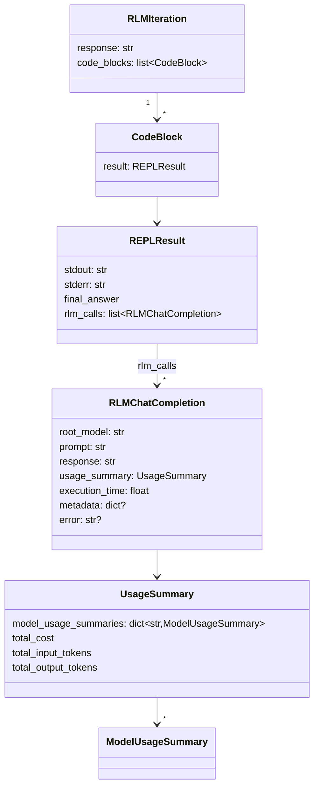

# Core types — the uniform data model across recursion depth and backend

## Overview

`rlm.core.types` is the shared vocabulary every other module in this repo speaks: whatever backend executed
the code and however deep the recursion went, the result always comes back as the same handful of
dataclasses. This uniformity is what let [`rlm-core-rlm`](rlm-core-rlm.md) treat a plain LM call and a
recursive sub-call identically, and what let [`rlm-core-lm_handler`](rlm-core-lm_handler.md) serialize a
result across a process/machine boundary without any backend-specific casing.

## Diagram

## Design rationale (why it's built this way)

**`RLMChatCompletion` is the return type for a root call *and* a sub-call, on purpose.** Both
[`RLM.completion`](../catalog/rlm/core/rlm.md#RLM.completion) and
[`RLM._subcall`](../catalog/rlm/core/rlm.md#RLM._subcall) produce this exact type — the only difference is
whether `metadata` is populated (a full child trajectory, when a logger captured one) or `None` (a leaf-depth
plain LM call). Code consuming a completion never needs to branch on which kind it got.

**`REPLResult.rlm_calls` is how a code-execution result reports the sub-calls it made**, not a separate
side-channel — so a single `execute_code()` return value carries both what printed to stdout/stderr *and*
every recursive RLM completion that call triggered, which is what [`VerbosePrinter.print_code_execution`](../catalog/rlm/logger/verbose.md#VerbosePrinter.print_code_execution)
walks to render a full trace of one iteration.

**Usage is tracked per-model, then aggregated, never just as one running total.** `UsageSummary.model_usage_summaries`
is a dict keyed by model name; `total_cost`/`total_input_tokens`/`total_output_tokens` are computed
properties over that dict. This is what makes a multi-model recursive tree's cost attributable — a parent
RLM using GPT-5 with GPT-5-mini sub-calls can report exactly how much each model contributed, not just a
blended number.

## Entry points
- [`RLMChatCompletion`](../catalog/rlm/core/types.md#RLMChatCompletion) — the terminal value of any
  completion, root or recursive; its [`response`](../catalog/rlm/core/types.md#RLMChatCompletion.response)
  field carries the answer text.
- A `REPLResult` (not itself citable from this packet's subgraph — see
  [`rlm-environments-base_env`](rlm-environments-base_env.md) for its producer) is the return type of every
  environment backend's `execute_code`, carrying [`stdout`](../catalog/rlm/core/types.md#REPLResult.stdout)/[`stderr`](../catalog/rlm/core/types.md#REPLResult.stderr).

## Mechanism (step-by-step)
1. A model turn produces a `response` string containing code; the environment executes it, producing a
   `REPLResult` with [`stdout`](../catalog/rlm/core/types.md#REPLResult.stdout)/[`stderr`](../catalog/rlm/core/types.md#REPLResult.stderr)
   and, if the model's code made any sub-calls, a list of `rlm_calls`.
2. That result is wrapped into a `CodeBlock` and appended to the current iteration's `code_blocks`, which
   [`RLM._check_iteration_limits`](../catalog/rlm/core/rlm.md#RLM._check_iteration_limits) — the very next
   step — reads back from.
3. [`RLM._check_iteration_limits`](../catalog/rlm/core/rlm.md#RLM._check_iteration_limits) reads `stderr`
   off each code block to track consecutive errors, and reads accumulated `UsageSummary.total_cost`/token
   counts to enforce budget/token limits.
4. On completion, everything collapses into one [`RLMChatCompletion`](../catalog/rlm/core/types.md#RLMChatCompletion) —
   the `response` field carries the final answer text; `usage_summary` carries the full per-model cost
   breakdown for that call (including everything spent by sub-calls it triggered).

## Key data structures
See the Diagram above — this page's entire content *is* the data model, so the diagram and the design
rationale together cover the material rather than restating it a third time here.

## Edge cases
- `RLMChatCompletion.error` is set (with `response` left empty) specifically for the batched-request
  partial-failure case documented in [`rlm-core-lm_handler`](rlm-core-lm_handler.md) — one slot failing in a
  batch does not raise; it populates this field instead.
- `metadata` on `RLMChatCompletion` is `None` for a leaf-depth sub-call (see
  [`rlm-core-rlm`](rlm-core-rlm.md) Edge cases) — consumers must not assume it's always populated just
  because the call was recursive.

## See also
- [`rlm-core-rlm`](rlm-core-rlm.md) — the primary producer and consumer of these types.
- [`rlm-core-lm_handler`](rlm-core-lm_handler.md) — serializes these types across the socket boundary.
- [`rlm-core-comms_utils`](rlm-core-comms_utils.md) — the wire-format wrapper types (`LMRequest`/`LMResponse`)
  around `RLMChatCompletion`.
