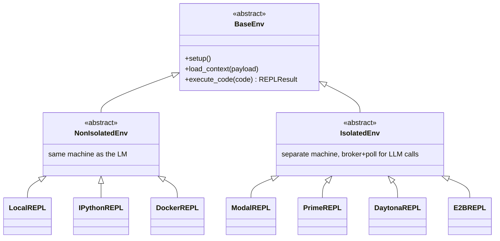

# BaseEnv — the isolated/non-isolated REPL abstraction

## Overview

Every environment backend in this repo — [`LocalREPL`](../catalog/rlm/environments/local_repl.md#LocalREPL),
[`IPythonREPL`](../catalog/rlm/environments/ipython_repl.md#IPythonREPL),
[`DockerREPL`](../catalog/rlm/environments/docker_repl.md#DockerREPL),
[`ModalREPL`](../catalog/rlm/environments/modal_repl.md#ModalREPL),
[`PrimeREPL`](../catalog/rlm/environments/prime_repl.md#PrimeREPL),
[`DaytonaREPL`](../catalog/rlm/environments/daytona_repl.md#DaytonaREPL),
[`E2BREPL`](../catalog/rlm/environments/e2b_repl.md#E2BREPL) — implements the same three-method contract
declared on [`BaseEnv`](../catalog/rlm/environments/base_env.md#BaseEnv): `setup`, `load_context`,
`execute_code`. What differs between them is entirely *where the code actually runs* and *how the model's
sub-calls get from that execution site back to a real LM* — the interface the rest of the system (the
[`RLM`](rlm-core-rlm.md) class) programs against never changes.

## Diagram

## Design rationale (why it's built this way)

**The isolated/non-isolated split is about the machine boundary, not features.** [`NonIsolatedEnv`](../catalog/rlm/environments/base_env.md#NonIsolatedEnv)'s
docstring is explicit: these run on the same machine as the LM caller ("the simplest, default is a local
Python REPL that runs as a subprocess"). [`IsolatedEnv`](../catalog/rlm/environments/base_env.md#IsolatedEnv)
environments (Modal, Prime, Daytona, E2B) sit on a genuinely separate machine, which changes the whole
communication pattern: since the sandbox can't dial back into the parent process directly, the isolated
backends run a small **broker server inside the sandbox** and have the parent **poll** it for pending LLM
requests, forwarding each to the real [`LMHandler`](rlm-core-lm_handler.md) and posting the response back —
a store-and-forward pattern the non-isolated backends don't need because they can call the LM handler
in-process or over localhost directly.

**Custom tools are a uniform, format-tolerant injection mechanism across every backend.** [`parse_custom_tools`](../catalog/rlm/environments/base_env.md#parse_custom_tools)
/ [`parse_tool_entry`](../catalog/rlm/environments/base_env.md#parse_tool_entry) accept either a bare
value/callable or a `{"tool": ..., "description": ...}` dict, normalizing both into a
[`ToolInfo`](../catalog/rlm/environments/base_env.md#ToolInfo); [`format_tools_for_prompt`](../catalog/rlm/environments/base_env.md#format_tools_for_prompt)
then renders whichever form into one consistent system-prompt section. This is what lets a caller pass
`{"fetch_data": my_fn}` or `{"fetch_data": {"tool": my_fn, "description": "..."}}` interchangeably and have
every backend — local subprocess, Docker container, or remote sandbox — describe it to the model the same
way, even though the *mechanism* of injecting the callable into each backend's namespace differs sharply
(see Edge cases).

**In-process IPython isolation is explicitly imperfect, and the docstring says so.** [`IPythonREPL`](../catalog/rlm/environments/ipython_repl.md#IPythonREPL)'s
own documentation states that in-process mode shares the parent's `sys.stdout`/`sys.stderr` and process
signals — "any other thread in the parent that touches them while a cell is running will see the shadowed
state" — and recommends `kernel_mode="subprocess"` for genuine isolation. This is a case where the code's
own comments are more honest about a limitation than a casual read of "it's a REPL environment" would
suggest.

## Entry points
- [`BaseEnv.execute_code`](../catalog/rlm/environments/base_env.md#BaseEnv) — the abstract method every
  backend implements; this is what [`RLM._completion_turn`](rlm-core-rlm.md) calls each iteration.
- [`format_tools_for_prompt`](../catalog/rlm/environments/base_env.md#format_tools_for_prompt) — called from
  [`build_rlm_system_prompt`](../catalog/rlm/utils/prompts.md#build_rlm_system_prompt) to render whatever
  custom tools a caller supplied into the system message the root model sees.

## Mechanism (step-by-step)
1. **A backend is selected by name** (`"local"`, `"ipython"`, `"docker"`, `"modal"`, `"prime"`, `"daytona"`,
   `"e2b"`) via `get_environment` in [`rlm-core-rlm`](rlm-core-rlm.md)'s `_spawn_completion_context`, and
   constructed as one of the seven concrete [`BaseEnv`](../catalog/rlm/environments/base_env.md#BaseEnv)
   subclasses with the LM handler's `(host, port)` plus the prompt as `context_payload`.
2. **Non-isolated backends load context directly into their execution namespace** — `LocalREPL` binds it as
   a Python variable in a persistent namespace under a temp directory; `IPythonREPL`'s
   [`_setup_in_process`](../catalog/rlm/environments/ipython_repl.md#IPythonREPL._setup_in_process) creates
   a fresh `InteractiveShell` with a **uniquely-named user module** specifically so two in-process instances
   don't collide on `sys.modules['__main__']`.
3. **Isolated backends stand up a broker in the sandbox and poll it** — [`ModalREPL`](../catalog/rlm/environments/modal_repl.md#ModalREPL)
   and [`PrimeREPL`](../catalog/rlm/environments/prime_repl.md#PrimeREPL) each launch a sandbox, expose a
   broker port (Modal via encrypted tunnels, Prime via `sandboxes.expose()`), and run a background poller
   thread that drains pending LLM requests the sandboxed code issued, forwards them to the real LM handler,
   and posts results back into the sandbox.
4. **Custom tools are injected per-backend, not once**: `IPythonREPL` in subprocess mode ships tools to the
   kernel via [`_inject_custom_tools_subprocess`](../catalog/rlm/environments/ipython_repl.md#IPythonREPL._inject_custom_tools_subprocess),
   preferring `dill` (which pickles functions by value, including closures, so the kernel process needs no
   import of the defining module) and falling back to JSON for plain data if `dill` isn't installed; Docker
   and Daytona instead generate injection *code* ([`_build_custom_tools_code`](../catalog/rlm/environments/docker_repl.md#_build_custom_tools_code),
   [`_build_exec_script`](../catalog/rlm/environments/daytona_repl.md#_build_exec_script)) that's executed
   inside the container/sandbox at setup time.
5. **[`BaseEnv.execute_code`](../catalog/rlm/environments/base_env.md#BaseEnv) always returns the same
   `REPLResult` shape** regardless of which backend ran it — `stdout`, `stderr`, and (if the model set it)
   `final_answer` — so the iteration loop in `RLM` never needs to know which backend is underneath.

## Key data structures
- [`ToolInfo`](../catalog/rlm/environments/base_env.md#ToolInfo) — `name`, `value`, `description`, plus an
  [`is_callable`](../catalog/rlm/environments/base_env.md#ToolInfo.is_callable) property; the normalized form
  every custom tool is parsed into regardless of which of the two input shapes the caller used.
- `REPLResult` (defined in `rlm.core.types`, referenced here) — the uniform return contract every backend's
  `execute_code` must produce.

## Dynamics (design intent)
`IPythonREPL.execute_code` is explicitly documented as serialized *within one instance* via a threading
lock in both kernel modes, while sub-call fan-out (`rlm_query_batched`) is bounded *globally per broker* by
`max_concurrent_subcalls` — two different concurrency scopes stacked on top of each other: one cell runs at
a time per REPL instance, but that one cell can still fan out several concurrent sub-RLM calls up to the
shared cap.

## Edge cases
- **Subprocess-mode subcall attribution can mis-tag long-lived background work.** The `IPythonREPL`
  docstring calls this out directly: a cell that spawns a thread or leaves an `asyncio.Task` running, which
  later calls `rlm_query` after the spawning cell has finished, gets its sub-call attributed to *whatever
  cell is active at call time* — not the cell that actually started the background work.
- **`ModalREPL` and `PrimeREPL` both explicitly reject `persistent=True`** — multi-turn persistence, a
  feature the non-isolated backends support, raises `NotImplementedError` on these two isolated backends as
  of this snapshot.
- **`_restore_scaffold_in_process` re-injects the scaffold functions (`rlm_query`, `answer`, custom tools)
  on every cell** in in-process `IPythonREPL` mode, specifically to recover from a user overwriting one of
  the reserved names (e.g. rebinding `answer` to a plain dict) — a defensive re-assertion, not a one-time
  setup.

## Open questions
- Whether `DaytonaREPL` and `E2BREPL` support `persistent=True` was not resolved from this packet's subgraph
  (their constructors weren't in scope here); `ModalREPL`/`PrimeREPL` explicitly do not.

## See also
- [`rlm-core-rlm`](rlm-core-rlm.md) — the caller of `execute_code` and the source of `context_payload`.
- [`rlm-core-lm_handler`](rlm-core-lm_handler.md) — what the isolated backends' broker/poll loop is actually
  talking to on the other end.
