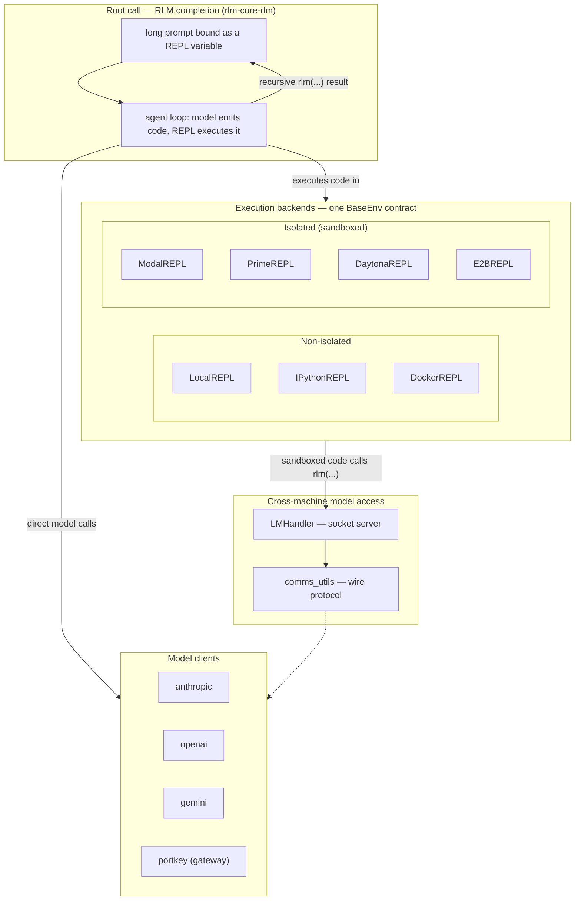

# rlm — what it is and how it fits together

> Grounded code wiki for [alexzhang13/rlm](https://github.com/alexzhang13/rlm), Alex Zhang's own reference
> implementation of **Recursive Language Models**, pinned @ `caf0bffa1a`. This is the *implementation*
> companion to the paper summary in
> [`../../sources/recursive-language-models.md`](../../sources/recursive-language-models.md). Read that for
> *what RLM claims and why it matters* (context-rot, prompt-as-a-variable, the recursion-depth ceiling);
> read this for *how the reference code actually implements it*.

## In one paragraph
RLM's core move is treating a long prompt as a Python variable rather than a token sequence the model must
read start-to-end: the root model runs inside a persistent REPL where the prompt lives as `prompt` (or a
similar bound variable) that ordinary code can slice, search, and pass to nested calls, and a recursive
sub-model call — `rlm(...)` — is just another function call the REPL can make, with the child's own answer
returned as a plain string back into the parent's variable namespace. [`RLM.completion`](concepts/rlm-core-rlm.md)
is the orchestration loop that runs this REPL and dispatches recursive calls; the REPL itself is one of
seven interchangeable execution backends, split between non-isolated (in-process, fast, trusted code only)
and isolated (sandboxed, safe for untrusted model-generated code) tiers sharing one
[`BaseEnv`](concepts/rlm-environments-base_env.md) contract. A separate socket-based
[`LMHandler`](concepts/rlm-core-lm_handler.md)/[`comms_utils`](concepts/rlm-core-comms_utils.md) layer lets
sandboxed code running on a different machine still reach the model, and a parallel training-time
reimplementation ([`RLMTrainEnv`](concepts/training-src-rlm_train-env.md)) was used to produce the paper's
RLM-Qwen3-8B fine-tune via RL.

## Core architecture

## Main concepts
- **The recursion loop itself.** [`RLM.completion`](concepts/rlm-core-rlm.md) binds the long context as a
  REPL variable and runs the agent loop that lets the model write code against it, including code that
  spawns a child `rlm(...)` call — the concrete mechanism behind "prompt-as-a-variable."
- **Reaching the model from inside a sandbox.** [`LMHandler`](concepts/rlm-core-lm_handler.md) and
  [`comms_utils`](concepts/rlm-core-comms_utils.md) are the socket server and wire protocol that let code
  running in an isolated backend (a different machine or container) still make `rlm(...)` calls back to a
  model.
- **Seven execution backends, one contract.** [`BaseEnv`](concepts/rlm-environments-base_env.md) is the
  shared interface; [`LocalREPL`](concepts/rlm-environments-local_repl.md) and
  [`IPythonREPL`](concepts/rlm-environments-ipython_repl.md) run in-process for trusted/fast use,
  [`DockerREPL`](concepts/rlm-environments-docker_repl.md) adds container isolation, and
  [`ModalREPL`](concepts/rlm-environments-modal_repl.md), [`PrimeREPL`](concepts/rlm-environments-prime_repl.md),
  [`DaytonaREPL`](concepts/rlm-environments-daytona_repl.md), and
  [`E2BREPL`](concepts/rlm-environments-e2b_repl.md) each delegate to a different remote sandbox provider —
  see [`repl-environment-taxonomy`](doc-concepts/repl-environment-taxonomy.md) for the full tradeoff table.
- **Model clients.** [`rlm-clients-anthropic`](concepts/rlm-clients-anthropic.md),
  [`rlm-clients-openai`](concepts/rlm-clients-openai.md), [`rlm-clients-gemini`](concepts/rlm-clients-gemini.md),
  and [`rlm-clients-portkey`](concepts/rlm-clients-portkey.md) each implement the same
  [`BaseLM`](concepts/rlm-clients-base_lm.md) contract, so the orchestration loop is provider-agnostic.
- **Logging and replay.** [`rlm_logger`](concepts/rlm-logger-rlm_logger.md) and
  [`verbose`](concepts/rlm-logger-verbose.md) record every REPL turn and recursive call for later
  inspection — see [`trajectory-logging-and-visualization`](doc-concepts/trajectory-logging-and-visualization.md)
  and the [visualizer types](concepts/visualizer-src-lib-types.ts.md) that render a saved trajectory.
- **Training-time reimplementation.** [`RLMTrainEnv`](concepts/training-src-rlm_train-env.md), its
  [proxy](concepts/training-src-rlm_train-proxy.md), [subprocess REPL](concepts/training-src-rlm_train-repl-subprocess.md),
  and [worker](concepts/training-src-rlm_train-worker.md) reimplement the same recursive-call mechanism
  inside an RL rollout loop — the code that produced the paper's RLM-Qwen3-8B fine-tune, not the same
  process as the inference-time `RLM.completion` path above.

## How a run flows
The root [`RLM.completion`](concepts/rlm-core-rlm.md) call binds the long prompt into a REPL namespace and
starts an agent loop against one of the seven [`BaseEnv`](concepts/rlm-environments-base_env.md) backends.
Each turn, the model emits Python that the REPL executes; when that code calls `rlm(...)`, the call either
runs in-process (non-isolated backends) or crosses a socket to [`LMHandler`](concepts/rlm-core-lm_handler.md)
(isolated backends), which dispatches to a model [client](concepts/rlm-clients-base_lm.md) and returns the
child's answer as a plain string back into the parent's REPL variables — the recursion bottoms out at a
depth ceiling, past which the system falls back to a plain (non-recursive) LM call. Every turn is recorded
by [`rlm_logger`](concepts/rlm-logger-rlm_logger.md) for the [visualizer](concepts/visualizer-src-lib-types.ts.md)
to replay later. `RLMTrainEnv` mirrors the same call structure but inside a training rollout, so the policy
being trained experiences the identical recursive-call interface it will use at inference time.

## Map of the wiki
- *"How does context-as-a-REPL-variable actually work?"* → [`rlm-core-rlm`](concepts/rlm-core-rlm.md).
- *"How does sandboxed code reach the model across a machine boundary?"* →
  [`rlm-core-lm_handler`](concepts/rlm-core-lm_handler.md), [`rlm-core-comms_utils`](concepts/rlm-core-comms_utils.md).
- *"What execution backends exist and when do I use which?"* →
  [`repl-environment-taxonomy`](doc-concepts/repl-environment-taxonomy.md).
- *"How is a trajectory logged and replayed?"* →
  [`trajectory-logging-and-visualization`](doc-concepts/trajectory-logging-and-visualization.md).
- *"What's the CodeAct connection?"* → [`codeact-bet`](doc-concepts/codeact-bet.md).
- *"How was the RL fine-tune produced?"* → [`training-src-rlm_train-env`](concepts/training-src-rlm_train-env.md).
- *Exhaustive per-module symbol index* → [`catalog/`](catalog/); *concept table + coverage* →
  [`index.md`](index.md).

## Cross-repo concepts
No page in this silo carries an explicit `concepts:` tag to this wiki's cross-paper vocabulary
(`wiki/concepts/`) — RLM's core mechanism (context-as-a-REPL-variable, recursive sub-agent calls as function
calls) is genuinely its own thing among the vocabulary this wiki has accumulated so far (evolutionary
search, tree search, mechanism rewriting, verification independence), rather than an instance of one of
them. The composition this silo is most directly relevant to is
[`prime-agent`](../prime-agent/overview.md)'s TypeScript reimplementation of the same mechanism — see
[`rlm-continual-harness-composition`](../prime-agent/doc-concepts/rlm-continual-harness-composition.md).
